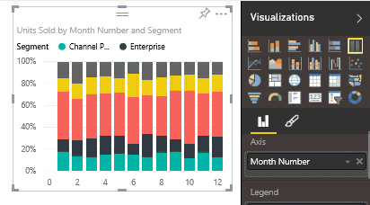

<properties
   pageTitle="Cambiar el tipo de visualización de un informe de Power BI"
   description="Cambiar el tipo de visualización de un informe de Power BI"
   services="powerbi"
   documentationCenter=""
   authors="mihart"
   manager="mblythe"
   backup=""
   editor=""
   tags=""
   qualityFocus="no"
   qualityDate=""/>

<tags
   ms.service="powerbi"
   ms.devlang="NA"
   ms.topic="article"
   ms.tgt_pltfrm="NA"
   ms.workload="powerbi"
   ms.date="10/08/2016"
   ms.author="mihart"/>

# Cambiar el tipo de visualización de un informe de Power BI

Pruebe diferentes tipos de visualizaciones en Power BI para ver cuál ilustra mejor los datos. 

1.  Abra su [informes en la vista de edición](powerbi-service-go-from-reading-view-to-editing-view.md) y [crear una visualización](powerbi-service-add-visualizations-to-a-report-i.md), si el informe no tiene ninguno todavía.

2.  En el panel de visualizaciones, seleccione el nuevo tipo de visualización.  

    

>
            **NOTA**: puede [anclar la visualización](powerbi-service-pin-a-tile-to-a-dashboard-from-a-report.md) al panel de mosaico.

Si cambia el tipo de visualización en el informe después de que anclado al escritorio, el icono no se actualiza automáticamente. Por lo tanto, si se fija la visualización como un gráfico de líneas y, a continuación, en el informe, cambió a un gráfico de barras, la versión ya anclado de estos datos seguirá un gráfico de líneas. Anclar el gráfico de barras para verlo demasiado en el panel.

###  Consulte también

Más información sobre [visualizaciones en informes de Power BI](powerbi-service-visualizations-for-reports.md)

[Power BI: conceptos básicos](powerbi-service-basic-concepts.md)

¿Preguntas más frecuentes? [Pruebe la Comunidad de Power BI](http://community.powerbi.com/)
