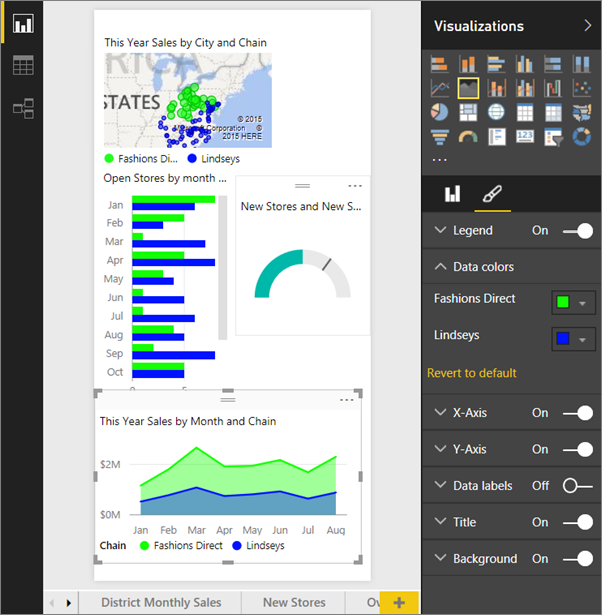
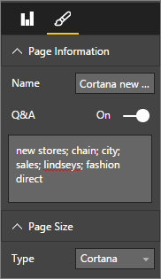
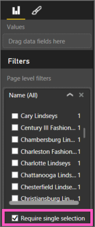

<properties
   pageTitle="Crear tarjetas de respuesta personalizadas de Power BI para Cortana"
   description="Crear tarjetas de respuesta personalizado para Cortana de Power BI"
   services="powerbi"
   documentationCenter=""
   authors="mihart"  
   manager="mblythe"
   backup=""
   editor=""
   tags=""
   qualityFocus="no"
   qualityDate=""/>

<tags
   ms.service="powerbi"
   ms.devlang="NA"
   ms.topic="article"
   ms.tgt_pltfrm="NA"
   ms.workload="powerbi"
   ms.date="09/30/2016"
   ms.author="mihart"/>

# Use Power BI para crear una página de respuesta personalizado para Cortana

Utilice las capacidades completas de Power BI para crear informes diseñados específicamente para responder a preguntas de Cortana.

## Antes de comenzar

Antes de comenzar a crear páginas personalizadas de respuesta para Cortana, [Habilitar Cortana para Power BI](powerbi-service-cortana-enable.md).  

## Crear una página de respuesta de Cortana
Un *página respuesta* en un informe tiene un tamaño específicamente para Cortana para que Cortana puede mostrar como respuesta a una pregunta.  Para crear una página de respuesta para Cortana:

1. Se recomienda empezar con un [página del informe en blanco](powerbi-service-add-a-page-to-a-report.md).

2. En el **visualizaciones** panel, seleccione el icono de pincel y elija **tamaño de página > Cortana**.

    

3. Crear un objeto visual o un conjunto de elementos visuales que desee que aparezca en Cortana en respuesta a una pregunta determinada (o conjunto de preguntas).

4. Asegúrese de que todos los elementos visuales se ajustan a los bordes de página.  Opcionalmente, modifique la configuración de pantalla, las etiquetas de datos, colores y fondos.  

    

5. Nombre de la página y agregue nombres alternativos.  Cortana utiliza estos nombres al buscar los resultados. En el **visualizaciones** panel, seleccione el icono de pincel y elija **información de la página**. Habilitar preguntas y respuestas para este objeto visual moviendo el control deslizante para **en**.

    

    >[AZURE.TIP] Para mejorar los resultados, evite utilizar palabras que también son los nombres de columna.

6. Opcionalmente, si el informe tiene filtros de nivel de página, puede establecer **requieren selección única**. Cortana solo mostrará este informe como respuesta si uno y sólo uno, de los elementos de filtro se especifica en la pregunta.

    

      Por ejemplo, si solicita a Cortana:

      - "Mostrar las ventas por nombre de tienda", esta página de respuesta no aparecerá porque no incluyó alguno de los elementos en el filtro de nivel de página requiere.

      - "Mostrar las ventas de Cary Lindseys y Charlotte Lindseys," esta página de respuesta no aparecerá porque se especificó más de un elemento de filtro de nivel de página requiere.

      - "Mostrar las ventas de Charlotte Lindseys", se mostrará esta página de respuesta.

    Ahora, formular una pregunta incluido el nombre de una página de tamaño de Cortana devolverá resultados de Cortana.

    >[AZURE.IMPORTANT]  Para poder acceder a la página de respuesta por Cortana, necesitará [Habilitar el conjunto de datos para Cortana](powerbi-service-cortana-enable.md).

## ¿Cómo Cortana el pedido de los resultados?

Resultados con respuestas puntuación alta (por ejemplo, una coincidencia completa de un nombre de página especificado) aparecerá en primer lugar como un *mejor coincidencia* en Cortana. Si hay varias respuestas en Power BI, pueden aparecer varios mejores coincidencias. Media o baja puntuación respuestas, como las respuestas no se basa en una página con nombre para una pregunta o Cortana con palabras que no entiende Power BI, se muestran como vínculos que aparecen las mejores coincidencias en Cortana.

>[AZURE.NOTE] Cuando un nuevo conjunto de datos o una página de respuesta de Cortana personalizado se agrega a Power BI y habilitada para Cortana puede tardar hasta 30 minutos para que comienzan a aparecer en Cortana los resultados. Registro dentro y fuera de Windows 10 o, de lo contrario, reiniciar el proceso de Cortana de Windows 10, le permitirá nuevo contenido a aparecer inmediatamente.

## Consulte también

[Uso de Cortana con Power BI](powerbi-service-cortana-intro.md)

[Introducción a Power BI Desktop](powerbi-desktop-getting-started.md)

¿Preguntas más frecuentes? [Pruebe la Comunidad de Power BI](http://community.powerbi.com/)
