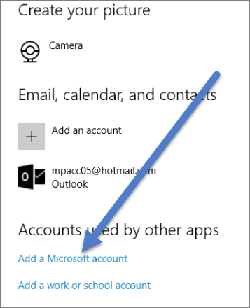

<properties
   pageTitle="Habilitar Cortana para Power BI"
   description="Usar Cortana con Power BI para obtener respuestas de los datos. Activar Cortana para cada conjunto de datos de Power BI y, a continuación, habilite Cortana tener acceso a los conjuntos de datos desde dispositivos móviles."
   services="powerbi"
   documentationCenter=""
   authors="mihart"  
   manager="mblythe"
   backup=""
   editor=""
   tags=""
   qualityFocus="no"
   qualityDate=""/>

<tags
   ms.service="powerbi"
   ms.devlang="NA"
   ms.topic="article"
   ms.tgt_pltfrm="NA"
   ms.workload="powerbi"
   ms.date="09/20/2016"
   ms.author="mihart"/>

# Habilitar Cortana para Power BI

Formule preguntas en lenguaje natural en Cortana y encuentre respuestas de datos almacenados en Power BI.

Antes de Cortana puede buscar respuestas en los informes y conjuntos de datos de Power BI, necesitará:

-  en Power BI habilitada para que Cortana tener acceso a un conjunto de datos

-  Para agregar la cuenta se utiliza con Power BI para Windows.

  >[AZURE.NOTE] Cortana para Power BI solo está disponible en inglés. Cortana no está actualmente disponible en dispositivos móviles.

## Habilitar Cortana para acceder a datos en Power BI
En el servicio Power BI, deberá repetir estos pasos para cada conjunto de datos que desee Cortana para tener acceso a.

1.  Inicie sesión en el servicio Power BI.

2. En la esquina superior derecha, seleccione el icono de engranaje y elija **configuración**.

    

3. Seleccione el **conjuntos de datos** ficha y seleccione el conjunto de datos en la lista de la izquierda.

4.  Seleccione **preguntas y respuestas y Cortana** > **Cortana permiten tener acceso a este conjunto de datos** > **aplicar**.

    

    En este ejemplo, permitimos que Cortana en el conjunto de datos de ejemplo de análisis de venta directa.

    >[AZURE.NOTE] Cuando un nuevo conjunto de datos o una página de respuesta de Cortana personalizado se agrega a Power BI y habilitada para Cortana, puede tardar hasta 30 minutos para que comiencen a aparecer los resultados.  Registro dentro y fuera de Windows 10 o, de lo contrario, reiniciar el proceso de Cortana de Windows 10, le permitirá nuevo contenido a aparecer inmediatamente.

    >[AZURE.IMPORTANT]Si habilita un conjunto de datos para Cortana, y ese conjunto de datos forma parte de un paquete de contenido tiene, será necesario volver a publicar para que sus compañeros para que también pueda utilizar con Cortana.

5. Determinar qué versión de Windows 10 que se está ejecutando. Compruebe qué versión tiene, seleccione **configuración** > **System** > **sobre**.

   -  Si tiene [Windows 10 versión 1511 (actualización de noviembre de Windows 10) hasta 1607](http://blogs.windows.com/windowsexperience/2015/11/12/first-major-update-for-windows-10-available-today/), agregar su cuenta organizativa y o cuenta Microsoft (finalizar los pasos 6 y 7 siguiente).

   -  Si tiene [Windows 10 versión 1607 (10 de julio de 2016 Windows update) o posterior](https://support.microsoft.com/en-us/kb/3176929), agregue el trabajo o escuela cuenta (completo único paso 6 a continuación).

6. Agregue su cuenta profesional o educativa para Cortana.
   -  Configuración de Windows > cuentas.

         

   -  Desplácese hasta la parte inferior y seleccione **Agregar una cuenta profesional o educativa**.

         

7. En el **cuentas** página, desplácese hasta el final donde verá **Agregar una cuenta de Microsoft**.
      

   -  Inicie sesión con la cuenta que utilice con Power BI.

Cortana usará este trabajo o escuela cuenta para comprobar Power BI para evitar posibles respuestas a sus preguntas en Cortana.

## Consulte también

            [Uso de Cortana con Power BI](powerbi-service-cortana-intro.md)

            [Crear Cortana *responder páginas* en Power BI](powerbi-service-cortana-desktop-entity-cards.md)

            [Preguntas y respuestas en Power BI](powerbi-service-q-and-a.md)

            [Conceptos básicos de Power BI](powerbi-service-basic-concepts.md)

¿Preguntas más frecuentes? 
            [Pruebe la Comunidad de Power BI](http://community.powerbi.com/)
