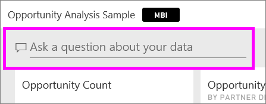
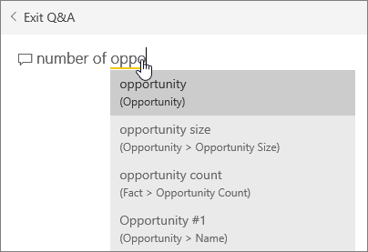
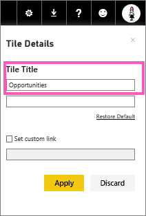

<properties
   pageTitle="Create a big number tile for a Power BI dashboard by asking a question"
   description="Create a big number tile for a Power BI dashboard by asking a question"
   services="powerbi"
   documentationCenter=""
   authors="mihart"
   manager="mblythe"
   backup=""
   editor=""
   tags=""
   qualityFocus="no"
   qualityDate=""/>

<tags
   ms.service="powerbi"
   ms.devlang="NA"
   ms.topic="article"
   ms.tgt_pltfrm="NA"
   ms.workload="powerbi"
   ms.date="10/07/2016"
   ms.author="mihart"/>

# Create a big number tile for a Power BI dashboard by asking a question  

Sometimes a single number is the most important thing you want to track in your Power BI dashboard, such as total sales, market share year over year, or total opportunities. You can <bpt id="p1">[</bpt>create a big number tile in a Power BI report<ept id="p1">](powerbi-service-create-a-big-number-tile-from-a-power-bi-report.md)</ept> or by asking a question in the Q&amp;A box. This article explains how to create one in Q&amp;A.

The question box is the easiest way to make a number tile like this.

1.    Create a <bpt id="p1">[</bpt>dashboard<ept id="p1">](powerbi-service-dashboards.md)</ept> and <bpt id="p2">[</bpt>get data<ept id="p2">](powerbi-service-get-data.md)</ept>.

2.    At the top of your dashboard, start typing what you want to know about your data in the question box. This example uses the Opportunity Analysis sample.

    

3.    For example, type "number of opportunities" in the question box.
    

    The question box suggests, restates as <bpt id="p1">**</bpt>Showing opportunity count<ept id="p1">**</ept>, and displays the total number.  

4.  Select the pin icon <ph id="ph1"></ph> in the upper-right corner to add the number tile to the dashboard. 

    

5.  Pin the tile to an existing dashboard or to a new dashboard. 

    -   Existing dashboard: select the name of the dashboard from the dropdown.

    -   New dashboard: type the name of the new dashboard.

6.  Select <bpt id="p1">**</bpt>Pin<ept id="p1">**</ept>.

    A Success message (near the top right corner) lets you know the visualization was added, as a tile, to your dashboard.  

    

7.  From the navigation pane, select the dashboard with the new tile. There, you can <bpt id="p1">[</bpt>rename, resize, link, and move<ept id="p1">](powerbi-service-edit-a-tile-in-a-dashboard.md)</ept> the pinned visualization.  
    

## Solucionar problemas
If you do not see a question box at all, it may be that you have not enabled Q&amp;A for this dataset.  

##  Enable Q&amp;A

1.  In the upper-right corner of Power BI, select the cog icon <ph id="ph1"></ph> and choose <bpt id="p1">**</bpt>Settings<ept id="p1">**</ept>.

    

2.  Select <bpt id="p1">**</bpt>datasets<ept id="p1">**</ept> and choose the dataset to enable for Q&amp;A.

    

3. Expand <bpt id="p1">**</bpt>Q&amp;A and Cortana<ept id="p1">**</ept>, select the checkbox for <bpt id="p2">**</bpt>Turn on Q&amp;A for this dataset<ept id="p2">**</ept> and choose <bpt id="p3">**</bpt>Apply<ept id="p3">**</ept>.

    

## Consulte también  
<bpt id="p1">[</bpt>Dashboard tiles in Power BI<ept id="p1">](powerbi-service-dashboard-tiles.md)</ept>  
<bpt id="p1">[</bpt>Dashboards in Power BI<ept id="p1">](powerbi-service-dashboards.md)</ept>  
<bpt id="p1">[</bpt>Power BI - Basic Concepts<ept id="p1">](powerbi-service-basic-concepts.md)</ept>

More questions? <bpt id="p1">[</bpt>Try the Power BI Community<ept id="p1">](http://community.powerbi.com/)</ept>
