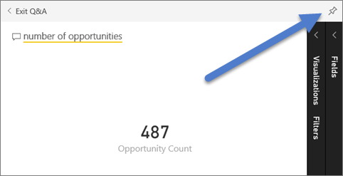

<properties
   pageTitle="Crear un icono de número grande para un panel de Power BI formular una pregunta"
   description="Crear un icono de número grande para un panel de Power BI formular una pregunta"
   services="powerbi"
   documentationCenter=""
   authors="mihart"
   manager="mblythe"
   backup=""
   editor=""
   tags=""
   qualityFocus="no"
   qualityDate=""/>

<tags
   ms.service="powerbi"
   ms.devlang="NA"
   ms.topic="article"
   ms.tgt_pltfrm="NA"
   ms.workload="powerbi"
   ms.date="10/07/2016"
   ms.author="mihart"/>

# Crear un icono de número grande para un panel de Power BI formular una pregunta  

A veces un único número es lo más importante que desea realizar un seguimiento en el panel de Power BI, como ventas totales, mercado recurso compartido de un año a año u oportunidades total. Puede [crear un mosaico de números grandes en un informe de Power BI](powerbi-service-create-a-big-number-tile-from-a-power-bi-report.md) o formular una pregunta en el cuadro de preguntas y respuestas. Este artículo explica cómo crear uno en preguntas y respuestas.

El cuadro de pregunta es la manera más fácil de crear un icono como este número.

1.    Crear un [panel](powerbi-service-dashboards.md) y [obtener datos](powerbi-service-get-data.md).

2.    En la parte superior del panel del, comience a escribir lo que desea saber acerca de los datos en el cuadro de pregunta. En este ejemplo se utiliza el ejemplo de análisis de la oportunidad.

    

3.    Por ejemplo, escriba "número de oportunidades" en el cuadro de pregunta.
    

    El cuadro de pregunta sugiere que redefine como **que muestra el recuento de oportunidades**, y muestra el número total.  

4.  Seleccione el icono de pin  en la esquina superior derecha para agregar el icono de número en el panel. 

    

5.  Anclar el mosaico a un panel existente o a un nuevo panel. 

    -   Panel existente: seleccione el nombre del panel en la lista desplegable.

    -   Nuevo panel: escriba el nombre del nuevo panel.

6.  Seleccione **Pin**.

    Un mensaje de confirmación (cerca de la esquina superior derecha) le permite conocer que la visualización se ha agregado, como un icono al escritorio.  

    

7.  En el panel de navegación, seleccione el panel con el nuevo icono. Allí, puede [cambiar el nombre, tamaño, vincular y mover](powerbi-service-edit-a-tile-in-a-dashboard.md) la visualización anclada.  
    

## Solucionar problemas
Si no ve un cuadro de pregunta, es posible que no ha habilitado preguntas y respuestas para este conjunto de datos.  

##  Habilitar preguntas y respuestas

1.  En la esquina superior derecha de Power BI, seleccione el icono de engranaje  y elija **configuración**.

    

2.  Seleccione **conjuntos de datos** y elija el conjunto de datos para habilitar para preguntas y respuestas.

    

3. Expanda **preguntas y respuestas y Cortana**, seleccione la casilla de verificación **Activar preguntas y respuestas para este conjunto de datos** y elija **aplicar**.

    

## Consulte también  

            [Iconos de panel en Power BI](powerbi-service-dashboard-tiles.md)  

            [Paneles de Power BI](powerbi-service-dashboards.md)  

            [Power BI: conceptos básicos](powerbi-service-basic-concepts.md)

¿Preguntas más frecuentes? 
            [Pruebe la Comunidad de Power BI](http://community.powerbi.com/)
