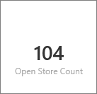

<properties
   pageTitle="Crear un icono de número grande de un informe de Power BI"
   description="Crear un icono de número grande de un informe de Power BI"
   services="powerbi"
   documentationCenter=""
   authors="mihart"
   manager="mblythe"
   backup=""
   editor=""
   tags=""
   qualityFocus="no"
   qualityDate=""/>

<tags
   ms.service="powerbi"
   ms.devlang="NA"
   ms.topic="article"
   ms.tgt_pltfrm="NA"
   ms.workload="powerbi"
   ms.date="10/07/2016"
   ms.author="mihart"/>
# Crear un icono de número grande de un informe de Power BI

A veces un único número es lo más importante que desea realizar un seguimiento en el panel de Power BI, como ventas totales, mercado recurso compartido de un año a año u oportunidades total. Puede crear un icono grande número por [una pregunta en el cuadro de preguntas y respuestas](powerbi-service-create-a-big-number-tile-for-a-dashboard.md), o en un informe de Power BI. Este artículo explica cómo crear uno en un informe.

1.  Crear un [panel](powerbi-service-dashboards.md) y [obtener datos](powerbi-service-get-data.md).

    Si desea practicar sobre datos, intente [descargar el ejemplo de análisis de venta](powerbi-sample-retail-analysis-take-a-tour.md). 

2.  Abra el informe en [vista de edición](powerbi-service-go-from-reading-view-to-editing-view.md).

4.  En el informe, busque una página con espacio en blanco o [Agregar una nueva página al informe](powerbi-service-add-a-page-to-a-report.md).

5.  En la lista de campos, seleccione el campo de número que desea mostrar.

    En este ejemplo, **recuento Abrir almacén** en el **almacén** tabla. Power BI crea un gráfico de columnas con el uno número.

    

6.  En el panel de visualizaciones, seleccione el icono de la tarjeta.

    

7.  Seleccione el icono de pin  en la esquina superior derecha para agregar el icono al escritorio. 

    

8.  Anclar el mosaico a un panel existente o a un nuevo panel. 

    -   Panel existente: seleccione el nombre del panel en la lista desplegable.

    -   Nuevo panel: escriba el nombre del nuevo panel.

9.  Seleccione **Pin**.

    Un mensaje de confirmación (cerca de la esquina superior derecha) le permite conocer que la visualización se ha agregado, como un icono al escritorio.

    

10. En el panel de navegación, seleccione el panel con el nuevo icono. Allí, puede [Editar y mover](powerbi-service-edit-a-tile-in-a-dashboard.md) la visualización anclada.

## Consulte también

[Iconos de panel en Power BI](powerbi-service-dashboard-tiles.md)

[Paneles de Power BI](powerbi-service-dashboards.md)

[Power BI: conceptos básicos](powerbi-service-basic-concepts.md)

¿Preguntas más frecuentes? [Pruebe la Comunidad de Power BI](http://community.powerbi.com/)
