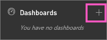

<properties
   pageTitle="Crear un panel de Power BI"
   description="Crear un panel de Power BI"
   services="powerbi"
   documentationCenter=""
   authors="mihart"
   manager="mblythe"
   backup=""
   editor=""
   tags=""
   featuredVideoId="lJKgWnvl6bQ"
   qualityFocus="monitoring"
   qualityDate="03/15/2016"/>

<tags
   ms.service="powerbi"
   ms.devlang="NA"
   ms.topic="article"
   ms.tgt_pltfrm="NA"
   ms.workload="powerbi"
   ms.date="10/07/2016"
   ms.author="mihart"/>

# Crear un panel de Power BI

Ha leído [paneles en Power BI](powerbi-service-dashboards.md), y ahora desea crear los suyos propios. Hay muchas maneras diferentes de crear un panel.  El vídeo muestra cómo crear un nuevo panel fijando elementos visuales y las imágenes de un informe. Y las instrucciones detalladas a continuación el vídeo muestran cómo crear un panel vacía mediante el panel de navegación izquierdo del servicio Power BI. Un panel vacía no es muy útil aunque: seguir los vínculos debajo y, en la parte inferior de la página, para obtener información sobre cómo agregar contenido al panel.

>
            **NOTA**: Recuerde que el panel estará en blanco hasta que [obtener algunos datos](powerbi-service-get-data.md) y [Anclar algunos iconos](powerbi-service-dashboard-tiles.md).

>
            **NOTA**: los paneles son una característica del servicio Power BI, no Power BI Desktop.

## Crear un panel
### Crear un panel fijando elementos visuales y las imágenes de un informe

<iframe width="560" height="315" src="https://www.youtube.com/embed/lJKgWnvl6bQ" frameborder="0" allowfullscreen></iframe>

### Crear un panel vacía desde cero
Este método crea un panel nuevo y vacío.

1. En el panel de navegación izquierdo en servicio Power BI (no Power BI Desktop), seleccione el signo más  junto a la **paneles** encabezado.

    

2. Escriba un nombre para el nuevo panel y presione ENTRAR.

    

    Se crea el nuevo panel.  Aparece en **paneles** en el panel de navegación izquierdo.

    

3. Seleccione el nuevo panel para que sea el panel activo.  Observe que está en blanco, que no hayamos agregado todavía ningún contenido.

### Agregar algún contenido al escritorio

Hay muchas maneras diferentes para agregar contenido a su escritorio.

-  
            [Conectarse o importar al menos un conjunto de datos](powerbi-service-get-data.md) y [Anclar contenido de ese conjunto de datos en el panel de](powerbi-service-dashboard-tiles.md).  

- 
            [Agregar contenido independiente al panel](powerbi-service-add-a-widget-to-a-dashboard.md). Use **Agregar mosaico** para agregar una imagen, cuadro de texto o título, vídeo o contenido web al escritorio.

>
            **¿SUGERENCIA**: necesita alguna ayuda agregar contenido introductorio?  Consulte la [Power BI tutorial Introducción a](powerbi-service-get-started.md).

## Consulte también

[Power BI: conceptos básicos](powerbi-service-basic-concepts.md)

[Paneles de Power BI](powerbi-service-dashboards.md)

[Sugerencias para diseñar un excelente panel](powerbi-service-tips-for-designing-a-great-dashboard.md)

¿Preguntas más frecuentes? [Pruebe la Comunidad de Power BI](http://community.powerbi.com/)
