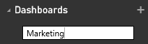

<properties
   pageTitle="Create a Power BI dashboard"
   description="Create a Power BI dashboard"
   services="powerbi"
   documentationCenter=""
   authors="mihart"
   manager="mblythe"
   backup=""
   editor=""
   tags=""
   featuredVideoId="lJKgWnvl6bQ"
   qualityFocus="monitoring"
   qualityDate="03/15/2016"/>

<tags
   ms.service="powerbi"
   ms.devlang="NA"
   ms.topic="article"
   ms.tgt_pltfrm="NA"
   ms.workload="powerbi"
   ms.date="10/07/2016"
   ms.author="mihart"/>

# Create a Power BI dashboard

You've read <bpt id="p1">[</bpt>Dashboards in Power BI<ept id="p1">](powerbi-service-dashboards.md)</ept>, and now you want to create your own. There are many different ways to create a dashboard.  The video shows you how to create a new dashboard by pinning visuals and images from a report. And the step-by-step instructions below the video show you how to create an empty dashboard using the Power BI service left navigation pane. An empty dashboard isn't very useful though -- follow the links below, and at the bottom of the page, to learn how to add content to your dashboard.

><bpt id="p1">**</bpt>NOTE<ept id="p1">**</ept>: Remember that your dashboard will be blank until you <bpt id="p2">[</bpt>get some data<ept id="p2">](powerbi-service-get-data.md)</ept> and <bpt id="p3">[</bpt>pin some tiles<ept id="p3">](powerbi-service-dashboard-tiles.md)</ept>.

><bpt id="p1">**</bpt>NOTE<ept id="p1">**</ept>: Dashboards are a feature of Power BI service, not Power BI Desktop.

## Create a dashboard
### Create a dashboard by pinning visuals and images from a report

<iframe width="560" height="315" src="https://www.youtube.com/embed/lJKgWnvl6bQ" frameborder="0" allowfullscreen></iframe>

### Create an empty dashboard from scratch
This method creates a new, empty, dashboard.

1. From the left navigation pane in Power BI Service (not Power BI Desktop), select the plus sign <ph id="ph1"></ph> next to the <bpt id="p1">**</bpt>Dashboards<ept id="p1">**</ept> heading.

    

2. Type a name for your new dashboard and select ENTER.

    

    The new dashboard is created.  See it listed under <bpt id="p1">**</bpt>Dashboards<ept id="p1">**</ept> in your left navigation pane.

    

3. Select the new dashboard to make it the active dashboard.  Notice that it's blank -- we haven't added any content yet.

### Add some content to the dashboard

There are many different ways to add content to your dashboard.

-  <bpt id="p1">[</bpt>Connect to or import at least one dataset<ept id="p1">](powerbi-service-get-data.md)</ept> and <bpt id="p2">[</bpt>pin content from that dataset to your dashboard<ept id="p2">](powerbi-service-dashboard-tiles.md)</ept>.  

- <bpt id="p1">[</bpt>Add standalone content to your dashboard<ept id="p1">](powerbi-service-add-a-widget-to-a-dashboard.md)</ept>. Use <bpt id="p1">**</bpt>Add tile<ept id="p1">**</ept> to add an image, text box or heading, video, or web content to your dashboard.

><bpt id="p1">**</bpt>TIP<ept id="p1">**</ept>: Need some help getting started adding content?  Check out the <bpt id="p1">[</bpt>Get started with Power BI tutorial<ept id="p1">](powerbi-service-get-started.md)</ept>.

## Consulte también

[Power BI - Basic Concepts](powerbi-service-basic-concepts.md)

[Dashboards in Power BI](powerbi-service-dashboards.md)

[Tips for designing a great dashboard](powerbi-service-tips-for-designing-a-great-dashboard.md)

More questions? [Try the Power BI Community](http://community.powerbi.com/)
