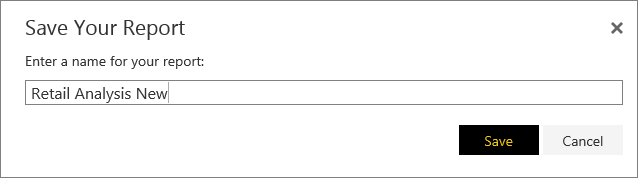

<properties
   pageTitle="Crear un nuevo informe de Power BI"
   description="Crear un nuevo informe de Power BI"
   services="powerbi"
   documentationCenter=""
   authors="mihart"
   manager="mblythe"
   backup=""
   editor=""
   tags=""
   qualityFocus="monitoring"
   qualityDate=""/>

<tags
   ms.service="powerbi"
   ms.devlang="NA"
   ms.topic="article"
   ms.tgt_pltfrm="NA"
   ms.workload="powerbi"
   ms.date="10/05/2016"
   ms.author="mihart"/>
# Crear un nuevo informe de Power BI

Hay muchas maneras diferentes de crear un nuevo informe. Este tema muestra dos de ellos.

-   Un conjunto de datos

-   Desde un informe existente

## Crear un informe desde un conjunto de datos

Este método crea un nuevo informe desde cero. Para continuar, [descargar el ejemplo de análisis de venta](powerbi-sample-downloads.md).

1.  Iniciar servicio Power BI y seleccione un conjunto de datos para abrirla. Abrir un conjunto de datos realmente abre el editor de informes.  Verá un lienzo en blanco y el informe de herramientas de edición.

    

2.  Explorar los datos y [Agregar efectos visuales](powerbi-service-visualizations-for-reports.md). Para este informe, vamos a agregar un medidor elemento visual que realiza un seguimiento de las ventas de este año.

   -  En la **campos** panel, seleccione **ventas** > **ventas de este año** > valor.

        

   -  Convertir el objeto visual en un medidor seleccionando la plantilla medidor  desde el **visualizaciones** panel.

        

   -  Arrastre **ventas** > **ventas de este año** > **objetivo** a la **valor de destino** bien.

        

3.  Opcionalmente, continúe agregando elementos visuales y luego [guardar su informe](powerbi-service-save-a-report.md).

    

## Crear un nuevo informe desde un informe existente
Quizá tenga un informe que ya se conecta al conjunto de datos y tiene algunos efectos visuales que le gustaría volver a utilizar o modificar.  ¿Por qué no simplemente copiar ese informe como base para un nuevo informe?  Siga estos pasos:

1.  
            [Abrir un informe](powerbi-service-open-a-report-in-reading-view.md).

2.  Desde el **archivo** menú, seleccione **Guardar como**.

    

3.  Escriba un nombre para el nuevo informe y seleccione **Guardar**.

    

    Un mensaje de confirmación le permite saber que se guardó el nuevo informe en Power BI.

    

4.  En el panel de navegación de Power BI, seleccione el nuevo informe para abrirlo. Opcionalmente, eliminar elementos visuales que no desea mantener, modificar otros elementos visuales y agregar nuevos.

    

5.  Diviértase actualizar y editar el nuevo informe.

## Pasos siguientes:

[Crear nuevas visualizaciones](powerbi-service-add-visualizations-to-a-report-ii.md)

            [Eliminar las visualizaciones](powerbi-service-delete-a-visualization.md) no es necesario

## Consulte también

Obtenga más información sobre [informes de Power BI](powerbi-service-reports.md)

[Introducción a Power BI](powerbi-service-get-started.md)

[Power BI: conceptos básicos](powerbi-service-basic-concepts.md)

¿Preguntas más frecuentes? [Pruebe la Comunidad de Power BI](http://community.powerbi.com/)
