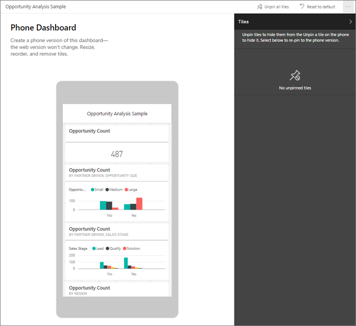

<properties
   pageTitle="Crear una vista de teléfono de un panel en Power BI"
   description="Aprenda a crear una vista personalizada de cualquier panel de Power BI que posee, específicamente para su visualización en teléfonos."
   services="powerbi"
   documentationCenter=""
   authors="maggiesMSFT"
   manager="mblythe"
   backup=""
   editor=""
   tags=""
   qualityFocus="no"
   qualityDate=""/>

<tags
   ms.service="powerbi"
   ms.devlang="NA"
   ms.topic="article"
   ms.tgt_pltfrm="NA"
   ms.workload="powerbi"
   ms.date="09/27/2016"
   ms.author="maggies"/>

# Crear una vista de teléfono de un panel en Power BI

Ver los paneles en la aplicación móvil de Power BI en un teléfono, verá los iconos de panel se colocan uno tras otro y está tamaño de los mismos. En el servicio Power BI, puede crear una vista personalizada de paneles que posee, específicamente para teléfonos.

Cuando se activa el teléfono lateralmente, a continuación, verá el panel recogido en el servicio, no se ha diseñado para el teléfono.

> 
            **Nota**: edición de la vista de teléfono, cualquiera que vea el panel en un teléfono puede ver los cambios que realice en tiempo real. 
> 
> Por ejemplo, si desancla todos los mosaicos en la vista de panel de teléfono, el panel en el teléfono de repente no tendrá ningún mosaico. 

1. En el servicio Power BI, abrir un panel.

2. Seleccione el botón de puntos suspensivos (...) en la esquina superior derecha > bajo **Editar vista**, seleccione **teléfono**.

    >
            **Nota**: si no es el propietario del panel, no verá esta opción en el menú.

    

    Se abre la vista de edición de escritorio de teléfono. Aquí se puede liberar, cambiar de tamaño y reorganizar los mosaicos para ajustarse a la vista de teléfono. La versión web del panel no cambia.

    

3. Seleccione un icono para arrastrar, cambiar el tamaño o Desanclar. Observe los otros iconos mover de forma mientras se arrastra un mosaico.

    

    Los mosaicos desanclados ir en el panel de mosaicos, donde permanecen a menos que se vuelva a agregarlas.

    

4. Si cambia de opinión, seleccione **Restablecer mosaicos** para volver a ponerlo en el tamaño y el orden que se encontraban antes.

    >
            **Nota**: simplemente abrir teléfono Editar vista de Power BI servicio cambia ligeramente el tamaño y la forma de los mosaicos en un teléfono. Para devolver el panel a su estado exacto antes de abrir en la vista Edición del teléfono, seleccione **Restablecer vista teléfono**.

5. Cuando esté satisfecho con el diseño del panel de teléfono, seleccione el botón de puntos suspensivos (...) en la esquina superior derecha > bajo **Editar vista**, seleccione **Web**.

### Consulte también

- [Introducción a Power BI](powerbi-service-get-started.md)
- [Paneles de las aplicaciones móviles de Power BI](powerbi-mobile-create-dashboard.md)
- ¿Preguntas más frecuentes? [Pruebe a formular a la Comunidad de Power BI](http://community.powerbi.com/)