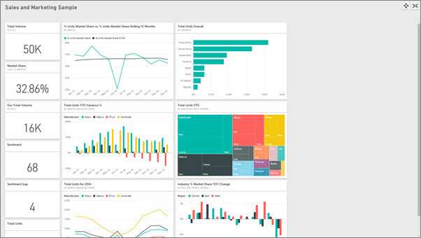
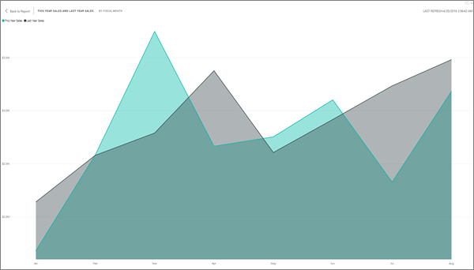

<properties
   pageTitle="Mostrar paneles e informes en modo de pantalla completa (el modo de televisión)"
   description="Mostrar paneles e informes en el modo de televisión, también conocido como modo de pantalla completa."
   services="powerbi"
   documentationCenter=""
   authors="mihart"
   manager="mblythe"
   backup=""
   editor=""
   tags=""
   featuredVideoId="c31gZkyvC54"
   qualityFocus="identified"
   qualityDate=""/>

<tags
   ms.service="powerbi"
   ms.devlang="NA"
   ms.topic="article"
   ms.tgt_pltfrm="NA"
   ms.workload="powerbi"
   ms.date="10/07/2016"
   ms.author="mihart"/>

# Mostrar paneles e informes en modo de pantalla completa (el modo de televisión)

## ¿Qué es el modo de pantalla completa?

Mostrar los paneles, informes, mosaicos y efectos visuales sin la distracción de los menús y botones de navegación.  Obtenga una vista completa puro de su negocio de un vistazo, todo el tiempo. A veces se denomina modo de televisión.

Algunos usos de modo de pantalla completa son:

- presentar el escritorio, icono visual o informe en una reunión o conferencia
- mostrar en una oficina en una pantalla grande dedicado o un proyector
- ver en una pantalla pequeña
- Revisar en modo de bloqueado, puede tocar la pantalla o el mouse sobre los iconos sin tener que abrir el informe subyacente o el panel

>
>            **NOTA**: modo de pantalla completa es diferente de [modo de enfoque (Pop out)](powerbi-service-display-dash-in-focus-mode.md).

Vea Amanda abrir y vaya a su panel en modo de pantalla completa y, a continuación, aplicar algunos parámetros de dirección URL para controlar la presentación predeterminada. A continuación, siga las instrucciones detalladas a continuación el vídeo para probarlo usted mismo.

<iframe width="560" height="315" src="https://www.youtube.com/embed/c31gZkyvC54" frameborder="0" allowfullscreen></iframe>

## Para activar el modo de pantalla completa (y desactivar) para un panel o informe

1. En la barra de menús de Power BI por encima de un panel o informe, seleccione la **pantalla completa** icono.

      

2. La página panel o informe ocupe toda la pantalla.

      

3. Utilice la **Atrás** botón para navegar a la página anterior en el explorador. Si la página anterior era una página de servicio de Power BI, se mostrará en modo de pantalla completa.  Modo de pantalla completa se conservará hasta que cierre la pantalla completa.

3. Para salir del modo de pantalla completa, seleccione el **Cerrar pantalla completa** icono.

      

## Para activar el modo de pantalla completa (y desactivada) de un icono de panel o informe visual

1. En el modo de pantalla completa para un informe o un panel, seleccione el icono de modo de enfoque   de un mosaico concreto o visual específica. El mosaico o visual mostrará una pantalla completa sin menús ni chrome.

    

2. Para salir, mantenga el mouse para mostrar el menú de opciones y seleccione el icono de salida para devolver al panel (para los mosaicos) o del informe (para elementos visuales).

    

## Paneles en modo de pantalla completa

### Ajustar a la pantalla
Modo de pantalla completa para los paneles ofrece algunas opciones de presentación que no están disponibles para los informes.

A veces los paneles se mostrarán en modo de pantalla completa con barras de desplazamiento (véase más arriba). Para quitar las barras de desplazamiento, mueva el cursor a un área vacía de la pantalla para mostrar el menú de opciones de pantalla completa.  

  Y seleccione el **Ajustar a la pantalla** icono.
    

### Ajustar a ancho
Y a veces no importa barras de desplazamiento, pero desea que el panel o informe para llenar todo el ancho del espacio disponible.  Seleccione el **Ajustar a ancho** icono. 

### Impresión
Para imprimir un panel de modo de pantalla completa, seleccione el icono de impresión.

## Informes en modo de pantalla completa
### Mostrar las páginas del informe
Informes de pantalla completos no tienen la opción de imprimir o las opciones de **Ajustar a la pantalla** o **Ajustar a ancho**.  Sin embargo, cuando el informe está en modo de pantalla completa, puede utilizar las flechas directa e inversas para desplazarse por las páginas del informe.

  .

## Consulte también  
[Paneles de Power BI](powerbi-service-dashboards.md)  
[Power BI: conceptos básicos](powerbi-service-basic-concepts.md)

¿Preguntas más frecuentes? [Pruebe la Comunidad de Power BI](http://community.powerbi.com/)
