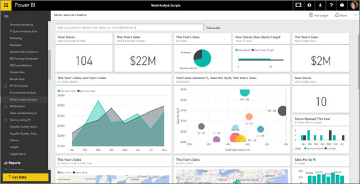
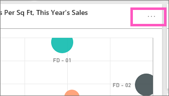

<properties
   pageTitle="Dashboard tiles in Power BI"
   description="All about dashboard tiles in Power BI. This includes tiles that are created from SQL Server Reporting Services (SSRS)."
   services="powerbi"
   documentationCenter=""
   authors="mihart"
   manager="mblythe"
   backup=""
   editor=""
   tags=""
   qualityFocus="monitoring"
   qualityDate="03/15/2016"/>

<tags
   ms.service="powerbi"
   ms.devlang="NA"
   ms.topic="article"
   ms.tgt_pltfrm="NA"
   ms.workload="powerbi"
   ms.date="10/24/2016"  
   ms.author="mihart"/>

# Dashboard tiles in Power BI
## Dashboard tiles

A tile is a snapshot of your data, pinned to the dashboard. A tile can be created from a report, dataset, dashboard, from the Q&amp;A box, Excel, and from SQL Server Reporting Services (SSRS), and more.  The screenshot below shows many different tiles pinned to a dashboard.

Besides pinning, standalone tiles can be created directly on the dashboard using <bpt id="p1">[</bpt>Add tile<ept id="p1">](powerbi-service-add-a-widget-to-a-dashboard.md)</ept>. Standalone tiles include: text boxes, images, videos, and web content.

Need help understanding the building blocks that make up Power BI?  See <bpt id="p1">[</bpt>Power BI - Basic Concepts<ept id="p1">](powerbi-service-basic-concepts.md)</ept>.

>[AZURE.NOTE] If the original visualization used to create the tile changes, the tile doesn't change.  For example, if you pinned a line chart from a report and then you change the line chart to a bar chart, the dashboard tile continues to show a line chart. The data refreshes, but the visualization type does not.

## Pin a tile from...

Tiles can be pinned from:

-   <bpt id="p1">[</bpt>Power BI Q&amp;A<ept id="p1">](powerbi-service-pin-a-tile-to-a-dashboard-from-the-question-box.md)</ept>

-   <bpt id="p1">[</bpt>a report<ept id="p1">](powerbi-service-pin-a-tile-to-a-dashboard-from-a-report.md)</ept>

-   <bpt id="p1">[</bpt>another dashboard<ept id="p1">](powerbi-pin-a-tile-from-one-dashboard-to-another.md)</ept>

- <bpt id="p1">[</bpt>Excel workbook on OneDrive for Business<ept id="p1">](powerbi-service-pin-a-tile-to-a-dashboard-from-excel.md)</ept>

- <bpt id="p1">[</bpt>Power BI publisher for Excel<ept id="p1">](powerbi-publisher-for-excel.md)</ept>

- <bpt id="p1">[</bpt>Quick Insights<ept id="p1">](powerbi-service-auto-insights.md)</ept>

-   <bpt id="p1">[</bpt>SSRS<ept id="p1">](https://msdn.microsoft.com/library/mt604784.aspx)</ept>

And standalone tiles for images, text boxes, videos, and web content can be created directly on the dashboard using <bpt id="p1">[</bpt>Add tile<ept id="p1">](powerbi-service-add-a-widget-to-a-dashboard.md)</ept>.

  

## Interacting with tiles on a dashboard

### Move and resize a tile

Grab a tile and <bpt id="p1">[</bpt>move it around on the dashboard<ept id="p1">](powerbi-service-edit-a-tile-in-a-dashboard.md)</ept>. Hover and select the handle <ph id="ph1"></ph> to resize the tile.

### Hover over a tile to change the appearance and behavior

1. Hover over the tile to display the ellipses.

    
2. Select the ellipses to open the tile action menu.

    

    From here you can:

  - <bpt id="p1">[</bpt>Edit title and subtitle, add a hyperlink, display last refresh time<ept id="p1">](powerbi-service-edit-a-tile-in-a-dashboard.md)</ept> <ph id="ph1"></ph>
  - <bpt id="p1">[</bpt>Export the data used in the tile<ept id="p1">](powerbi-service-edit-a-tile-in-a-dashboard.md)</ept><ph id="ph1"></ph>

  - <bpt id="p1">[</bpt>View in Focus mode<ept id="p1">](powerbi-service-display-dash-in-focus-mode.md)</ept> <ph id="ph1"></ph>

  - <bpt id="p1">[</bpt>Pin the tile to another dashboard<ept id="p1">](powerbi-pin-a-tile-from-one-dashboard-to-another.md)</ept><ph id="ph1">
 </ph><ph id="ph2"></ph>

  - <bpt id="p1">[</bpt>Remove the tile<ept id="p1">](powerbi-service-edit-a-tile-in-a-dashboard.md)</ept><ph id="ph1">
 </ph><ph id="ph2"></ph>

3. To close the action menu, select the X icon <ph id="ph1"></ph>.

### Select (click) a tile
When you select a tile, what happens next depends on how the tile was created and if it has a <bpt id="p1">[</bpt>custom link<ept id="p1">](powerbi-service-edit-a-tile-in-a-dashboard.md)</ept>. If it has a custom link, selecting the tile takes you to that link. Otherwise, selecting the tile takes you to the report, Excel Online workbook, SSRS report that is on-premises, or Q&amp;A question that was used to create the tile.

>[AZURE.NOTE] The exception to this is video tiles created directly on the dashbaord using <bpt id="p1">**</bpt>Add tile<ept id="p1">**</ept>. Selecting a video tile (that was created this way) causes the video to play right there on the dashboard.   

## Tips and troubleshooting  

- If the report that was used to create the visualization was not saved, then selecting the tile produces no action.

- If the tile was created from a workbook in Excel Online, and you do not have at least Read permissions for that workbook, selecting the tile will not open the workbook in Excel Online.

- For tiles created directly on the dashboard using <bpt id="p1">**</bpt>Add tile<ept id="p1">**</ept>, if a custom hyperlink has been set, selecting the title, subtitle, and or tile will open that URL.  Otherwise, by default, selecting one of these tiles created directly on the dashboard for an image, web code, or text box produces no action.

- If you don't have permission to the report within SSRS, selecting a tile created from SSRS will produce a page indicating you don't have access (rsAccessDenied).

- If you don't have access to the network where the SSRS server is located, selecting a tile created from SSRS will product a page that will indicate it cannot locate the server (HTTP 404). Your device needs to have network access to the report server to view the report.

- If the original visualization used to create the tile changes, the tile doesn't change.  For example, if you pinned a line chart from a report and then you change the line chart to a bar chart, the dashboard tile continues to show a line chart. The data refreshes, but the visualization type does not.

## Consulte también  
<bpt id="p1">[</bpt>Create a big number tile from a report<ept id="p1">](powerbi-service-create-a-big-number-tile-from-a-power-bi-report.md)</ept>

<bpt id="p1">[</bpt>Create a big number tile from Q&amp;A<ept id="p1">](powerbi-service-create-a-big-number-tile-for-a-dashboard.md)</ept>

<bpt id="p1">[</bpt>Dashboards in Power BI<ept id="p1">](powerbi-service-dashboards.md)</ept>  
<bpt id="p1">[</bpt>Data refresh<ept id="p1">](powerbi-refresh-data.md)</ept>

<bpt id="p1">[</bpt>Power BI - Basic Concepts<ept id="p1">](powerbi-service-basic-concepts.md)</ept>

<bpt id="p1">[</bpt>Export a tile to Power Point<ept id="p1">](http://blogs.msdn.com/b/powerbidev/archive/2015/09/28/integrating-power-bi-tiles-into-office-documents.aspx)</ept>

<bpt id="p1">[</bpt>Pin Reporting Services items to Power BI Dashboards<ept id="p1">](https://msdn.microsoft.com/library/mt604784.aspx)</ept>

More questions? <bpt id="p1">[</bpt>Try the Power BI Community<ept id="p1">](http://community.powerbi.com/)</ept>
