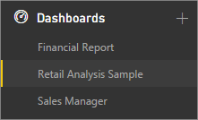

<properties
   pageTitle="Paneles de Power BI"
   description="Paneles de Power BI"
   services="powerbi"
   documentationCenter=""
   authors="mihart"
   manager="mblythe"
   backup=""
   editor=""
   tags=""
   qualityFocus="monitoring"
   qualityDate="03/15/2016"/>

<tags
   ms.service="powerbi"
   ms.devlang="NA"
   ms.topic="article"
   ms.tgt_pltfrm="NA"
   ms.workload="powerbi"
   ms.date="10/07/2016"
   ms.author="mihart"/>

# Paneles de Power BI

Los paneles, informes y conjuntos de datos están en el centro de servicio Power BI. Crear personalizados ***paneles*** para supervisar los datos más importantes de un vistazo.  Un panel combina locales y datos procedentes de nube en un solo panel de vidrio, que proporciona una vista consolidada en toda la organización, independientemente de donde residen los datos. Cada métrica, o recomendación, se muestra en el panel como una ***icono***. 

¿Necesita ayuda para comprender los bloques de creación que conforman Power BI?  Consulte [BI: conceptos básicos de energía](powerbi-service-basic-concepts.md).

Hay ejemplos disponibles para su uso con Power BI. A continuación muestra el ejemplo de análisis de venta directa. Para obtener información detallada sobre el ejemplo, vea [conjuntos de datos de ejemplo](powerbi-sample-datasets.md).

Cada mosaico es una instantánea de la información obtenida de un conjunto de datos subyacente.  Obtenga información acerca de cómo [Agregar mosaicos a un panel](powerbi-service-dashboard-tiles.md). Los mosaicos en un panel pueden ser [cambia el tamaño, mover, eliminar, vinculado y cambia el nombre](powerbi-service-edit-a-tile-in-a-dashboard.md). 

### Crear un panel

Obtenga información acerca de cómo [crear un nuevo panel](powerbi-service-create-a-dashboard.md) y agregue mosaicos.

### Agregar mosaicos a un panel

            [Obtener datos](powerbi-service-get-data.md) y [Agregar mosaicos](powerbi-service-dashboard-tiles.md) y [imágenes, vídeos, código de web y cuadros de texto](powerbi-service-add-a-widget-to-a-dashboard.md) al panel de informes, preguntas y respuestas, SSRS, Excel y mucho más.

### Compartir un panel

Obtenga información acerca de cómo [compartir un panel de solo lectura con sus colegas](powerbi-service-share-unshare-dashboard.md).

Obtenga información acerca de cómo [comparte posee un panel entre colegas](powerbi-service-organizational-content-packs-introduction.md).

### Cambiar el nombre de un panel

¿Necesita un nombre más descriptivo de panel?  
            [Cámbiele el nombre](powerbi-service-rename-a-dashboard.md).

### Imprimir un panel

¿Desea hacer copias impresas de su escritorio?  
            [Imprimir](powerbi-service-print.md).

### Eliminar un panel

¿No necesita el panel más?  
            [Eliminar](powerbi-service-delete-or-remove-a-dashboard.md).

### Tamaño del panel

Mostrar el panel sin los controles y los menús con [modo de pantalla completa](powerbi-service-dash-and-reports-fullscreen.md).

Paneles pueden ser más ancho y más largo que la ventana del explorador. Si es así, tienen barras de desplazamiento. Dado que desea mostrar toda la información importante de un vistazo, se recomienda hacer que el panel de la ventana del explorador. Para obtener más información, consulte [sugerencias para diseñar un excelente panel](powerbi-service-tips-for-designing-a-great-dashboard.md).

### Trabajar con paneles en el panel de navegación

Power BI puede tener más de un panel: a medida que agrega más paneles, sus títulos se agregan a la lista bajo la **paneles** encabezado.  Se resalta el panel que está viendo actualmente. Solo se puede abrir un panel a la vez.

## Consulte también

[Introducción a Power BI](powerbi-service-get-started.md)

[Power BI: conceptos básicos](powerbi-service-basic-concepts.md)

¿Preguntas más frecuentes? [Pruebe la Comunidad de Power BI](http://community.powerbi.com/)
