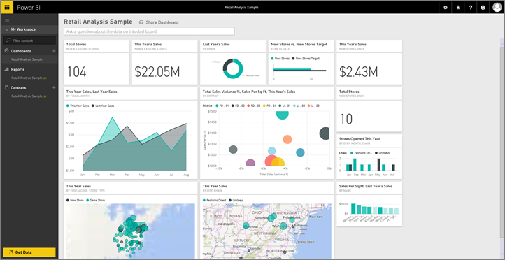

<properties
   pageTitle="Dashboards in Power BI"
   description="Dashboards in Power BI"
   services="powerbi"
   documentationCenter=""
   authors="mihart"
   manager="mblythe"
   backup=""
   editor=""
   tags=""
   qualityFocus="monitoring"
   qualityDate="03/15/2016"/>

<tags
   ms.service="powerbi"
   ms.devlang="NA"
   ms.topic="article"
   ms.tgt_pltfrm="NA"
   ms.workload="powerbi"
   ms.date="10/07/2016"
   ms.author="mihart"/>

# Dashboards in Power BI

Dashboards, reports, and datasets are at the heart of Power BI service. Create personalized <bpt id="p1">***</bpt>dashboards<ept id="p1">***</ept> to monitor your most important data, at a glance.  A dashboard combines on-premises and cloud-born data in a single pane of glass, providing a consolidated view across the organization regardless of where the data lives. Each metric, or insight, is displayed on the dashboard as a <bpt id="p1">***</bpt>tile<ept id="p1">***</ept>. 

Need help understanding the building blocks that make up Power BI?  See <bpt id="p1">[</bpt>Power BI - Basic Concepts<ept id="p1">](powerbi-service-basic-concepts.md)</ept>.

There are samples available for you to use with Power BI. Below shows the Retail Analysis Sample. For detailed information about the sample, see <bpt id="p1">[</bpt>Sample datasets<ept id="p1">](powerbi-sample-datasets.md)</ept>.

Each tile is a snapshot of information taken from an underlying dataset.  Learn how to <bpt id="p1">[</bpt>add tiles to a dashboard<ept id="p1">](powerbi-service-dashboard-tiles.md)</ept>. The tiles on a dashboard can be <bpt id="p1">[</bpt>resized, moved, deleted, linked, and renamed<ept id="p1">](powerbi-service-edit-a-tile-in-a-dashboard.md)</ept>. 

### Create a dashboard

Learn how to <bpt id="p1">[</bpt>create a new dashboard<ept id="p1">](powerbi-service-create-a-dashboard.md)</ept> and add tiles.

### Add tiles to a dashboard

<bpt id="p1">[</bpt>Get data<ept id="p1">](powerbi-service-get-data.md)</ept> and <bpt id="p2">[</bpt>add tiles<ept id="p2">](powerbi-service-dashboard-tiles.md)</ept> and <bpt id="p3">[</bpt>images, videos, web code, and text boxes<ept id="p3">](powerbi-service-add-a-widget-to-a-dashboard.md)</ept> to your dashboard from reports, Q&amp;A, SSRS, Excel, and more.

### Share a dashboard

Learn how to <bpt id="p1">[</bpt>share a read-only dashboard with your colleagues<ept id="p1">](powerbi-service-share-unshare-dashboard.md)</ept>.

Learn how to <bpt id="p1">[</bpt>co-own a dashboard among colleagues<ept id="p1">](powerbi-service-organizational-content-packs-introduction.md)</ept>.

### Rename a dashboard

Need a more descriptive dashboard name?  <bpt id="p1">[</bpt>Rename it<ept id="p1">](powerbi-service-rename-a-dashboard.md)</ept>.

### Print a dashboard

Want to make hard copies of your dashboard?  <bpt id="p1">[</bpt>Print it<ept id="p1">](powerbi-service-print.md)</ept>.

### Delete a dashboard

Don't need the dashboard any more?  <bpt id="p1">[</bpt>Delete it<ept id="p1">](powerbi-service-delete-or-remove-a-dashboard.md)</ept>.

### Dashboard size

Display your dashboard without controls and menus using <bpt id="p1">[</bpt>full screen mode<ept id="p1">](powerbi-service-dash-and-reports-fullscreen.md)</ept>.

Dashboards can be wider and longer than the browser window. If so, they have scroll bars. Because you want to show everything important at a glance, we recommend making the dashboard fit the browser window. For more tips, see <bpt id="p1">[</bpt>Tips for designing a great dashboard<ept id="p1">](powerbi-service-tips-for-designing-a-great-dashboard.md)</ept>.

### Working with Dashboards in the navigation pane

Power BI can have more than one dashboard -- as you add more dashboards, their titles are added to the list under the <bpt id="p1">**</bpt>Dashboards<ept id="p1">**</ept> heading.  The dashboard you're currently viewing is highlighted. Only one dashboard can be open at a time.

## Consulte también

[Get Started with Power BI](powerbi-service-get-started.md)

[Power BI - Basic Concepts](powerbi-service-basic-concepts.md)

More questions? [Try the Power BI Community](http://community.powerbi.com/)
