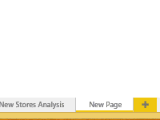

<properties
   pageTitle="Delete a page from a Power BI report"
   description="Delete a page from a Power BI report"
   services="powerbi"
   documentationCenter=""
   authors="mihart"
   manager="mblythe"
   backup=""
   editor=""
   tags=""
   qualityFocus="no"
   qualityDate=""/>

<tags
   ms.service="powerbi"
   ms.devlang="NA"
   ms.topic="article"
   ms.tgt_pltfrm="NA"
   ms.workload="powerbi"
   ms.date="10/01/2016"
   ms.author="mihart"/>

# Delete a page from a Power BI report

Hover over the tab of the page to delete and click the <bpt id="p1">**</bpt>X<ept id="p1">**</ept> (in the top right corner).  Sometimes the X is hard to see.

### Consulte también

Read more about <bpt id="p1">[</bpt>reports in Power BI<ept id="p1">](powerbi-service-reports.md)</ept>

[Power BI - Basic Concepts](powerbi-service-basic-concepts.md)

More questions? [Try the Power BI Community](http://community.powerbi.com/)
