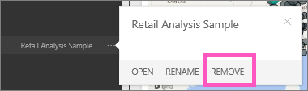

<properties
   pageTitle="Eliminar un informe de Power BI"
   description="Eliminar un informe de Power BI"
   services="powerbi"
   documentationCenter=""
   authors="mihart"
   manager="mblythe"
   backup=""
   editor=""
   tags=""
   qualityFocus="no"
   qualityDate=""/>

<tags
   ms.service="powerbi"
   ms.devlang="NA"
   ms.topic="article"
   ms.tgt_pltfrm="NA"
   ms.workload="powerbi"
   ms.date="08/25/2016"
   ms.author="mihart"/>

# Eliminar un informe de Power BI  

No se preocupe, eliminar un informe no elimina el conjunto de datos que se basa el informe.  Y las visualizaciones que anclado del informe también son seguros, sino que siguen en el panel hasta que elimine individualmente.

## Para eliminar un informe:  
1.  En el panel de navegación izquierdo, haga clic en el informe para eliminar y seleccione **quitar**.  
    

2.  Confirmar la eliminación.

>**Nota:**  
>Si el informe es parte de una [paquete de contenido](powerbi-service-organizational-content-packs-introduction.md), no podrá eliminar con este método.  Consulte [Eliminar un paquete de contenido de organización](powerbi-service-organizational-content-pack-delete.md). 

## Consulte también  
Obtenga más información sobre [informes de Power BI](powerbi-service-reports.md)  
[Power BI: conceptos básicos](powerbi-service-basic-concepts.md)  
¿Preguntas más frecuentes? [Pruebe la Comunidad de Power BI](http://community.powerbi.com/)
