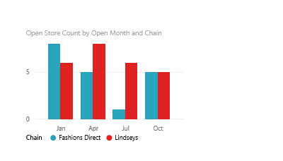

<properties
   pageTitle="Eliminar una visualización en Power BI"
   description="Eliminar una visualización en Power BI"
   services="powerbi"
   documentationCenter=""
   authors="mihart"
   manager="mblythe"
   backup=""
   editor=""
   tags=""
   qualityFocus="no"
   qualityDate=""/>

<tags
   ms.service="powerbi"
   ms.devlang="NA"
   ms.topic="article"
   ms.tgt_pltfrm="NA"
   ms.workload="powerbi"
   ms.date="08/25/2016"
   ms.author="mihart"/>
# Eliminar una visualización en Power BI

## Eliminar una visualización

1.  En Power BI, abrir un informe en [vista de edición](powerbi-service-go-from-reading-view-to-editing-view.md) y [crear una visualización](powerbi-service-add-visualizations-to-a-report-i.md) Si todavía no tiene el informe. 

2.  Seleccione el botón de puntos suspensivos (...) y elija **quitar**.

    

    O bien, selecciónela y presione SUPR.

## Consulte también

Más información sobre [visualizaciones en informes de Power BI](powerbi-service-visualizations-for-reports.md)

[Power BI: conceptos básicos](powerbi-service-basic-concepts.md)

¿Preguntas más frecuentes? [Pruebe la Comunidad de Power BI](http://community.powerbi.com/)
