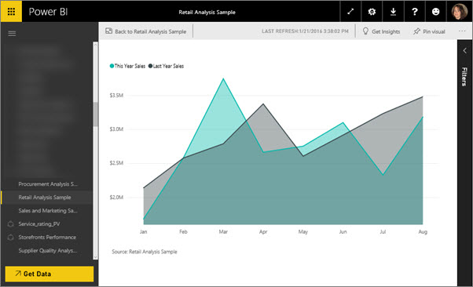

<properties
   pageTitle="Display a dashboard tile in Focus mode"
   description="Documentation for displaying a Power BI dashboard tile or report visual in Focus mode, aka Pop Out."
   services="powerbi"
   documentationCenter=""
   authors="mihart"
   manager="mblythe"
   backup=""
   editor=""
   tags=""
   featuredVideoId="dtdLul6otYE"
   qualityFocus="no"
   qualityDate=""/>

<tags
   ms.service="powerbi"
   ms.devlang="NA"
   ms.topic="article"
   ms.tgt_pltfrm="NA"
   ms.workload="powerbi"
   ms.date="08/29/2016"
   ms.author="mihart"/>

# Display a dashboard tile or report visual in Focus mode

<iframe width="560" height="315" src="https://www.youtube.com/embed/dtdLul6otYE" frameborder="0" allowfullscreen></iframe>

## What is Focus mode?  

<bpt id="p1">***</bpt>Focus<ept id="p1">***</ept> mode lets you expand (pop out) a dashboard tile or report visual to see more detail.  While in Focus mode for a dashboard tile, you can view and modify the filters that were applied when this visual was created.  And while in Focus mode for a report visual, you can view and modify the Visual level and Page level filters.

>[AZURE.NOTE] Currently, Focus mode is not available for tiles created from Q&amp;A or for map tiles. 

>[AZURE.NOTE]  &gt;Focus is different from full screen mode.  Full screen mode is available for <bpt id="p1">[</bpt>dashboards and reports <ept id="p1">](powerbi-service-dash-and-reports-fullscreen.md)</ept> and <bpt id="p2">[</bpt>tiles<ept id="p2">](powerbi-service-display-tile-in-full-screen-mode.md)</ept>.

1.  Hover over the tile or visual and select the <bpt id="p1">**</bpt>Focus mode<ept id="p1">**</ept> icon <ph id="ph1"></ph>.  

    

2.  It opens and fills the entire canvas. 

    

3.  Expand the Filters pane to see all filters applied to this visual.  
    

4.  Explore further by modifying the filters and, if you discover something interesting, pin the visual to a dashboard.   

6.  Leave Focus mode and return to the dashboard by selecting the Focus mode icon (in the top left corner of the visual).

## Go from Focus mode to Full Screen mode
 

## Consulte también  
[Dashboards in Power BI](powerbi-service-dashboards.md)  
[Power BI - Basic Concepts](powerbi-service-basic-concepts.md)

More questions? [Try the Power BI Community](http://community.powerbi.com/)
