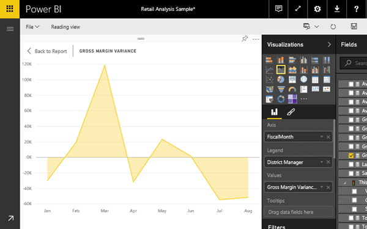
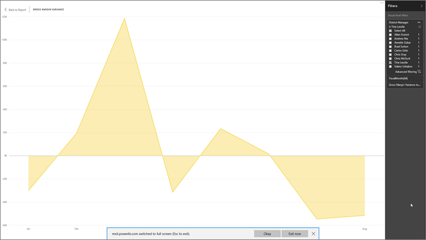

<properties
   pageTitle="Display a dashboard tile in full screen mode (TV mode)"
   description="Display a dashboard tile in full screen TV mode"
   services="powerbi"
   documentationCenter=""
   authors="mihart"
   manager="mblythe"
   backup=""
   editor=""
   tags=""
   qualityFocus="no"
   qualityDate=""/>

<tags
   ms.service="powerbi"
   ms.devlang="NA"
   ms.topic="article"
   ms.tgt_pltfrm="NA"
   ms.workload="powerbi"
   ms.date="08/29/2016"
   ms.author="mihart"/>

# Display a dashboard tile in full screen mode

Tiles must first be <bpt id="p1">[</bpt>popped out<ept id="p1">](powerbi-service-display-dash-in-focus-mode.md)</ept> before they can be displayed in full screen mode.

## What is Full Screen Mode?

Display your <bpt id="p1">[</bpt>dashboards, reports<ept id="p1">](powerbi-service-dash-and-reports-fullscreen.md)</ept>, and tiles without the distraction of menus and navigation buttons.  You get an unadulterated, full view of your business at a glance, all the time. This is sometimes referred to as TV Mode.

Some uses for full screen mode are:

- presenting your tile at a meeting or conference
- displaying your tile in an office on a dedicated large screen or projector
- looking at your tile on a small screen
- reviewing your tile in locked mode -- you can touch the screen or mouse over the tile without opening the underlying report

## To turn full screen mode on (and off)

1. <bpt id="p1">[</bpt>Pop out the tile and display it in Focus mode<ept id="p1">](powerbi-service-display-dash-in-focus-mode.md)</ept>.

    

    Your tile fills the report canvas.

    

3. From the top menubar, select this icon    <ph id="ph1"></ph> to display the tile in Full Screen mode.

4.  In full screen mode, the tile fills your entire screen.

    

4. To exit full screen mode, select the <bpt id="p1">**</bpt>Exit Full Screen<ept id="p1">**</ept> icon located in the bottom right corner of the screen.

    

## Consulte también

[Dashboards in Power BI](powerbi-service-dashboards.md)

[Power BI - Basic Concepts](powerbi-service-basic-concepts.md)

More questions? [Try the Power BI Community](http://community.powerbi.com/)
