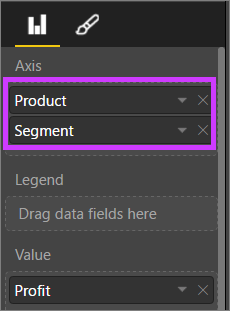
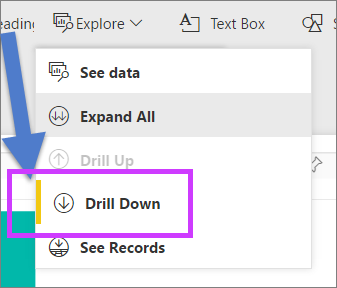
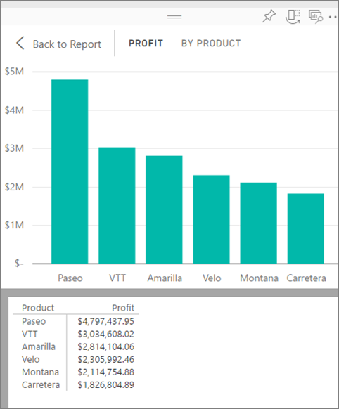

<properties
   pageTitle="Drill down in a visualization in Power BI"
   description="This document shows how to drill down in a visualization in Microsoft Power BI service and Power BI Desktop."
   services="powerbi"
   documentationCenter=""
   authors="mihart"
   manager="mblythe"
   backup=""
   editor=""
   tags=""
   qualityFocus="no"
   qualityDate=""/>

<tags
   ms.service="powerbi"
   ms.devlang="NA"
   ms.topic="article"
   ms.tgt_pltfrm="NA"
   ms.workload="powerbi"
   ms.date="10/08/2016"
   ms.author="mihart"/>

# Drill down in a visualization in Power BI

  <iframe width="560" height="315" src="https://www.youtube.com/embed/MNAaHw4PxzE?list=PL1N57mwBHtN0JFoKSR0n-tBkUJHeMP2cP" frameborder="0" allowfullscreen></iframe>

  ><bpt id="p1">**</bpt>NOTE<ept id="p1">**</ept>: To learn how to create hierarchies using Power BI Desktop, watch the video <bpt id="p2">[</bpt>How to create and add hierarchies<ept id="p2">](https://youtu.be/q8WDUAiTGeU)</ept>

##  2 methods to drill down
There are 2 different way to drill down (and up) in your visualization.  Both are described in this document. Both methods accomplish the same thing, so use whichever one you enjoy most.

## Method 1 for drill down

1.  In Power BI, open a report in <bpt id="p1">[</bpt>Reading View<ept id="p1">](powerbi-service-open-a-report-in-reading-view.md)</ept> or <bpt id="p2">[</bpt>Editing View<ept id="p2">](powerbi-service-go-from-reading-view-to-editing-view.md)</ept>. Drill requires a visualization with a hierarchy. 

    A hierarchy is shown below.  The <bpt id="p1">*</bpt>Profit by Product <ept id="p1">*</ept>visualization has a hierarchy made up of <bpt id="p2">**</bpt>Product <ept id="p2">**</ept>and <bpt id="p3">**</bpt>Segment<ept id="p3">**</ept>; each product has one or more segments. By default, the visualization displays only the product data, because <bpt id="p1">*</bpt>Product <ept id="p1">*</ept>appears in the Axis bucket above <bpt id="p2">*</bpt>Segment<ept id="p2">*</ept>.

2.  To enable drill down, select the arrow icon in the top right corner of the visualization. When the icon is dark, drill is enabled.

    ><bpt id="p1">**</bpt>NOTE<ept id="p1">**</ept>: The animation below shows using drilldown in Editing View.  Editing View allows us to see the hierarchy -- the two fields in the Axis bucket.

    

3.  To drill down one field at a time, double-click one of the chart bars. 

    

4.  To drill down all fields at once, select the double arrow in the top left corner of the visualization.

    

5.  To drill back up, select the up arrow in the top left corner of the visualization.

    

## Method 2 for drill down

1.  In Power BI, open a report in <bpt id="p1">[</bpt>Reading View<ept id="p1">](powerbi-service-open-a-report-in-reading-view.md)</ept> or <bpt id="p2">[</bpt>Editing View<ept id="p2">](powerbi-service-go-from-reading-view-to-editing-view.md)</ept>. Drill requires a visualization with a hierarchy. 

    A hierarchy is from the Financial sample is shown below.  The <bpt id="p1">*</bpt>Profit by Product <ept id="p1">*</ept>visualization has a hierarchy made up of <bpt id="p2">**</bpt>Product <ept id="p2">**</ept>and <bpt id="p3">**</bpt>Segment<ept id="p3">**</ept>; each product has one or more segments. By default, the visualization displays only the product data, because <bpt id="p1">*</bpt>Product <ept id="p1">*</ept>appears in the Axis bucket above <bpt id="p2">*</bpt>Segment<ept id="p2">*</ept>.

    

2.  To enable drill down, select <bpt id="p1">**</bpt>Explore<ept id="p1">**</ept><ph id="ph1"> &gt; </ph><bpt id="p2">**</bpt>Drill Down<ept id="p2">**</ept>. The yellow bar next to <bpt id="p1">**</bpt>Drill Down<ept id="p1">**</ept> let's you know it's enabled.  

    

3.  Once enabled, drill down one field at a time by double-clicking one of the chart bars. In this example, I've double-clicked the product named <bpt id="p1">**</bpt>Velo<ept id="p1">**</ept> to see profit for Velo by Segment.

    

4.  To drill down all fields at once, select <bpt id="p1">**</bpt>Expand all<ept id="p1">**</ept>.

    

5.  To drill back up, select <bpt id="p1">**</bpt>Drill Up<ept id="p1">**</ept>.

    

6.  To see the data being used to create the visual, select <bpt id="p1">**</bpt>See data<ept id="p1">**</ept>. The data is displayed in a pane below the visual. This pane remains as you continue drilling through the visual.

    

### Consulte también

[Visualizations in Power BI reports](powerbi-service-visualizations-for-reports.md)

[Power BI Preview reports](powerbi-service-reports.md)

[Power BI Preview - Basic Concepts](powerbi-service-basic-concepts.md)

More questions? [Try the Power BI Community](http://community.powerbi.com/)
