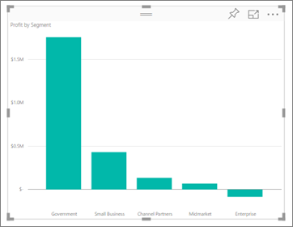
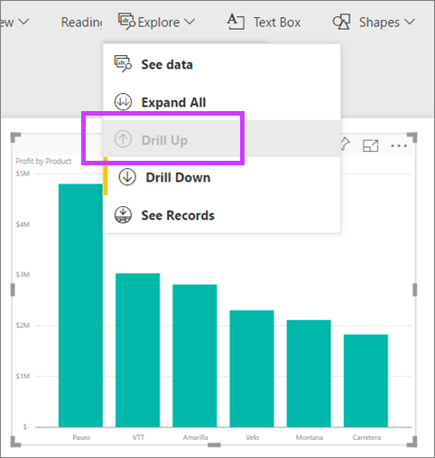

<properties
   pageTitle="Vea los detalles en una visualización en Power BI"
   description="Este documento muestra cómo explorar en profundidad en una visualización en el servicio de Microsoft Power BI y Power BI Desktop."
   services="powerbi"
   documentationCenter=""
   authors="mihart"
   manager="mblythe"
   backup=""
   editor=""
   tags=""
   qualityFocus="no"
   qualityDate=""/>

<tags
   ms.service="powerbi"
   ms.devlang="NA"
   ms.topic="article"
   ms.tgt_pltfrm="NA"
   ms.workload="powerbi"
   ms.date="10/08/2016"
   ms.author="mihart"/>

# Vea los detalles en una visualización en Power BI

  <iframe width="560" height="315" src="https://www.youtube.com/embed/MNAaHw4PxzE?list=PL1N57mwBHtN0JFoKSR0n-tBkUJHeMP2cP" frameborder="0" allowfullscreen></iframe>

  >
            **NOTA**: para obtener información sobre cómo crear jerarquías con Power BI Desktop, vea el vídeo [cómo crear y agregar jerarquías](https://youtu.be/q8WDUAiTGeU)

##  2 métodos para explorar en profundidad
Hay 2 diferente a explorar la visualización (y).  Ambos se describen en este documento. Ambos métodos conseguir lo mismo, por lo que cualquiera que disfrute más.

## Método 1 para explorar en profundidad

1.  En Power BI, abrir un informe en [vista lectura](powerbi-service-open-a-report-in-reading-view.md) o [vista de edición de](powerbi-service-go-from-reading-view-to-editing-view.md). Obtención de detalles requiere una visualización con una jerarquía. 

    A continuación se muestra una jerarquía.  El *de beneficios por producto *visualización tiene una jerarquía formada por **producto **y **segmento**; cada producto tiene uno o más segmentos. De forma predeterminada, la visualización muestra sólo los datos del producto, porque *producto *aparece en el depósito de eje anterior *segmento*.

2.  Para habilitar la obtención de detalles hacia abajo, seleccione el icono de flecha en la esquina superior derecha de la visualización. Si el icono es oscuro, se habilita la obtención de detalles.

    >
            **NOTA**: la animación se muestra con la obtención de detalles en la vista de edición.  Vista de edición permite ver la jerarquía, los dos campos en el eje de depósito.

    

3.  Para desglosar un campo a la vez, haga doble clic en una de las barras del gráfico. 

    

4.  Para explorar en profundidad todos los campos a la vez, seleccione la flecha doble en la esquina superior izquierda de la visualización.

    

5.  Para obtener detalles de copia de seguridad, seleccione la flecha hacia arriba en la esquina superior izquierda de la visualización.

    

## Método 2 para explorar en profundidad

1.  En Power BI, abrir un informe en [vista lectura](powerbi-service-open-a-report-in-reading-view.md) o [vista de edición de](powerbi-service-go-from-reading-view-to-editing-view.md). Obtención de detalles requiere una visualización con una jerarquía. 

    Una jerarquía es desde la financiero muestra a continuación.  El *de beneficios por producto *visualización tiene una jerarquía formada por **producto **y **segmento**; cada producto tiene uno o más segmentos. De forma predeterminada, la visualización muestra sólo los datos del producto, porque *producto *aparece en el depósito de eje anterior *segmento*.

    

2.  Para habilitar la obtención de detalles hacia abajo, seleccione **Explorar** > **explorar hacia abajo**. La barra amarilla junto a **detalle** le permite saber está habilitado.  

    

3.  Una vez habilitado, explorar en profundidad un campo a la vez haciendo doble clic en una de las barras del gráfico. En este ejemplo, hice doble clic el producto denominado **Velo** para ver la ganancia Velo por segmento.

    

4.  Para explorar en profundidad todos los campos a la vez, seleccione **Expandir todo**.

    

5.  Para obtener detalles de copia de seguridad, seleccione **Detalles de**.

    

6.  Para ver los datos que se utiliza para crear el objeto visual, seleccione **Ver datos**. Los datos se muestran en un panel debajo del objeto visual. Este panel permanece continuar la profundidad del objeto visual.

    

### Consulte también

[Visualizaciones en informes de Power BI](powerbi-service-visualizations-for-reports.md)

[Informes de Power BI Preview](powerbi-service-reports.md)

[Vista previa de Power BI: conceptos básicos](powerbi-service-basic-concepts.md)

¿Preguntas más frecuentes? [Pruebe la Comunidad de Power BI](http://community.powerbi.com/)
