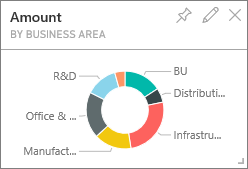
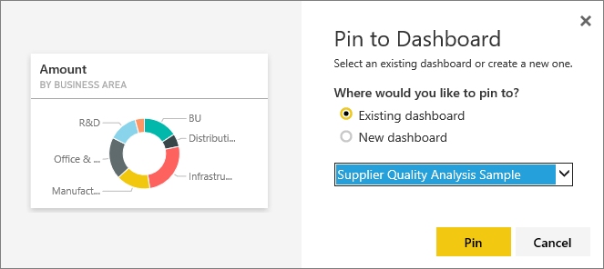

<properties
   pageTitle="Edit a tile -- resize, move, rename, pin, delete, add hyperlink"
   description="Documentation for how to edit a dashboard tile -- resize, move, rename, pin, delete, add hyperlink."
   services="powerbi"
   documentationCenter=""
   authors="mihart"
   manager="mblythe"
   backup=""
   editor=""
   tags=""
   featuredVideoId="lJKgWnvl6bQ"
   qualityFocus="no"
   qualityDate=""/>

<tags
   ms.service="powerbi"
   ms.devlang="NA"
   ms.topic="article"
   ms.tgt_pltfrm="NA"
   ms.workload="powerbi"
   ms.date="08/24/2016"
   ms.author="mihart"/>

# Edit a tile -- resize, move, rename, pin, delete, add hyperlink

You can change the look and default behavior of a tile in a dashboard.

<iframe width="560" height="315" src="https://www.youtube.com/embed/lJKgWnvl6bQ" frameborder="0" allowfullscreen></iframe>

This article covers the following.

-   [Pin a tile to a different dashboard](#different)

-   [Rename a tile](#rename)

-   [Move a tile](#move)

-   [Resize a tile](#resize)

-   [Add a hyperlink to a tile](#hyperlink)

-   [Delete a tile](#delete)

    >[AZURE.NOTE] To change the visualization shown on the tile itself, delete the tile and add a new <bpt id="p1">[</bpt>dashboard tile<ept id="p1">](powerbi-service-dashboard-tiles.md)</ept>.

##  How to begin   

1.  In a <bpt id="p1">[</bpt>dashboard<ept id="p1">](powerbi-service-dashboards.md)</ept>, <bpt id="p2">[</bpt>get data <ept id="p2">](powerbi-service-get-data.md)</ept>, and add a tile. 

    

2.  Hover over a dashboard tile, select the ellipses to display the options.

    

## Pin the tile to a different dashboard

1.    Select the pin icon <ph id="ph1"></ph> .

2.  Decide whether to pin to an existing dashboard or to a new dashboard. 

    

3.  Select <bpt id="p1">**</bpt>Pin<ept id="p1">**</ept>.

****

## Rename the tile

-   Select the pencil icon   <ph id="ph1"></ph>  to edit the tile title.

****

## Move the tile

-   Select and hold the tile to drag it to a new location on the dashboard canvas.

****

## Resize the tile

You can make tiles many different sizes -- from 1x1 tile units up to 5x5.

-    Select and drag the handle  (in the bottom right corner) to resize the tile.
    

****

## Add a hyperlink to a dashboard tile

By default, clicking a tile takes you to the report where the tile was created or to Q&amp;A (if the tile was created in Q&amp;A). To link to a webpage, another dashboard, an SSRS report, or other online content - add a custom link:

1.    Select the pencil icon <ph id="ph1"></ph>  to edit the tile.

2.    Place a checkmark in <bpt id="p1">**</bpt>Set custom link<ept id="p1">**</ept> and enter a URL.

****

## Delete the tile

-   Select the X icon <ph id="ph1"></ph> to delete the tile. Deleting a tile does not delete the underlying report.

****

## Consulte también

[Dashboard tiles in Power BI](powerbi-service-dashboard-tiles.md)

[Dashboards in Power BI](powerbi-service-dashboards.md)

[Power BI - Basic Concepts](powerbi-service-basic-concepts.md)

More questions? [Try the Power BI Community](http://community.powerbi.com/)
