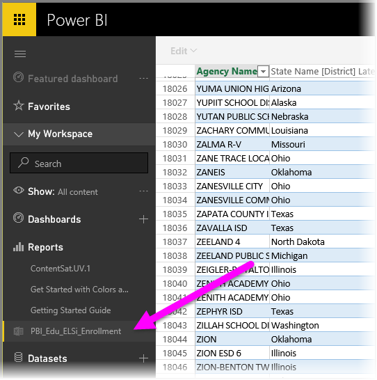

<properties
    pageTitle="Obtener datos de archivos de libro de Excel"
    description="Obtenga información sobre cómo obtener datos de archivos de libro de Excel en Power BI"
    services="powerbi"
    documentationCenter=""
    authors="davidiseminger"
    manager="mblythe"
    backup=""
   editor=""
    tags=""
   qualityFocus="monitoring"
   qualityDate="05/25/2016"/>

<tags
    ms.service="powerbi"
    ms.devlang="NA"
    ms.topic="article"
    ms.tgt_pltfrm="NA"
    ms.workload="powerbi"
    ms.date="09/29/2016"
    ms.author="davidi"/>

# Obtener datos de archivos de libro de Excel

Microsoft Excel es una de las aplicaciones empresariales más utilizados alrededor. También es una de las maneras más comunes para obtener los datos en Power BI.

## ¿Qué tipos de libros admite Power BI?

Power BI admite importar o conectarse a los libros creados en Excel 2007 y versiones posteriores. Los libros deben guardarse como tipo de archivo .xlsx o .xlsm y tener menos de 1 GB. Algunas funciones descritas en este artículo sólo están disponibles en versiones posteriores de Excel.

#### Libros con intervalos o tablas de datos

Si el libro tiene hojas de cálculo simples con intervalos de datos, para sacar el máximo partido de sus datos en Power BI, asegúrese de dar formato a los intervalos como tablas. De este modo, al crear informes en Power BI, verá con nombre de tablas y columnas en el panel de campos, lo que facilita la visualización de los datos.

#### Con los modelos de datos

Libros pueden contener un modelo de datos con una o más tablas de datos se cargan en él utilizando tablas vinculadas, Power Query (obtener & transformar en Excel 2016) o Power Pivot. Power BI admite todas las propiedades de modelo de datos como las relaciones, medidas, jerarquías y KPI.

>   Nota: No se puede compartir con los modelos de datos entre los inquilinos de Power BI. Por ejemplo, un usuario que inicia sesión en Power BI utilizando un *contoso.com* cuenta no puede compartir un libro de Excel con un usuario que inicia sesión con una cuenta de inicio de sesión de Power BI de *woodgrovebank.com*.

#### Libros con conexiones a orígenes de datos externos

Si utiliza Excel para conectarse a un origen de datos externo, una vez que el libro se encuentra en Power BI, puede crear informes y paneles basados en datos de ese origen de datos conectado. También puede configurar la actualización programada para conectarse directamente al origen de datos y obtener actualizaciones automáticamente. Ya no necesitará actualizar manualmente desde la cinta de opciones en Excel. Las visualizaciones en informes y mosaicos en paneles basados en datos de origen de datos que se actualizan automáticamente. Para obtener más información, consulte [de actualización de datos en Power BI](articles/powerbi-refresh-data.md).

#### Libros con hojas de Power View, tablas dinámicas y gráficos

Cómo aparecen las hojas de PowerView y tablas dinámicas y gráficos, o no aparecen, en Power BI depende de dónde se guarda el archivo de libro y cómo decide obtener en Power BI. Vamos a más a continuación.

#### Tipos de datos

Power BI admite los siguientes tipos de datos: número entero, número Decimal, moneda, fecha, True/False, texto. Marcar los datos como datos específicos tipos en Excel mejorará la experiencia de Power BI.

### Preparar el libro de Power BI

Vea este vídeo para obtener más información acerca de cómo asegurarse de que los libros de Excel están listos para Power BI útil.

<iframe width="500" height="281" src="https://www.youtube.com/embed/l2wy4XgQIu0" frameborder="0" allowfullscreen></iframe>

## Donde se guarda el archivo de libro marca la diferencia

            **Local** : Si guarda el archivo de libro en una unidad local en el equipo o en otra ubicación de su organización, desde Power BI, puede cargar el archivo en Power BI. El archivo realmente permanecerá en la unidad local, por lo que todo el archivo no importa realmente en Power BI. Lo que sucede en realidad es un nuevo conjunto de datos se crea en Power BI y datos y el modelo de datos (si existe) del libro se cargan en el conjunto de datos. Si el libro tiene todas las hojas de Power View, aquellos aparecerá en el sitio de Power BI en informes. Excel 2016 también tiene la **publicar** característica (en el **archivo** menú). Mediante **publicar** es realmente lo mismo que usar **obtener datos > archivos > archivo Local** de Power BI, pero suele ser más fácil de actualizar el conjunto de datos en Power BI si regularmente está realizando cambios en el libro.

            **OneDrive - Business** : si tiene OneDrive para la empresa y que inicie sesión en él con la misma cuenta que inicie sesión en Power BI con, se trata por lejos la manera más eficaz mantener el trabajo en Excel y el conjunto de datos, informes y paneles en Power BI en sincronización. Dado que son Power BI y OneDrive en la nube, Power BI *conecta* a su archivo de libro en OneDrive sobre cada hora. Si se detectan cambios, se actualizan automáticamente el conjunto de datos, informes y paneles en Power BI. Al igual que si guarda el libro en una unidad local, también puede utilizar publicación para actualizar el conjunto de datos e informes de Power BI inmediatamente; de lo contrario, Power BI sincronizará automáticamente, normalmente dentro de una hora.

            **OneDrive - Personal** – Si guarda los archivos de libro a su propia cuenta de OneDrive, obtendrá muchas de las mismas ventajas como lo haría con OneDrive para la empresa. La principal diferencia es cuando se conecta primero a su archivo (mediante obtener datos > archivos > OneDrive – Personal) debe iniciar sesión en su OneDrive con su cuenta de Microsoft, que normalmente es distinta de lo que use para iniciar sesión en Power BI. Al iniciar sesión con su OneDrive con su cuenta de Microsoft, asegúrese de seleccionar el mantener la sesión en la opción. De este modo, Power BI pueda conectarse a su archivo de libro sobre cada hora y asegúrese de que el conjunto de datos e informes en Power BI en sincronización.

            **Sitios de SharePoint Team** : guardar los archivos de Power BI Desktop en SharePoint, sitios de grupo es igual que el ahorro de OneDrive para la empresa. La diferencia más importante es cómo se conecta al archivo de Power BI. Puede especificar una dirección URL o conectarse a la carpeta raíz.

## Un libro de Excel: dos maneras de utilizar
Si guarda los archivos de libro a **OneDrive**, tendrá un par de formas, puede explorar los datos en Power BI

### Importar datos de Excel en Power BI
Cuando se elige **importación**, se importan los datos en tablas o en un modelo de datos admitidos en un nuevo conjunto de datos en Power BI. Si dispone de todas las hojas de Power View, las vuelve a creará en Power BI como informes.

Puede seguir modificando el libro. Cuando se guardan los cambios, se sincronizará con el conjunto de datos en Power BI, normalmente dentro de una hora aproximadamente. Si necesita más satisfacción inmediata, puede hacer clic publicar nuevo y los cambios se exportan preciso momento. Las visualizaciones tienen en los informes y paneles se actualizarán, demasiado.

Elija esta opción si ha usado Get y transformación de datos o PowerPivot para cargar datos en un modelo de datos, o si el libro tiene hojas de Power View con visualizaciones desea ver en Power BI.

En Excel 2016, también puede utilizar publicación > Exportar. Es prácticamente lo mismo. Para obtener más información, consulte [publicar en Power BI de Excel 2016](powerbi-service-publish-from-excel.md).

### Conectar, administrar y ver Excel en Power BI
Cuando se elige **Conectar**, aparecerá su libro en Power BI tal como lo haría en Excel Online. Sin embargo, a diferencia de Excel en línea, tendrá algunas funciones fantásticas para ayudar a anclar elementos desde las hojas de cálculo de derecha a los paneles.

No se puede editar el libro en Power BI. Pero si necesita realizar algunos cambios, haga clic en Editar y, a continuación, elija Editar el libro en Excel Online o abrirlo en Excel en su equipo. Los cambios que realice se guardan en el libro en OneDrive.

Al elegir este modo, no se crea ningún conjunto de datos en Power BI. El libro aparecerá en el panel de navegación del área de trabajo Power BI en informes. Los libros conectados tienen un icono especial de Excel.

Elija esta opción si sólo tiene datos en hojas de cálculo, o si tienen intervalos, tablas dinámicas y gráficos que desea anclar a paneles.

En Excel 2016, también puede utilizar publicación > cargar. Es prácticamente lo mismo. Para obtener más información, consulte [publicar en Power BI de Excel 2016](articles/powerbi-service-publish-from-excel).

## Importar o conectarse a un libro de Excel desde Power BI

1.  Power BI, en el panel de navegación, haga clic en **obtener datos**.

    

2.  En los archivos, haga clic en **obtener**.

    

3.  Busque el archivo.

    

4.  Si el archivo de libro está en OneDrive o SharePoint, sitios de equipo, elija **importación** o **Conectar**.

## Libros de Excel locales
También puede usar un archivo de Excel local y cargarlo en Power BI. Simplemente seleccione **archivo Local** desde el menú anterior, vaya a donde haya guardado los libros de Excel.

Una vez seleccionado, elija cargar el archivo en Power BI.

Cuando se carga el libro, se recibe una notificación que el libro está listo.

Cuando el libro esté listo, puede encontrarlo en la **informes** sección de Power BI.

## Publicar desde Excel 2016 en su sitio de Power BI
Mediante el **publicar en Power BI** característica de Excel 2016 es realmente lo mismo que usar **obtener datos** en Power BI para importar o conectar con el archivo. No entraremos en detalles aquí, pero puede ver [publicar en Power BI de Excel 2016](articles/powerbi-service-publish-from-excel.md) para obtener más información.

## ¿Qué viene a continuación?

            **Explorar los datos** -una vez que obtenga datos e informes de su archivo en Power BI, es hora de explorar. Simplemente haga clic en el nuevo conjunto de datos y, a continuación, haga clic en explorar. Si elige conectarse a un archivo de libro en OneDrive en el paso 4, el libro aparecerá en los informes. Al hacer clic en él, se abrirá en Power BI, tal como lo haría si estuviera en Excel Online.

            **Programar la actualización** : si el archivo de libro de Excel se conecta a orígenes de datos externos o importado desde una unidad local, puede configurar actualización programada para asegurarse de que el conjunto de datos o informe siempre está actualizado. En la mayoría de los casos, configurar actualización programada es bastante fácil de hacer, pero entrar en los detalles está fuera del ámbito de este artículo. Consulte [de actualización de datos en Power BI](articles/powerbi-refresh-data.md) para obtener más información.

## Solucionar problemas

¿Archivo de libro es demasiado grande? Desproteger [reducir el tamaño de un libro de Excel para ver en Power BI](articles/powerbi-reduce-the-size-of-an-excel-workbook.md).

Actualmente, cuando elija importar, Power BI sólo importa los datos que forman parte de una tabla con nombre o un modelo de datos. Como resultado, si el libro contiene ninguna tabla con nombre, hojas de Power View o modelos de datos de Excel, puede ver este error: **"No se encontraron los datos en el libro de Excel"**. 
            [Este artículo](articles/powerbi-admin-troubleshoot-excel-workbook-data.md) explica cómo corregir el libro y vuelva a importarlo.

## Consulte también
[Publicar desde Excel 2016 en Power BI](articles/powerbi-service-publish-from-excel.md)

[Publicador de Power BI para Excel](articles/powerbi-publisher-for-excel.md)

[Actualización de datos en Power BI](articles/powerbi-refresh-data.md)
