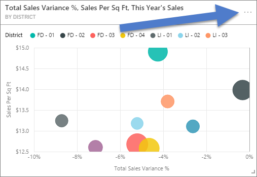
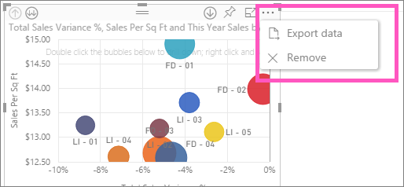

<properties
   pageTitle="Exportar datos de una visualización"
   description="Exportar datos de una visualización de informes y la visualización del panel"
   services="powerbi"
   documentationCenter=""
   authors="mihart"
   manager="mblythe"
   backup=""
   editor=""
   tags=""
   featuredVideoId="jtlLGRKBvXY"
   qualityFocus="no"
   qualityDate=""/>

<tags
   ms.service="powerbi"
   ms.devlang="NA"
   ms.topic="article"
   ms.tgt_pltfrm="NA"
   ms.workload="powerbi"
   ms.date="08/25/2016"
   ms.author="mihart"/>

# Exportar datos de visualizaciones de Power BI
Pueden exportar datos desde objetos visuales en un panel y en los informes.  

>[AZURE.NOTE] El número máximo de filas que se puede descargar es 10.000.

Exportar los datos usados en su escritorio y guárdelo como un archivo .csv, vea Amanda. A continuación, siga las instrucciones detalladas a continuación el vídeo para probarlo usted mismo.

<iframe width="560" height="315" src="https://www.youtube.com/embed/jtlLGRKBvXY?start=61" frameborder="0" allowfullscreen></iframe>

## Exportar datos de un objeto visual panel

1. Seleccione el botón de puntos suspensivos en la esquina superior derecha de la visualización.

    

2. Elija la  **Exportar datos** icono.

    

    Los datos se exportan a un archivo CSV. Si el objeto visual está filtrado, también se filtrarán los datos descargados.

3. Abra el archivo CSV en Excel.

    

    >[AZURE.NOTE] Si hay unicode en el archivo .csv, el texto de Excel no se muestren correctamente. Aunque, ábralo en el Bloc de notas funcionará correctamente. Ejemplos de unicode son símbolos de moneda y palabras extranjeras. la solución para esto es para importar el archivo csv en Excel, en lugar de abrir el archivo csv directamente. Para ello: 1. Abra Excel 2. Desde el **datos** ficha, seleccione **obtener datos externos** > **de texto**.

## Exportar datos de un objeto visual informe

1. Seleccione el botón de puntos suspensivos en la esquina superior derecha de la visualización. Elija  **Exportar datos**.

    

    >[AZURE.NOTE] La opción para quitar un objeto visual sólo está disponible en [vista de edición de informes](powerbi-service-go-from-reading-view-to-editing-view.md).

2. Vea el paso 3 anterior.

## Consulte también

[Paneles de Power BI](powerbi-service-dashboards.md)

[Informes de Power BI](powerbi-service-reports.md)

[Power BI: conceptos básicos](powerbi-service-basic-concepts.md)

¿Preguntas más frecuentes? [Pruebe la Comunidad de Power BI](http://community.powerbi.com/)
