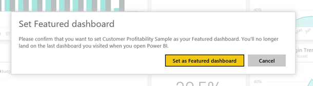

<properties
   pageTitle="Paneles destacados en Power BI"
   description="Documentación sobre cómo crear un panel destacados en Power BI"
   services="powerbi"
   documentationCenter=""
   authors="mihart"
   manager="mblythe"
   backup=""
   editor=""
   tags=""
   featuredVideoId="6aTiAK-oiJ8"
   qualityFocus="no"
   qualityDate=""/>

<tags
   ms.service="powerbi"
   ms.devlang="NA"
   ms.topic="article"
   ms.tgt_pltfrm="NA"
   ms.workload="powerbi"
   ms.date="08/25/2016"
   ms.author="mihart"/>

# Paneles destacados en Power BI

## Crear un panel destacados

Muchos de ustedes tienen un panel que visite más de los demás.  Es posible que el panel que se utiliza para ejecutar su negocio o puede contener una agregación de mosaicos de muchos informes y paneles diferentes.

Para que resulten más fáciles de alcanzar el panel que le preocupa más, hemos agregado la capacidad de ofrecer un panel del área de trabajo. Esto significa que siempre se abrirá Power BI a este panel (en lugar del panel última visita).  Y pueden alcanzar su panel destacados en cualquier momento seleccionando  **panel destacados** en el panel de navegación izquierdo.

>
            **NOTA**: también puede seleccionar algunos paneles y establecerlos como *favoritos*. Consulte [Favoritos del panel](powerbi-service-favorite-dashboards.md).

Los **destacados panel** sección de la izquierda del panel de navegación se atenúa hasta que se establezca un panel como destacados.

### Para establecer un panel como **destacados**

Vea Amanda crear un panel de información destacada y, a continuación, siga las instrucciones a continuación el vídeo para probarlo usted mismo.

<iframe width="560" height="315" src="https://www.youtube.com/embed/7-gQWhUZSsk" frameborder="0" allowfullscreen></iframe>

1. En la esquina superior derecha del panel, seleccione el '...' y elija **establecido como portada**.

    

2. Confirme la selección.

    

3. Una vez que aparezca el mensaje de confirmación, la **destacados panel** opción está activada en la izquierda del panel de navegación.

    

## Cambiar el panel destacados

Por supuesto, si cambia de opinión más adelante puede establecer un nuevo panel como el panel de la portada, o puede quitar completamente el panel de la portada.

1. Seleccione el '...' y elija **destacados de deshabilitar panel**.

    

2. Confirme que ya no desea este panel concreto de características. No cuenta con un panel no quita del área de trabajo.  

    

## Consulte también

[Introducción a Power BI](powerbi-service-get-started.md)

[Power BI: conceptos básicos](powerbi-service-basic-concepts.md)

¿Preguntas más frecuentes? [Pruebe la Comunidad de Power BI](http://community.powerbi.com/)
