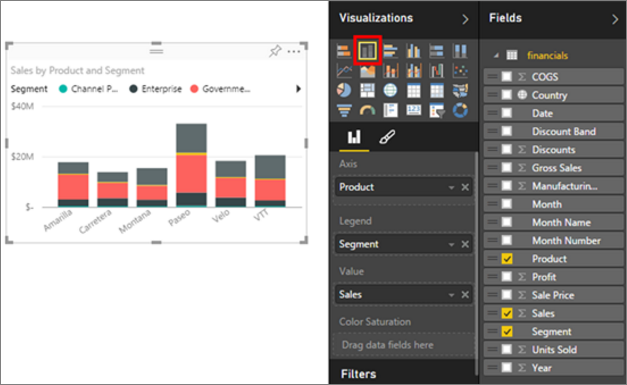
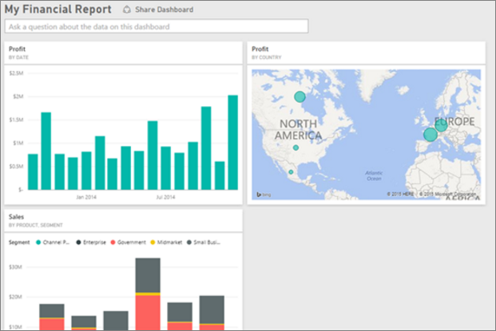

<properties
   pageTitle="Tutorial: From Excel workbook to stunning report in no time"
   description="Tutorial: From Excel workbook to stunning report in no time"
   services="powerbi"
   documentationCenter=""
   authors="mihart"
   manager="mblythe"
   backup=""
   editor=""
   tags=""
   qualityFocus="no"
   qualityDate=""/>

<tags
   ms.service="powerbi"
   ms.devlang="NA"
   ms.topic="article"
   ms.tgt_pltfrm="NA"
   ms.workload="powerbi"
   ms.date="10/01/2016"
   ms.author="mihart"/>

# From Excel workbook to stunning report in no time

Your manager wants to see a report on your latest sales figures combined with your last campaign impressions by the end of the day. But the latest data resides on various third party systems and on files in your laptop. In the past it’s taken hours to create visuals and format a report. You’re beginning to feel anxious.

>> No pasa nada. With Power BI, you can create a stunning report in no time.

In this example, we’ll upload an Excel file from a local system, create a new report, and share it with colleagues—all from within Power BI.

## Prepare your data

Let’s take a simple Excel file as an example. Before you can load your Excel file into Power BI, you must organize your data in a flat table. This means that each column contains the same data type--for example, text, date, number, or currency. You should have a header row, but there should not be any column or row that displays totals.

Next, format your data as a table. In Excel, on the Home tab, in the Styles group, select <bpt id="p1">**</bpt>Format as Table<ept id="p1">**</ept>. Select a table style to apply to your worksheet. Your Excel worksheet is now ready to load into Power BI.

## Upload your Excel file into Power BI

Power BI connects to many data sources, including Excel files that live on your computer. To get started, sign in to Power BI. If you haven’t signed up, <bpt id="p1">[</bpt>you can do so for free<ept id="p1">](https://powerbi.com)</ept>.

You want to create a new dashboard. In the left Navigation Pane, next to <bpt id="p1">**</bpt>Dashboards<ept id="p1">**</ept>, select the plus symbol. Enter a name for your new dashboard.

At the bottom of the left pane, select <bpt id="p1">**</bpt>Get Data<ept id="p1">**</ept>. On the Get Data page, under Import or Connect to Data, in the Files box, select <bpt id="p1">**</bpt>Get<ept id="p1">**</ept>.

On the Files page, select <bpt id="p1">**</bpt>Local File<ept id="p1">**</ept>. Navigate to the Excel workbook file on your computer and select it to load into Power BI.

><bpt id="p1">**</bpt>NOTE<ept id="p1">**</ept>: To follow along with the rest of this tutorial, use the <bpt id="p2">[</bpt>Financial sample workbook<ept id="p2">](powerbi-sample-download-the-financial-sample-workbook.md)</ept>.

## Build your report

After Power BI loads your Excel workbook, start building your report. In the left Navigation Pane, in the <bpt id="p1">**</bpt>Datasets<ept id="p1">**</ept> section, select the dataset that you just imported. Power BI displays the report canvas. On the right side are the Visualizations and Fields panes.

Notice that your Excel workbook table data appears in the Fields pane. Under the name of the table, Power BI lists the column headings as individual fields.

Now you can begin to create visualizations. Your manager wants to see profit over time. In the Fields pane, drag <bpt id="p1">**</bpt>Profit<ept id="p1">**</ept> to the report canvas. Power BI displays a bar chart by default. Next, drag <bpt id="p1">**</bpt>Date<ept id="p1">**</ept> to the report canvas. Power BI updates the bar chart to show profit by date.

><bpt id="p1">**</bpt>TIP<ept id="p1">**</ept>: If your chart doesn't look like you expected, check your aggregations. For example, in the <bpt id="p1">**</bpt>Value<ept id="p1">**</ept> well, right click the field you just added and make sure the data is being aggregated the way you'd like it to be.  In this example, we're using <bpt id="p1">**</bpt>Sum<ept id="p1">**</ept>.

Your manager wants to know which countries are the most profitable. Impress her with a map visualization. Select a blank area on your canvas, and from the Fields pane, simply drag over the <bpt id="p1">**</bpt>Country<ept id="p1">**</ept> and then <bpt id="p2">**</bpt>Profit<ept id="p2">**</ept> fields. Power BI creates a map visual with bubbles representing the relative profit of each location.

What about displaying a visual showing sales by product and market segment? Easy. In the Fields pane, select the checkboxes next to the Sales, Product and Segment fields. Power BI creates a bar chart instantly. Change the type of chart by choosing one of the icons in the Visualizations menu. For instance, change it to a Stacked Bar chart.  To sort the chart, select the ellipses (...) &gt; <bpt id="p1">**</bpt>Sort by<ept id="p1">**</ept>.

Pin all of your visuals to your Dashboard. You’re ready to share it with your colleagues.

## Share your dashboard

You want to share your dashboard with your manager, Paula. You can share your dashboard and underlying report with any colleague who has a Power BI account. They can interact with your report, but cannot save changes.

To share your report, at the top of the dashboard, select <bpt id="p1">**</bpt>Share<ept id="p1">**</ept>.

Power BI displays the Share Dashboard page. In the top area, enter the email addresses of the recipients. Add a message in the field below. To allow recipients to share your dashboard with others, select <bpt id="p1">**</bpt>Allow recipients to share your dashboard<ept id="p1">**</ept>. Select <bpt id="p1">**</bpt>Share<ept id="p1">**</ept>.

Consulte también

- [Get started with Power BI service](powerbi-service-get-started.md)

- [Get started with Power BI Desktop](powerbi-desktop-getting-started.md)

- [Power BI - Basic Concepts](powerbi-service-basic-concepts.md)

-  More questions? [Try the Power BI Community](http://community.powerbi.com/) 
