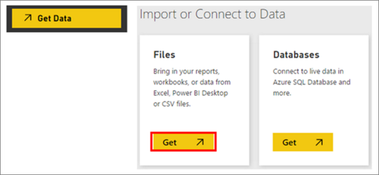
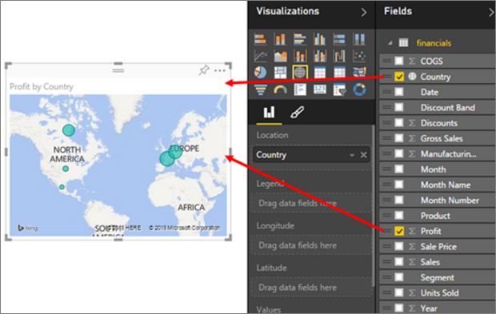

<properties
   pageTitle="Tutorial: De libro de Excel a sorprendentes informes en ningún momento"
   description="Tutorial: De libro de Excel a sorprendentes informes en ningún momento"
   services="powerbi"
   documentationCenter=""
   authors="mihart"
   manager="mblythe"
   backup=""
   editor=""
   tags=""
   qualityFocus="no"
   qualityDate=""/>

<tags
   ms.service="powerbi"
   ms.devlang="NA"
   ms.topic="article"
   ms.tgt_pltfrm="NA"
   ms.workload="powerbi"
   ms.date="10/01/2016"
   ms.author="mihart"/>

# Libro de Excel a sorprendentes informes en ningún momento

Su jefe desea ver un informe en las cifras de ventas más recientes, combinadas con sus último impresiones de campaña al final del día. Pero los datos más recientes residen en varios sistemas de terceros y en archivos en su equipo portátil. En el pasado le ha llevado horas para crear efectos visuales y dar formato a un informe. Está empezando a sentir ansiosa.

>> No pasa nada. Con Power BI, puede crear un informe espectaculares en ningún momento.

En este ejemplo, se deberá cargar un archivo de Excel desde un sistema local, cree un nuevo informe y compartir con compañeros, todo desde Power BI.

## Preparar los datos

Por ejemplo, echemos un simple archivo de Excel. Antes de poder cargar el archivo de Excel en Power BI, debe organizar los datos en una tabla plana. Esto significa que cada columna contiene el mismo tipo de datos: por ejemplo, texto, fecha, número o moneda. Debe tener una fila de encabezado, pero no debería haber ninguna columna o fila que muestra los totales.

A continuación, dar formato a los datos como una tabla. En Excel, en la ficha Inicio, en el grupo estilos, seleccione **dar formato como tabla**. Seleccione un estilo de tabla para aplicar a la hoja de cálculo. La hoja de cálculo de Excel ya está listo para cargar en Power BI.

## Cargar el archivo de Excel en Power BI

Power BI se conecta a muchos orígenes de datos, incluidos los archivos de Excel que se encuentran en el equipo. Para comenzar, inicie sesión en Power BI. Si no ha iniciado la sesión, [puede hacerlo de forma gratuita](https://powerbi.com).

Desea crear un nuevo panel. En el panel de navegación izquierdo, junto a **paneles**, seleccione el signo más. Escriba un nombre para el nuevo panel.

En la parte inferior del panel izquierdo, seleccione **obtener datos**. En la página de obtención de datos, en Importar o conectarse a los datos en el cuadro archivos, seleccione **obtener**.

En la página de archivos, seleccione **archivo Local**. Desplácese hasta el archivo de libro de Excel en el equipo y seleccione cargarlo en Power BI.

>
            **NOTA**: para seguir junto con el resto de este tutorial, use la [libro de ejemplo financiera](powerbi-sample-download-the-financial-sample-workbook.md).

## Generar el informe

Después de Power BI carga el libro de Excel, comience a crear el informe. En el panel de navegación izquierdo, en la **conjuntos de datos** seleccione el conjunto de datos que acaba de importar. Power BI muestra el lienzo del informe. En el lado derecho son los paneles de visualizaciones y campos.

Observe que los datos de tabla del libro de Excel aparecen en el panel campos. Power BI bajo el nombre de la tabla, se enumeran los encabezados de columna como campos individuales.

Ahora puede empezar a crear visualizaciones. El administrador desea ver beneficios con el tiempo. En el panel de campos, arrastre **ganancias** al lienzo del informe. Power BI muestra un gráfico de barras de forma predeterminada. A continuación, arrastre **fecha** al lienzo del informe. Power BI actualiza el gráfico de barras para mostrar las ganancias por fecha.

>
            **SUGERENCIA**: si el gráfico no parece que esperaba, compruebe las agregaciones. Por ejemplo, en la **valor** haga clic con el campo que acaba de agregar y asegúrese de que los datos se agrega la forma en que desea que sea.  En este ejemplo, estamos usando **suma**.

El administrador desea saber qué países son más rentables. Impresione a ella con una visualización de mapa. Seleccione un área en blanco en el lienzo y, en el panel campos, simplemente arrastre la **País** y, a continuación, **beneficios** campos. Power BI crea un mapa visual de burbujas que representa el beneficio relativo de cada ubicación.

¿Mostrar ventas que muestra visual por segmento de productos y mercado? Fácil. En el panel de campos, seleccione las casillas de verificación junto a las ventas, los campos de producto y el segmento. Power BI crea un gráfico de barras al instante. Cambiar el tipo de gráfico, elija uno de los iconos en el menú visualizaciones. Por ejemplo, cambiar a un gráfico de barras apiladas.  Para ordenar el gráfico, seleccione el botón de puntos suspensivos (...) > **Ordenar por**.

Anclar todos los objetos visuales al panel. Está listo para compartir con sus colegas.

## Compartir el escritorio

Desea compartir el escritorio con el administrador, Paula. Puede compartir su escritorio y el informe subyacente con los compañeros que tiene una cuenta de Power BI. Puede interactuar con el informe, pero no pueden guardar los cambios.

Para compartir el informe, en la parte superior del panel, seleccione **Compartir**.

Power BI muestra la página panel de recurso compartido. En la parte superior, escriba las direcciones de correo electrónico de los destinatarios. Agregar un mensaje en el campo siguiente. Para permitir que los destinatarios compartir el escritorio con otras personas, seleccione **Permitir que los destinatarios compartan su panel**. Seleccione **recurso compartido**.

Consulte también

- [Introducción a servicios de Power BI](powerbi-service-get-started.md)

- [Introducción a Power BI Desktop](powerbi-desktop-getting-started.md)

- [Power BI: conceptos básicos](powerbi-service-basic-concepts.md)

-  ¿Preguntas más frecuentes? [Pruebe la Comunidad de Power BI](http://community.powerbi.com/) 
