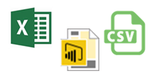

<properties
   pageTitle="Obtener datos de archivos"
   description="Obtenga información acerca de cómo importar datos desde Excel, Power BI Desktop y archivos CSV en Power BI"
   services="powerbi"
   documentationCenter=""
   authors="davidiseminger"
   manager="mblythe"
   backup=""
   editor=""
   tags=""
   qualityFocus="monitoring"
   qualityDate="04/01/2016"/>

<tags
   ms.service="powerbi"
   ms.devlang="NA"
   ms.topic="article"
   ms.tgt_pltfrm="NA"
   ms.workload="powerbi"
   ms.date="09/29/2016"
   ms.author="davidi"/>

# Obtener datos de archivos

En Power BI, puede conectarse o importar datos e informes de tres tipos de archivos.

-   Microsoft Excel (.xlsx o .xlsm)
-   Power BI Desktop (.pbix)
-   Separados por comas (.csv) de valor

## ¿Qué obtener datos desde un archivo realmente Media?

En Power BI los datos que se explora proceden de un conjunto de datos. Pero, para disponer de un conjunto de datos, primero es necesario obtener algunos datos. Para este artículo, vamos a centrar en obtener datos de archivos.

Para entender mejor la importancia de los conjuntos de datos y cómo obtenemos datos para ellos, echemos un vistazo a un automóvil. Tomar una plaza en su automóvil y examine el panel. Que es muy similar a sentado delante del equipo que se observa un panel en Power BI. El panel muestra todas las cosas que hace su automóvil; ¿con qué rapidez el motor es motor, temperatura, ¿qué dispositivos se encuentra en la velocidad, etc..

En Power BI, un conjunto de datos es como el motor de su automóvil. El conjunto de datos proporciona la información se muestra en el panel de Power BI, métricas y datos. Por supuesto su motor o conjunto de datos, necesita combustible y en Power BI, ese combustible es de datos. Un automóvil tiene un tanque de combustible que proporciona la gasolina al motor. Igual en Power BI, necesita un tanque de combustible que tiene datos que puede introducir al conjunto de datos. En nuestro caso, ese depósito es un archivo de Power BI Desktop, un archivo de libro de Excel, o una. Archivo CSV.

Nos podemos incluso si vamos un paso más. Un depósito de combustible en un automóvil debe rellenarse con gas. El gas para nuestro Power BI Desktop, Excel, o. Archivo CSV es otro origen de datos. Nos obtener datos de otro origen de datos y se coloca en una hoja de Excel, Power BI Desktop, o. Archivo CSV. Si es un libro de Excel o. Archivo CSV, podemos escribir manualmente las filas de datos. O bien, podemos conectarnos a un origen de datos externo para consultar y cargar datos en el archivo. Una vez que tenemos un archivo con algunos datos, lo conseguimos en Power BI como un conjunto de datos.

## Donde se guarda el archivo marca la diferencia

            **Local** : Si guarda el archivo en una unidad local en el equipo o en otra ubicación de su organización, desde Power BI, puede *importar* el archivo en Power BI. El archivo realmente permanecerá en la unidad local, por lo que todo el archivo no importa realmente en Power BI. ¿Qué sucede en realidad es un nuevo conjunto de datos se crea en su sitio de Power BI y datos y en algunos casos, el modelo de datos, se carga en el conjunto de datos. Si el archivo tiene algún informe aquellos aparecerá en el sitio de Power BI en informes.

            **OneDrive - Business** : si tiene OneDrive para la empresa e iniciar sesión en ella con la misma cuenta que inicie sesión en Power BI con, se trata por lejos la manera más eficaz mantener el trabajo en Excel Power BI Desktop o. Archivo CSV y su conjunto de datos, informes y paneles en Power BI en la sincronización. Como Power BI y OneDrive están en la nube, Power BI se conecta a su archivo en OneDrive sobre cada hora. Si se detectan cambios, se actualizan automáticamente el conjunto de datos, informes y paneles en Power BI.

            **OneDrive - Personal** – Si guarda los archivos en su propia cuenta de OneDrive, obtendrá muchas de las mismas ventajas como lo haría con OneDrive para la empresa. La principal diferencia es cuando se conecta primero a su archivo (mediante obtener datos > archivos > OneDrive – Personal) debe iniciar sesión en su OneDrive con su cuenta de Microsoft, que normalmente es distinta de lo que use para iniciar sesión en Power BI. Al iniciar sesión con su OneDrive con su cuenta de Microsoft, asegúrese de seleccionar el mantener la sesión en la opción. De este modo, será capaz de conectarse a su archivo sobre cada hora y asegúrese de que el conjunto de datos en Power BI está en la sincronización de Power BI.

            **Sitios de SharePoint Team** : guardar los archivos de Power BI Desktop en SharePoint, sitios de grupo es igual que el ahorro de OneDrive para la empresa. La diferencia más importante es cómo se conecta al archivo de Power BI. Puede especificar una dirección URL o conectarse a la carpeta raíz.

## ¿Listo para comenzar?
Consulte los artículos siguientes para obtener información acerca de cómo obtener el archivo en Power BI.

-   [Obtener datos de archivos de libro de Excel](articles/powerbi-service-excel-workbook-files.md)
-   [Obtener datos de archivos de Power BI Desktop](articles/powerbi-service-powerbi-desktop-files.md)
-   [Obtener datos de archivos de valores separados por comas](articles/powerbi-service-comma-separated-value-files.md)
