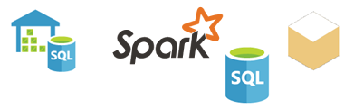

<properties
   pageTitle="Orígenes de datos para Power BI"
   description="Orígenes de datos para Power BI"
   services="powerbi"
   documentationCenter=""
   authors="davidiseminger"
   manager="mblythe"
   backup=""
   editor=""
   tags=""
   qualityFocus="identified"
   qualityDate=""/>

<tags
   ms.service="powerbi"
   ms.devlang="NA"
   ms.topic="get-started-article"
   ms.tgt_pltfrm="NA"
   ms.workload="powerbi"
   ms.date="09/29/2016"
   ms.author="davidi"/>

# Orígenes de datos para el servicio Power BI

Datos están la esencia de Power BI. Cuando está explorando los datos, crear gráficos y paneles, hacer preguntas con preguntas y respuestas, todas las visualizaciones y respuestas que verá realmente reciben sus datos subyacentes de un conjunto de datos. Pero, ¿de dónde proceden ese conjunto de datos? Bueno, de un origen de datos.

En este artículo, vamos a recorrer los distintos tipos de orígenes de datos que puede conectarse a desde el servicio Power BI. Tenga en cuenta, hay muchos otros tipos de orígenes de datos que se puede obtener datos, demasiado. Pero los pueden necesitar en primer lugar mediante Power BI Desktop o de Excel consulta avanzada de datos y características de modelado. Vamos a más información acerca de los más adelante. Por ahora, echemos un vistazo a los distintos tipos de orígenes de datos que puede conectarse a la derecha de su sitio de servicio de Power BI.

Puede obtener datos desde cualquiera de estos orígenes de datos en Power BI haciendo clic **Mi área de trabajo** > **obtener datos**.

## Archivos

            **Excel** (.xlsx, xlxm): Excel es único en que un libro puede tener tanto los datos que ha escrito en hojas de cálculo usted mismo o puede consultar y cargar datos de orígenes de datos externos mediante Power Query (obtener & transformar en Excel 2016) o Power Pivot. Datos pueden estar en hojas de cálculo simples o cargan en un modelo de datos. Para obtener más información, consulte [obtener datos desde Excel](powerbi-service-get-data-from-files.md).

            **Power BI Desktop** (.pbi): puede usar Power BI Desktop para consultar y cargar datos desde orígenes de datos externos, ampliar el modelo de datos con medidas y relaciones y crear informes. Puede importar el archivo de Power BI Desktop en el sitio de Power BI. Power BI Desktop es mejor para los usuarios más avanzados con una buena comprensión de sus orígenes de datos, consultas de datos, transformación y conceptos de modelado de datos. Para obtener más información, consulte [Conectar a datos en Power BI Desktop](powerbi-desktop-connect-to-data.md).

            **Valores separados por comas** (.csv) - son archivos de texto simple con filas de datos. Cada fila puede contener uno o varios valores, separados por punto y coma. Por ejemplo, un .csv que contiene el nombre y los datos de la dirección pueden tener un número de filas, donde cada fila tiene valores para nombre, apellido, dirección, ciudad, estado y así sucesivamente. No puede importar datos en un archivo .csv, pero muchas aplicaciones, como Excel, pueden guardar datos de tabla simple como un archivo .csv.

Para otros tipos de archivo como tabla de XML (.xml) o archivos de texto (.txt), puede utilizar obtener & transformar para consultar, transformar y cargar datos en un archivo de Excel o Power BI Desktop primero. A continuación, puede importar el archivo de Excel o Power BI Desktop en Power BI.

Donde se almacenan los archivos, una gran diferencia, hace demasiado. OneDrive para la empresa proporciona un mayor grado de flexibilidad y la integración con Power BI. Si guarda los archivos en la unidad local, que es correcta, pero si necesita actualizar los datos, intervienen unos pasos adicionales. Se proporcionan más detalles en los artículos vinculados.

## Paquetes de contenido

Paquetes de contenido contienen todos los datos y los informes que necesita ya está preparados para usted. En Power BI, hay dos tipos de paquetes de contenido; los servicios de como Google Analytics, Marketo o Salesforce y las crean y comparten con otros usuarios de su organización.

            **Servicios** : existen, literalmente, decenas de servicios con los paquetes de contenido para Power BI y más se agregan continuamente. La mayoría de servicios requiere que tenga una cuenta. Para obtener más información, consulte [conectarse a servicios](powerbi-content-packs-services.md).

            **Organización** – Si usted y otros usuarios de su organización tienen una cuenta de Power BI Pro, puede crear, compartir y usar paquetes de contenido. Para obtener más información, consulte [paquetes de contenido organizativo](powerbi-service-organizational-content-packs-introduction.md).

## Bases de datos

            **Las bases de datos en la nube** : servicio de Power BI, puede conectarse en directo a la base de datos de SQL Azure, almacenamiento de datos de SQL Azure, Spark en Hdinsight de Azure y SQL Server Analysis Services mediante DirectQuery. Las conexiones de Power BI a estas bases de datos en directo, es decir, cuando se haya conectado para indicar una base de datos de SQL Azure y comenzar a explorar sus datos mediante la creación de informes en Power BI, en cualquier momento Segmente los datos o agregar otro campo a una visualización, se realiza una consulta correcta para la base de datos. Para obtener más información, consulte [Azure y Power BI](powerbi-azure-and-power-bi.md).

            **Las bases de datos local** : servicio de Power BI, puede conectarse directamente a SQL Server Analysis Services Tabular bases de datos de modelo. Se requiere una puerta de enlace empresarial de Power BI. Si no está seguro de cómo conectarse a la base de datos de modelo tabular de su organización, consulte con el administrador o el departamento de TI. Para obtener más información, consulte [datos tabulares de SQL Server Analysis en Power BI](powerbi-sql-server-analysis-services-tabular-data.md).

Para otros tipos de bases de datos de su organización, debe utilizar primero Power BI Desktop o Excel para conectarse a, consultar y cargar datos en un modelo de datos. A continuación, puede importar el archivo en Power BI donde se crea un conjunto de datos. Si configura la actualización programada, Power BI usará la información de conexión desde el archivo junto con la configuración de actualización que puede configurar para conectarse directamente al origen de datos y consultas sobre las actualizaciones. Esas actualizaciones se cargan en el conjunto de datos en Power BI. Para obtener más información, consulte [Conectar a datos en Power BI Desktop](powerbi-desktop-connect-to-data.md).

## ¿Qué ocurre si mi datos proceden de un origen diferente?
Existen literalmente cientos de diferentes orígenes de datos que puede usar con Power BI. Pero independientemente de dónde obtener los datos, que los datos tienen que estar en un formato que se puede utilizar el servicio Power BI para crear informes y paneles, responder preguntas con preguntas y respuestas y así sucesivamente.

Algunos orígenes de datos ya tienen sus datos en un formato de lista para el servicio Power BI, como paquetes de contenido de proveedores de servicios como Google Analytics y Twilio. Bases de datos de SQL Server Analysis Services Tabular modelo estén listos, demasiado. Y puede conectarse a bases de datos en la nube como base de datos de SQL Azure y Spark en HDInsight en vivo.

En otros casos, podría ser necesario consultar y cargar los datos que desee en un archivo. Por ejemplo, supongamos que tiene datos de logística en una base de datos del almacén de datos en un servidor de su organización. En el servicio Power BI, no puede conectarse directamente a esa base de datos y empezar a explorar sus datos (a menos que es una base de datos de modelo tabular). Sin embargo, puede usar Power BI Desktop o Excel para consultar y cargar datos logística en un modelo de datos, a continuación, guardar como un archivo. A continuación, puede importar ese archivo en Power BI donde se crea un conjunto de datos.

Probablemente esté pensando "pero que cambian los datos de logística en esa base de datos cada día. Cómo asegurarse de que se actualiza el conjunto de datos en Power BI?" Información de conexión desde el archivo de Excel o Power BI Desktop se importa en el conjunto de datos junto con los datos. Si la instalación de actualización programada o realizar una actualización manual en el conjunto de datos, Power BI usará la información de conexión del conjunto de datos, junto con algunas otras configuraciones para conectarse directamente a la base de datos, consultas de actualizaciones y cargar las actualizaciones en el conjunto de datos. Una puerta de enlace de Power BI probablemente serán necesaria para proteger cualquier transferencia de datos entre el servidor local y Power BI. Las visualizaciones en informes y paneles se actualizan automáticamente.

Vea, simplemente porque no se puede conectar a la derecha del origen de datos desde el servicio Power BI no significa que no puede obtener datos en Power BI. Quizás algunos ayuda del departamento de TI y sólo puede tardar unos pocos pasos más. Consulte [orígenes de datos en Power BI Desktop](powerbi-desktop-data-sources.md) para obtener más información.

## Algunos detalles más
Verá el conjunto de datos de términos y origen de datos que se usan mucho en Power BI. A menudo se usan como sinónimos, pero que realmente son dos cosas distintas, aunque relacionados.

Un ***conjunto de datos*** se crea automáticamente en Power BI al utilizar la obtención de datos para conectarse a e importar datos desde un paquete de contenido, archivo o conexión a un origen de datos en directo. Un conjunto de datos contiene información sobre el origen de datos, las credenciales del origen de datos, y en muchos casos, un conjunto de datos secundarios se copia desde el origen de datos. En la mayoría de los casos, al crear visualizaciones en informes y paneles, busca en el conjunto de datos.

Un ***origen de datos*** es donde entra realmente los datos en un conjunto de datos de. Por ejemplo, un servicio en línea, como Google Analytics o QuickBooks, una base de datos en la nube como base de datos de SQL Azure, o base de datos o un archivo en un equipo local o el servidor en su propia organización.

### Actualización de datos
Si guarda los archivos en la unidad local o una unidad en algún lugar de su organización, una puerta de enlace de Power BI podría ser necesarios en orden para actualizar el conjunto de datos en Power BI. Y el equipo donde se guarda el archivo debe estar activado cuando se produce una actualización. También puede volver a importar el archivo o use publicar desde Excel o Power BI Desktop, pero no son procesos automatizados.

Si guardar los archivos en OneDrive para el negocio o SharePoint, sitios de equipos y conectarse o importarlos en Power BI, el conjunto de datos, informes y paneles siempre estar actualizada. Como OneDrive y Power BI están en la nube, Power BI puede conectarse directamente al archivo guardado, sobre una vez cada hora y comprobar si hay actualizaciones. Si encuentra alguno, el conjunto de datos y las visualizaciones se actualizan automáticamente.

Paquetes de contenido de servicios se actualizan automáticamente. En la mayoría de los casos, una vez al día. Puede actualizar manualmente, pero si no verá los datos actualizados se dependen del proveedor de servicio. Paquetes de contenido de otros usuarios de su organización dependerá de los orígenes de datos que se utiliza y cómo la actualización de la persona que creó el programa de instalación del paquete de contenido.

Base de datos de SQL Azure, almacenamiento de datos de SQL Azure y Spark en HDInsight de Azure son únicos en que son orígenes de datos en la nube. Porque el servicio de Power BI también está en la nube, Power BI puede conectarse a ellos en vivo, mediante DirectQuery. Lo que ve en Power BI es siempre sincronizados y no es necesario actualizar el programa de instalación.

SQL Server Analysis Services es único en que cuando se conecta a él desde Power BI, es una conexión activa como una base de datos de Azure en la nube, pero la base de datos está en un servidor de su organización. Este tipo de conexión requiere una puerta de enlace de BI de energía, que normalmente se configura de un departamento de TI.

Actualización de datos es una muy importante parte de Power BI y mucho demasiado profundas para tratar aquí. Si desea obtener una descripción completa, asegúrese de desprotección [de actualización de datos en Power BI](powerbi-refresh-data.md).
