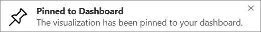

<properties
   pageTitle="Get started with Power BI"
   description="Get started with Power BI"
   services="powerbi"
   documentationCenter=""
   authors="mihart"
   manager="mblythe"
   backup=""
   editor=""
   tags=""
   qualityFocus="monitoring"
   qualityDate=""/>

<tags
   ms.service="powerbi"
   ms.devlang="NA"
   ms.topic="article"
   ms.tgt_pltfrm="NA"
   ms.workload="powerbi"
   ms.date="10/05/2016"
   ms.author="mihart"/>

# Get started with Power BI

##  Introducción

This tutorial helps you get started with Power BI service.  If you're looking for help with Power BI Desktop, see <bpt id="p1">[</bpt>Get started with Desktop<ept id="p1">](powerbi-desktop-getting-started.md)</ept>.

Microsoft Power BI helps you stay up to date with the information that matters to you.  With Power BI, <bpt id="p1">***</bpt>dashboards<ept id="p1">***</ept> help you keep a finger on the pulse of your business.  Your dashboards display <bpt id="p1">***</bpt>tiles<ept id="p1">***</ept> that you can click to open <bpt id="p2">***</bpt>reports<ept id="p2">***</ept> for exploring further.  Connect to multiple <bpt id="p1">***</bpt>datasets<ept id="p1">***</ept> to bring all of the relevant data together in one place.

Need help understanding the building blocks that make up Power BI?  See <bpt id="p1">[</bpt>Power BI - Basic Concepts<ept id="p1">](powerbi-service-basic-concepts.md)</ept>.

If you have important data in Excel or CSV files, you can create a Power BI dashboard to stay informed anywhere and share insights with others.  Do you have a subscription to a SaaS application like Salesforce?  Get a head start by <bpt id="p1">[</bpt>connecting to Salesforce<ept id="p1">](powerbi-content-pack-salesforce.md)</ept> to automatically create a dashboard from that data, or <bpt id="p2">[</bpt>check out all the other SaaS apps<ept id="p2">](powerbi-service-get-data.md)</ept> you can connect to. If you are part of an organization, see if any <bpt id="p1">[</bpt>organizational content packs<ept id="p1">](powerbi-service-organizational-content-packs-introduction.md)</ept> have been published for you.

Read about all the other ways to <bpt id="p1">[</bpt>get data for Power BI<ept id="p1">](powerbi-service-get-data.md)</ept>.

## Step 1: Get data

Here's an example of getting data from a CSV file. Want to follow along with this tutorial? <bpt id="p1">[</bpt>Download this sample CSV file<ept id="p1">](http://go.microsoft.com/fwlink/?LinkID=619356)</ept>.

1.  <bpt id="p1">[</bpt>Sign in to Power BI<ept id="p1">](http://www.powerbi.com/)</ept>. Don’t have an account? You can sign up for <bpt id="p1">[</bpt>Power BI for free<ept id="p1">]</ept><bpt id="p2">(http://www.powerbi.com/ "</bpt>try out the new Power BI Preview for free<ept id="p2">")</ept>.

1.  Power BI opens with a dashboard displayed. Select <bpt id="p1">**</bpt>Get Data<ept id="p1">**</ept> at the bottom of the left navigation pane.

    

2.  Select <bpt id="p1">**</bpt>Files<ept id="p1">**</ept>. 

    

3.  Select <bpt id="p1">**</bpt>Local File<ept id="p1">**</ept>, browse to the file on your computer, and choose <bpt id="p2">**</bpt>Open<ept id="p2">**</ept>.

    

4.  Power BI uploads the CSV file and adds it as a new dataset (the yellow asterisk indicates a new item).  Since we did not already have a dashboard, Power BI also created a new dashboard for us.  In the left navigation pane, the new dashboard is listed under the <bpt id="p1">**</bpt>Dashboards<ept id="p1">**</ept> heading, and the new dataset appears under the <bpt id="p2">**</bpt>Datasets<ept id="p2">**</ept> heading. 

    

## Step 2: Start exploring your dataset

Now that you have connected to data, explore to find insights.  When you've found something you want to monitor, you can create a dashboard to keep up-to-date with changes.

1.  Select the dataset image on the dashboard to explore the data you just connected to or, under the <bpt id="p1">**</bpt>Datasets<ept id="p1">**</ept> heading, select the dataset name to open it. This opens the dataset as a blank report.

    

    >NOTE: Another way to explore your data is <bpt id="p1">**</bpt>Quick Insights<ept id="p1">**</ept>.  For more information, see <bpt id="p1">[</bpt>Introduction to Quick Insights<ept id="p1">](powerbi-service-auto-insights.md)</ept>

2.  In the <bpt id="p1">**</bpt>Fields<ept id="p1">**</ept> list on the right side of the page, select fields to build a visualization.  Select the checkbox beside <bpt id="p1">**</bpt><ph id="ph1"></ph>Gross Sales<ept id="p1">**</ept><ph id="ph2"></ph> and  <bpt id="p2">**</bpt><ph id="ph3"></ph>Date<ept id="p2">**</ept><ph id="ph4"></ph>.

    

3.  Power BI analyzes the data and creates a visual.  If you selected <bpt id="p1">**</bpt>Date<ept id="p1">**</ept> first, you'll see a table.  If you selected <bpt id="p1">**</bpt>Gross Sales<ept id="p1">**</ept> first, you'll see a chart. Switch to a different way of displaying your data. Try changing to a line chart by selecting the line chart option.

    

4.  When you have a visualization you want on your dashboard, hover over the visualization and select the <bpt id="p1">**</bpt><ph id="ph1"></ph>Pin<ept id="p1">**</ept><ph id="ph2"></ph> icon.  When you pin this visualization, it will be stored on your dashboard so you can track the latest value at a glance.

    

5.  Because this is a new report, you need to save it before you can pin a visualization from it to the dashboard. Give your report a name (e.g., <bpt id="p1">*</bpt>Sales Over Time<ept id="p1">*</ept>) and select <bpt id="p2">**</bpt>Save and Continue<ept id="p2">**</ept>. 

    

    The new report appears in the navigation pane under the <bpt id="p1">**</bpt>Reports<ept id="p1">**</ept> heading.

6.  Pin the tile to an existing dashboard or to a new dashboard. 

    

    -   <bpt id="p1">**</bpt>Existing dashboard<ept id="p1">**</ept>: select the name of the dashboard from the dropdown.
    -   <bpt id="p1">**</bpt>New dashboard<ept id="p1">**</ept>: type the name of the new dashboard.

7.  Select <bpt id="p1">**</bpt>Pin<ept id="p1">**</ept>.

    A Success message (near the top right corner) lets you know the visualization was added, as a tile, to your dashboard.

    

8.  Open the dashboard you just created. To do this, select the name under the <bpt id="p1">**</bpt>Dashboards<ept id="p1">**</ept> heading in the left navigation pane. Because the dashboard is new, it will have a yellow asterisk. The line chart is pinned, as a tile, to the dashboard. Make your dashboard even better by <bpt id="p1">[</bpt>renaming, resizing, linking, and repositioning tiles<ept id="p1">](powerbi-service-edit-a-tile-in-a-dashboard.md)</ept>.

    

    Select the new tile on your dashboard to return to the report any time.

##  Step 3: Continue exploring with Q&amp;A (natural language querying)

1.  For a quick exploration of your data, try asking a question in the Q&amp;A box. The Q&amp;A question box is located at the top of your dashboard. For example, try typing "<bpt id="p1">**</bpt>what segment had the most revenue<ept id="p1">**</ept>".

    

1. Select the pin icon <ph id="ph1"></ph> to show this visualization on your dashboard too.

2. Pin the visualization to the Financial Sample dashboard.

    

3. Select the back arrow <ph id="ph1"></ph> to return to your dashboard where you'll see the new tile.

Ready to try more?  Here are some great ways to explore more of Power BI.

-   <bpt id="p1">[</bpt>Connect to another dataset<ept id="p1">](powerbi-service-get-data.md)</ept>.
-   <bpt id="p1">[</bpt>Share your dashboard<ept id="p1">](powerbi-service-share-unshare-dashboard.md)</ept> with your colleagues.
-   Read <bpt id="p1">[</bpt>tips for designing dashboards<ept id="p1">](powerbi-service-tips-for-designing-a-great-dashboard.md)</ept>.
-   View your dashboards with a <bpt id="p1">[</bpt>Power BI app on a mobile device<ept id="p1">](powerbi-power-bi-apps-for-mobile-devices.md)</ept>

Not quite ready to jump right in? Start with these topics designed to help you feel comfortable with Power BI.

-   [Learn how reports, datasets, dashboards, and tiles all fit together](powerbi-service-basic-concepts.md)
-   [Power BI videos](powerbi-videos.md)
-   [See what samples we have available for you to use](powerbi-sample-datasets.md)

### Stay in touch with Power BI

-   Follow <bpt id="p1">[</bpt>@MSPowerBI on Twitter<ept id="p1">](https://twitter.com/mspowerbi)</ept>
-   Subscribe to our <bpt id="p1">[</bpt>YouTube video channel<ept id="p1">](https://www.youtube.com/channel/UCy--PYvwBwAeuYaR8JLmrfg)</ept>
-   Watch our <bpt id="p1">[</bpt>Power BI Getting Started webinars<ept id="p1">](powerbi-webinars.md)</ept> on demand
-  More questions? [Try the Power BI Community](http://community.powerbi.com/)
