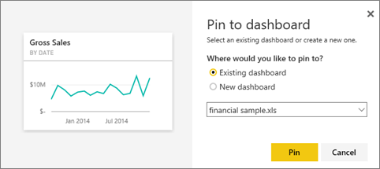

<properties
   pageTitle="Introducción a Power BI"
   description="Introducción a Power BI"
   services="powerbi"
   documentationCenter=""
   authors="mihart"
   manager="mblythe"
   backup=""
   editor=""
   tags=""
   qualityFocus="monitoring"
   qualityDate=""/>

<tags
   ms.service="powerbi"
   ms.devlang="NA"
   ms.topic="article"
   ms.tgt_pltfrm="NA"
   ms.workload="powerbi"
   ms.date="10/05/2016"
   ms.author="mihart"/>

# Introducción a Power BI

##  Introducción

Este tutorial le ayudará a empezar a trabajar con el servicio Power BI.  Si desea obtener ayuda con Power BI Desktop, consulte [Introducción a Desktop](powerbi-desktop-getting-started.md).

Microsoft Power BI le ayuda a mantenerse al día con la información que es importante para usted.  Con Power BI, ***paneles*** le ayuda a tener un dedo en el pulso de su negocio.  Los paneles muestran ***mosaicos*** que puede hacer clic para abrir ***informes*** para explorar aún más.  Conectar a varios ***conjuntos de datos*** para mostrar todos los datos relevantes juntos en un solo lugar.

¿Necesita ayuda para comprender los bloques de creación que conforman Power BI?  Consulte [BI: conceptos básicos de energía](powerbi-service-basic-concepts.md).

Si tiene datos importantes en los archivos de Excel o CSV, puede crear un panel de Power BI para mantenerse informado en cualquier lugar y compartir conocimientos con otros usuarios.  ¿Tiene una suscripción a una aplicación de SaaS como Salesforce?  Obtenga un avance [conectarse a Salesforce](powerbi-content-pack-salesforce.md) para crear automáticamente un panel de datos, o [retirar todas las aplicaciones SaaS](powerbi-service-get-data.md) puede conectarse a. Si forma parte de una organización, ver si algún [paquetes de contenido organizativo](powerbi-service-organizational-content-packs-introduction.md) se han publicado para usted.

Obtenga información acerca de todas las formas a [obtener datos para Power BI](powerbi-service-get-data.md).

## Paso 1: Obtener los datos

Este es un ejemplo de cómo obtener datos desde un archivo CSV. ¿Desea seguir este tutorial? 
            [Descargue este archivo CSV de ejemplo](http://go.microsoft.com/fwlink/?LinkID=619356).

1.  
            [Inicie sesión Power BI](http://www.powerbi.com/). ¿No tiene una cuenta? Puede registrarse para [Power BI para liberar](http://www.powerbi.com/ "Pruebe gratuitamente la nueva vista previa de Power BI").

1.  Power BI se abre con un panel que se muestra. Seleccione **obtener datos** en la parte inferior del panel de navegación izquierdo.

    

2.  Seleccione **archivos**. 

    

3.  Seleccione **archivo Local**, busque el archivo en el equipo y elija **abiertos**.

    

4.  Power BI carga el archivo CSV y lo agrega como un nuevo conjunto de datos (el asterisco amarillo indica un nuevo elemento).  Puesto que ya no ha habido un panel, Power BI también crea un nuevo panel para nosotros.  En el panel de navegación izquierdo, el nuevo panel aparece bajo la **paneles** título y el nuevo conjunto de datos aparece en la **conjuntos de datos** encabezado. 

    

## Paso 2: Empezar a explorar el conjunto de datos

Ahora que ha conectado a datos, explore para encontrar información.  Cuando haya encontrado algo que desea supervisar, puede crear un panel para mantenerse actualizado con los cambios.

1.  Seleccione la imagen del conjunto de datos en el panel para explorar los datos que acaba de conectarse a o, bajo la **conjuntos de datos** título, seleccione el nombre del conjunto de datos para abrirla. Esto abre el conjunto de datos como un informe en blanco.

    

    >NOTA: Es otra manera de explorar los datos **profundas**.  Para obtener más información, consulte [Introducción rápida visión](powerbi-service-auto-insights.md)

2.  En la **campos** en el lado derecho de la página, seleccione los campos para crear una visualización.  Seleccione la casilla de verificación situada junto a **ventas brutas** y  **fecha**.

    

3.  Power BI analiza los datos y crea un objeto visual.  Si seleccionó **fecha** en primer lugar, verá una tabla.  Si seleccionó **ventas brutas** en primer lugar, verá un gráfico. Cambiar a una forma diferente de mostrar los datos. Intente cambiar a un gráfico de líneas, seleccione la opción de gráfico de línea.

    

4.  Cuando tenga una visualización que desee en el panel, mantenga el mouse sobre la visualización y seleccione el **Pin** icono.  Anclar esta visualización, se almacenan en el panel para que pueda seguir el valor más reciente de un vistazo.

    

5.  Se trata de un nuevo informe, debe guardarlo antes de poder anclar una visualización del mismo en el panel. Asigne un nombre a un informe (por ejemplo, *ventas sobre tiempo*) y seleccione **Guardar y continuar**. 

    

    Aparece el nuevo informe en el panel de navegación en el **informes** encabezado.

6.  Anclar el mosaico a un panel existente o a un nuevo panel. 

    

    -   
            **Panel existente**: seleccione el nombre del panel en la lista desplegable.
    -   
            **Nuevo panel**: escriba el nombre del nuevo panel.

7.  Seleccione **Pin**.

    Un mensaje de confirmación (cerca de la esquina superior derecha) le permite conocer que la visualización se ha agregado, como un icono al escritorio.

    

8.  Abrir el panel que acaba de crear. Para ello, seleccione el nombre de la **paneles** título en el panel de navegación izquierdo. Dado que el panel es nuevo, tendrá un asterisco amarillo. El gráfico de líneas está anclado, como un icono en el panel. Haga que el panel aún mejor [cambiar el nombre, el cambio de tamaño, vinculación y reubicando los mosaicos](powerbi-service-edit-a-tile-in-a-dashboard.md).

    

    Seleccione el icono nuevo en el panel para volver al informe en cualquier momento.

##  Paso 3: Continuar explorando con preguntas y respuestas (consulta de lenguaje natural)

1.  Para una exploración rápida de los datos, intente formular una pregunta en el cuadro de preguntas y respuestas. El cuadro de pregunta de preguntas y respuestas se encuentra en la parte superior del panel. Por ejemplo, pruebe a escribir "**qué departamento tuvo más ingresos**".

    

1. Seleccione el icono de pin  para mostrar esta visualización en el panel demasiado.

2. Anclar la visualización en el panel de ejemplo financieros.

    

3. Seleccione la flecha Atrás  para volver al panel donde podrá ver el nuevo icono.

¿Listo para probar más?  Estas son algunas formas de explorar más de Power BI.

-   
            [Conectarse a otro conjunto de datos](powerbi-service-get-data.md).
-   
            [Compartir el escritorio](powerbi-service-share-unshare-dashboard.md) con sus colegas.
-   Lectura [sugerencias para diseñar paneles](powerbi-service-tips-for-designing-a-great-dashboard.md).
-   Ver sus paneles con un [aplicación Power BI en un dispositivo móvil](powerbi-power-bi-apps-for-mobile-devices.md)

¿No es bastante listo para lanzarse? Comience con estos temas diseñados para ayudarle a sentirse cómodo con Power BI.

-   [Obtenga información acerca de cómo funcionan conjuntamente los informes, conjuntos de datos, paneles y mosaicos](powerbi-service-basic-concepts.md)
-   [Vídeos de Power BI](powerbi-videos.md)
-   [Vea los ejemplos que tenemos disponible para su uso](powerbi-sample-datasets.md)

### Mantente en contacto con Power BI

-   Siga [@MSPowerBI en Twitter](https://twitter.com/mspowerbi)
-   Suscríbase a nuestro [canales de vídeo de YouTube](https://www.youtube.com/channel/UCy--PYvwBwAeuYaR8JLmrfg)
-   Vea nuestros [seminarios Web de introducción a Power BI](powerbi-webinars.md) a petición
-  ¿Preguntas más frecuentes? [Pruebe la Comunidad de Power BI](http://community.powerbi.com/)
