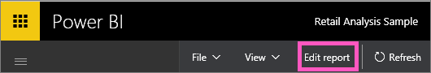

<properties
   pageTitle="Go from Reading View to Editing View in Power BI"
   description="Go from Reading View to Editing View in Power BI"
   services="powerbi"
   documentationCenter=""
   authors="mihart"
   manager="mblythe"
   backup=""
   editor=""
   tags=""
   qualityFocus="no"
   qualityDate=""/>

<tags
   ms.service="powerbi"
   ms.devlang="NA"
   ms.topic="article"
   ms.tgt_pltfrm="NA"
   ms.workload="powerbi"
   ms.date="08/25/2016"
   ms.author="mihart"/>

# Go from Reading View to Editing View in Power BI

In Editing View in Power BI (compared to <bpt id="p1">[</bpt>Reading View<ept id="p1">](powerbi-service-interact-with-a-report-in-reading-view.md)</ept>) you can dig even deeper into your data by adding and removing fields, changing visualization type, creating new visualizations, and adding and deleting visualizations and pages from the report.  To edit a report, you must be the owner of the report.

1.  In Reading View, select <bpt id="p1">**</bpt>Edit Report<ept id="p1">**</ept>. 

    

    The report is now in Editing View and uses the same <bpt id="p1">[</bpt>display settings<ept id="p1">](powerbi-service-change-report-display-settings.md)</ept> you last used in Reading View.

2. To return to <bpt id="p1">**</bpt>Reading View<ept id="p1">**</ept>, select Reading View from the top navigation bar.

    

There are so many ways to <bpt id="p1">[</bpt>edit your report<ept id="p1">](powerbi-service-interact-with-a-report-in-editing-view.md)</ept>, slicing and dicing your data to discover insights and get answers to questions.  The next topic, <bpt id="p1">[</bpt>Interact with a report in Editing View<ept id="p1">](powerbi-service-interact-with-a-report-in-editing-view.md)</ept>, lists and describes these in detail.

## Consulte también

Read more about <bpt id="p1">[</bpt>reports in Power BI<ept id="p1">](powerbi-service-reports.md)</ept>

[Get started with Power BI](powerbi-service-get-started.md)

[Power BI - Basic Concepts](powerbi-service-basic-concepts.md) 

More questions? [Try the Power BI Community](http://community.powerbi.com/) 
