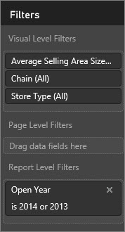
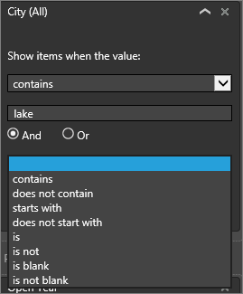

<properties
   pageTitle="Dé un paseo por el panel de filtros"
   description="Cómo usar filtros de informe"
   services="powerbi"
   documentationCenter=""
   authors="mihart"
   manager="mblythe"
   backup=""
   editor=""
   tags=""
   qualityFocus="monitoring"
   qualityDate=""/>

<tags
   ms.service="powerbi"
   ms.devlang="NA"
   ms.topic="article"
   ms.tgt_pltfrm="NA"
   ms.workload="powerbi"
   ms.date="10/24/2016"
   ms.author="mihart"/>

# Dé un paseo por el panel de filtros de informe
Este artículo analiza profunda en el panel de filtros del informe. Verá el panel de vista de edición y en la vista de lectura para los informes de Power BI.

Hay muchas maneras diferentes para filtrar los datos en Power BI y se recomienda leer primero [sobre los filtros y resaltado](powerbi-service-about-filters-and-highlighting-in-reports).

## Trabajar con filtros  
Se pueden abrir informes en [vista de edición](powerbi-service-interact-with-a-report-in-editing-view.md) o [vista lectura](powerbi-service-interact-with-a-report-in-reading-view.md). En la vista de edición, los propietarios del informe pueden [Agregar filtros a un informe](powerbi-service-add-a-filter-to-a-report) y esos filtros se guardan con el informe. Las personas a ver el informe en la vista de lectura puede interactuar con los filtros, pero no puede guardar los cambios en los filtros para el informe.

## Filtros en la vista de lectura

Cuando un informe se abre en la vista de lectura, el panel de filtros se muestra en el lado derecho del lienzo del informe.  

>[AZURE.NOTE] Si no ve el panel, seleccione la flecha en la esquina superior derecha para expandirla.

En este ejemplo, hemos seleccionado un elemento visual que cuente con filtros de 6. La página del informe también tiene filtros, que se muestran en el **filtros de nivel de página** encabezado. Y todo el informe tiene un filtro demasiado:  **FiscalYear** es 2013 o 2014.  

Algunos de los filtros tienen la palabra **todos los** junto a ellos y esto significa que el campo completo se incluye como un filtro.  Por ejemplo, **Chain(All)** en la captura de pantalla siguiente indica que esta página del informe incluye datos sobre todas las cadenas de la tienda.  Por otro lado, el nivel de informe de filtro de **FiscalYear es 2013 o 2014** nos indica que el informe sólo incluye los datos de los años fiscales de 2013 y 2014.

Cualquiera que vea este informe puede interactuar con estos filtros.

-    ver los detalles del filtro, el mouse y seleccione la flecha situada junto al filtro.

      

-  Cambie el filtro, por ejemplo, cambie **Lindseys** a **modas directa**.

      

-  eliminar el filtro seleccionando el **x** junto al nombre del filtro.

   >[AZURE.NOTE]  Eliminar un filtro quita de la lista, pero no elimina los datos del informe.  Por ejemplo, si elimina el **FiscalYear es 2013 o 2014** filtro, el año fiscal datos permanecerán en el informe pero no ya se filtrará para mostrar solo 2013 y 2014; mostrará todos los años fiscales contienen los datos.  Sin embargo, una vez eliminado el filtro, no podrá modificarlo desde que se quita de la lista. Es una mejor opción Borrar el filtro seleccionando el icono de borrador .

   

## Filtros en la vista de edición

Cuando un informe se abre en la vista de edición, las pantallas de panel de filtros en el lado derecho del informe lienzo en la parte inferior de la mitad el **panel de visualización**.

            .  

>[AZURE.NOTE] Si no ve el panel, seleccione la flecha en la esquina superior derecha para expandirla.

Si no se selecciona ningún visual en el lienzo, el panel filtros muestra sólo los filtros que se aplican a la página de informe completo y a todo el informe (si se ha establecido). En el ejemplo siguiente, no se selecciona ningún visual y no hay ningún filtro de nivel de página pero hay un filtro de nivel de informe.  
  

Si se selecciona un elemento visual en el lienzo, también verá los filtros que se aplican a sólo ese visual:  

Para mostrar las opciones para un filtro determinado, seleccione la flecha abajo situada junto al nombre del filtro.  En el ejemplo siguiente, se establece el filtro de nivel de informe en 2013 y 2014. Y este es un ejemplo de **filtrado básico**.  Para mostrar las opciones avanzadas, seleccione **filtrado avanzado**.

## Borrar un filtro  
 En el modo de filtrado avanzado o básico, seleccione el icono de borrador   para restablecer el filtro. 

##   Agregar un filtro
-  Para agregar un filtro a un informe o una página, seleccione un campo desde el panel campos y arrástrelo por debajo del **filtros de nivel de informe**  o **página filtros de nivel de** encabezado, donde verá las palabras **arrastre aquí los campos de datos**. Una vez que se ha agregado un campo como un filtro, ajustar mediante el filtrado básico y avanzado filtrado controles (descritos a continuación).

-  Es una manera de agregar un filtro a un objeto visual con los campos que se utiliza para crear que visual. En primer lugar, seleccione un elemento visual para activarlo. Los campos que se utilizan en el objeto visual se muestran en el panel de visualizaciones y en el panel de filtros en el **filtros de nivel Visual** encabezado.

      

    Ajustar cualquiera de estos campos mediante el filtrado básico y avanzado filtrado controles (descritos a continuación).

-  Otra manera de agregar un filtro a un objeto visual es arrastrar y colocar un campo en el **filtros de nivel Visual** depósito. Arrastrar un campo nuevo aquí no agrega ese campo a visual, pero permite al filtro que visual con este nuevo campo. En el ejemplo siguiente, **cadena** se agrega como un nuevo filtro para el objeto visual. Tenga en cuenta que si se agrega simplemente **cadena** como un filtro no modifica el objeto visual hasta que utilice básica o avanzada controles de filtrado.

    

## Tipos de filtros: filtros de campo de texto  
### Modo de lista  
Una casilla de verificación la cuenta atrás o selecciona o anula la selección del valor. El **todas las** casilla se puede utilizar para cambiar el estado de todas las casillas de verificación Activar o desactivar. Las casillas de verificación representan todos los valores disponibles para ese campo.  Al ajustar el filtro, la redefinición se actualiza para reflejar las opciones elegidas. 

Tenga en cuenta cómo la rectificación ahora dice "es Amarilla o Carretera"

### Modo avanzado  
Seleccione **filtrado avanzado** para cambiar al modo avanzado. Utilice los controles de lista desplegable y cuadros de texto para identificar los campos que desea incluir. Eligiendo entre **y** y **o**, puede crear expresiones de filtro complejas. Haga clic en el **Aplicar filtro** botón cuando haya establecido los valores que desee.  

## Tipos de filtros: filtros de campo numérico  
### Modo de lista  
Si los valores son limitados, seleccione el nombre del campo muestra una lista.  Consulte **filtros de campo de texto** &gt; **modo de lista** anteriormente para obtener ayuda con las casillas de verificación.   

### Modo avanzado  
Si los valores son infinitos o representan un intervalo, seleccione el nombre del campo abre el modo de filtro avanzado. Utilice la lista desplegable y cuadros de texto para especificar un intervalo de valores que desea ver. 

Eligiendo entre **y** y **o**, puede crear expresiones de filtro complejas. Seleccione el **Aplicar filtro** botón cuando haya establecido los valores que desee.

## Tipos de filtros: fecha y hora  
### Modo de lista  
Si los valores son limitados, seleccione el nombre del campo muestra una lista.  Consulte **filtros de campo de texto** &gt; **modo de lista** anteriormente para obtener ayuda con las casillas de verificación.   

### Modo avanzado  
Si los valores de campo representan la fecha u hora, puede especificar una hora de inicio y finalización utilizando la fecha y hora cuando filtra.  

## Consulte también  

            [Filtros y resaltado en informes](powerbi-service-about-filters-and-highlighting-in-reports.md)  

            [Interactuar con los filtros y resaltado en la vista de lectura de informe](powerbi-service-interact-with-a-report-in-reading-view.md)  

            [Crear filtros en la vista de edición](powerbi-service-add-a-filter-to-a-report.md)  

            [Cambiar elementos visuales de informe filtro cruzado y resaltan entre sí](powerbi-service-visual-interactions.md)

Obtenga más información sobre [informes de Power BI](powerbi-service-reports.md)  

            [Power BI: conceptos básicos](powerbi-service-basic-concepts.md)

¿Preguntas más frecuentes? 
            [Pruebe la Comunidad de Power BI](http://community.powerbi.com/)
