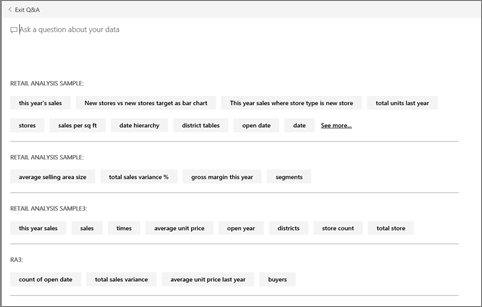

<properties
   pageTitle="Uso de Power BI Q & A"
   description="Uso de Power BI Q & A"
   services="powerbi"
   documentationCenter=""
   authors="mihart"
   manager="mblythe"
   backup=""
   editor=""
   tags=""
   featuredVideoId="qMf7OLJfCz8"
   qualityFocus="no"
   qualityDate=""/>

<tags
   ms.service="powerbi"
   ms.devlang="NA"
   ms.topic="article"
   ms.tgt_pltfrm="NA"
   ms.workload="powerbi"
   ms.date="08/23/2016"
   ms.author="mihart"/>

# Uso de Power BI Q & A  

## Formule preguntas de los datos con lenguaje natural  
El cuadro de pregunta de preguntas y respuestas es donde escribe su pregunta con lenguaje natural. Preguntas y respuestas que reconoce las palabras que escribe y cifras dónde (qué conjunto de datos) encontrar la respuesta. Preguntas y respuestas también le ayuda a formar la pregunta con Autocompletar, redefinición y otros textual y ayudas visuales.

La respuesta a su pregunta se muestra como una visualización interactiva y actualizaciones que modifique la pregunta.

Preguntas y respuestas es interactiva e incluso divertido y, más a menudo de no conducirá una pregunta a muchos otros como las visualizaciones revelan interesantes rutas llevar a cabo. Vea Amanda muestran el uso de preguntas y respuestas para crear elementos visuales, profundizar en los elementos visuales y anclar en paneles.

<iframe width="560" height="315" src="https://www.youtube.com/embed/qMf7OLJfCz8?list=PL1N57mwBHtN0JFoKSR0n-tBkUJHeMP2cP" frameborder="0" allowfullscreen></iframe>

## Usar lenguaje natural para formular preguntas acerca de los datos

1.  Coloque el cursor en el cuadro de pregunta. Antes de comenzar a escribir, preguntas y respuestas muestra una nueva pantalla con sugerencias que le ayudarán a formar su pregunta.

      

    Esta lista contiene:  
    - las preguntas que se usa para crear [mosaicos ](powerbi-service-dashboard-tiles.md)que ya están anclados al panel, y  

    - el nombre de tablas en el [subyacente conjuntos de datos](powerbi-service-get-data.md).  

    Siempre puede elegir una de estas preguntas como punto de partida y continuar perfeccionando la pregunta para encontrar la respuesta concreta que está buscando.  O bien, utilice un nombre de tabla para ayudarle a una pregunta nueva de word.

2.  Seleccione en la lista desplegable o comience a escribir su pregunta.  
    

3.  Como se escriba un signo de interrogación, Power BI Q & A toma lo mejor [visualización ](powerbi-service-visualization-types-for-reports-and-q-and-a.md)para mostrar la respuesta; y los cambios de visualización dinámicamente como modificar la pregunta. Preguntas y respuestas también le ayuda a formular la pregunta de Autocompletar, reformular la pregunta y con otras ayudas textuales y visuales.  
    

4.  Al escribir una consulta, Power BI busca respuestas en cualquier conjunto de datos que tenga un icono en ese panel.  Si todos los iconos son de *conjunto de datos a*, entonces su respuesta procederá de *conjunto de datos a*.  Si hay iconos del *conjunto de datos a *y *conjunto de datos b*, a continuación, preguntas y respuestas buscará la mejor respuesta de esos conjuntos de 2 datos.

    Los conjuntos de datos que se utilizan para crear la visualización aparece debajo de la visualización.  

    >
    >            **Sugerencia:** tenga cuidado si sólo dispone de un mosaico de *conjunto de datos a *y quitarlo de su escritorio, preguntas y respuestas dejará de tener acceso a *conjunto de datos a*.

5.  Cuando esté satisfecho con el resultado, [anclar la visualización a un panel](powerbi-service-pin-a-tile-to-a-dashboard-from-the-question-box.md) seleccionando el icono de pin en la esquina superior derecha.

    

## Indicar las preguntas y respuestas visualización que usar.  
Con preguntas y respuestas, no sólo puede solicitar los datos para hablar por sí misma, puede indicar cómo desea que se muestre. Simplemente agregue "como un &lt;tipo de visualización&gt;" al final de su pregunta.  Por ejemplo, "Mostrar volumen de inventario por planta como un mapa" y "Mostrar total del inventario como una tarjeta".  Inténtelo usted mismo.

## ¿Cómo preguntas y respuestas cómo responder a preguntas?  
### ¿Los conjuntos de datos hace un uso de preguntas y respuestas?

¿Cómo preguntas y respuestas cómo responder a preguntas específicas de datos? Se basa en los nombres de tablas, columnas y campos calculados en el dataset subyacente. Por lo que lo que usted (o el propietario del conjunto de datos) a cada cosa es importante! 

Por ejemplo, suponga que tiene una tabla de Excel denominada "Ventas", con columnas tituladas "Product", "Mes", "Unidades vendidas", "Ventas brutas" y "Beneficios". Puede hacer preguntas acerca de cualquiera de esas entidades.  Podría pedir "Mostrar *ventas"*, "total *beneficios *por *mes"*, "ordenación *productos *por *unidades vendidas"*, y mucho más.

Preguntas y respuestas pueden responder a preguntas que se basan en cómo se organiza el conjunto de datos. ¿Cómo funcionaría esto para datos de Salesforce? Cuando se conecta a su cuenta de salesforce.com, Power BI genera automáticamente un panel.  Antes de empezar a plantear preguntas con preguntas y respuestas, eche un vistazo en los datos mostrados en las visualizaciones de panel y en los datos mostrados en la lista desplegable de preguntas y respuestas.

-   Si las etiquetas del eje y los valores de las visualizaciones incluir "ventas", "cuenta", "mes" y "oportunidades", con confianza puede hacer preguntas como: "que *cuenta *tiene el mejor *oportunidad*", o "Mostrar *ventas *por mes como un gráfico de barras".
 
-   Si la lista desplegable incluye "comercial", "estado" y "year", entonces puede confidencialmente hacer preguntas como: "que *vendedor *tenía la menor *ventas *en *Florida* en *2013*."

Si tiene datos de rendimiento del sitio Web de Google Analytics, podría pedir a preguntas y respuestas sobre el tiempo invertido en una página web, el número de visitas de página única y las tasas de contratación de usuario. O bien, si está consultando datos demográficos, podría preguntar sobre la edad y los ingresos por ubicación.

### ¿Visualización que hace un uso de preguntas y respuestas?  
Preguntas y respuestas escoge la mejor visualización basada en los datos que se muestran. A veces los datos en los conjuntos de datos subyacente se definen como un tipo determinado o una categoría y esto ayuda a preguntas y cómo mostrarlo. Por ejemplo, si los datos se definen como un tipo de fecha, es más probable que se mostrará como un gráfico de líneas. Datos que se clasifica por categorías como una ciudad son más probables que se mostrará como un mapa.

También puede indicar a preguntas y visualización que use agregando a su pregunta. Pero tenga en cuenta que es no siempre posible para preguntas y respuestas para mostrar los datos en el tipo de visualización que ha solicitado.

Para obtener información sobre las palabras clave que reconoce preguntas y respuestas, vea [sugerencias para hacer preguntas](powerbi-service-q-and-a-tips.md).

## Consulte también  
Volver al [preguntas y respuestas en Power BI](powerbi-service-q-and-a.md)  
[Tutorial: Usar preguntas y respuestas con el ejemplo de ventas minoristas](powerbi-service-tutorial-introduction-to-q-and-a.md)  
[Sugerencias para hacer preguntas acerca de preguntas y respuestas](powerbi-service-q-and-a-tips.md)  
[Preparar un libro para preguntas y respuestas](powerbi-service-make-your-data-work-well-with-q-and-a.md)  
[Anclar un icono en el panel de preguntas y respuestas](powerbi-service-pin-a-tile-to-a-dashboard-from-the-question-box.md)  

¿Preguntas más frecuentes? [Pruebe la Comunidad de Power BI](http://community.powerbi.com/)
