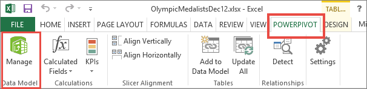

<properties
   pageTitle="Hipervínculos en tablas"
   description="Hipervínculos en tablas"
   services="powerbi"
   documentationCenter=""
   authors="mihart"
   manager="mblythe"
   backup=""
   editor=""
   tags=""
   qualityFocus="identified"
   qualityDate=""/>

<tags
   ms.service="powerbi"
   ms.devlang="NA"
   ms.topic="article"
   ms.tgt_pltfrm="NA"
   ms.workload="powerbi"
   ms.date="10/05/2016"
   ms.author="mihart"/>
# Hipervínculos en tablas

Este tema le enseña a crear y trabajar con hipervínculos en tablas y matrices.  Las direcciones URL en Power BI (matrices y tablas) pueden funcionar como hipervínculos. Texto subrayado en una tabla o matriz que cambia de color al mantener el mouse sobre él, es un hipervínculo.  Al hacer clic en él, llevará a la dirección URL vinculada. 

>
>            **NOTA**: también se pueden agregar hipervínculos a [iconos en los paneles](powerbi-service-edit-a-tile-in-a-dashboard.md), [cuadros de texto en los informes](powerbi-service-add-a-hyperlink-to-a-text-box.md), y [cuadros de texto en los paneles de](powerbi-service-add-a-widget-to-a-dashboard.md).

## Para crear un hipervínculo en Power BI tabla o matriz

Hipervínculos en tablas y matrices se pueden crear en Power BI Desktop, pero no desde el servicio Power BI. Los hipervínculos también pueden crearse en Excel PowerPivot antes de importa el libro en Power BI. Ambos métodos se describen a continuación.

## Crear un hipervínculo de la tabla o matriz en Power BI Desktop
El procedimiento para agregar un hipervínculo depende de si ha importado los datos o conectados mediante DirectQuery. A continuación se describen ambos escenarios.

### Para los datos importados en Power BI  

1. Si el hipervínculo ya no existe como un campo en el conjunto de datos, utilice escritorio para agregarlo como un [columna personalizada](powerbi-desktop-common-query-tasks.md).

2. Seleccione la columna y, en la **modelado** ficha elija la lista desplegable de **categoría datos**.

    

3. Seleccione **dirección URL Web**.

4. Cambie a la vista de informe y crear una tabla o matriz mediante el campo que se clasifica por categorías como una dirección URL Web. Los hipervínculos será azul y subrayado.

    

4. 
            [Publicar el informe desde el escritorio al servicio Power BI](powerbi-learning-4-1-publish-reports.md) y abra el informe en el servicio Power BI. Los hipervínculos funcionará allí también.

### Para los datos relacionados con DirectQuery

No podrá crear una nueva columna en el modo DirectQuery.  Pero si los datos ya contienen las direcciones URL, puede desactivar aquellos en los hipervínculos.

2. En la vista de informe, crear una tabla con un campo que contiene las direcciones URL.

3. Seleccione la columna y, en la **modelado** ficha, elija la lista desplegable de **categoría datos**.

3. Seleccione **dirección URL Web**. Los hipervínculos será azul y subrayado.

4. 
            [Publicar el informe desde el escritorio al servicio Power BI](powerbi-learning-4-1-publish-reports.md) y abra el informe en el servicio Power BI. Los hipervínculos funcionará allí también.

## Crear un hipervínculo de la tabla o matriz en Excel PowerPivot

1.  Abra el libro en Excel.

2.  Seleccione el **PowerPivot** ficha y, a continuación, elija **administrar**.

    

3.  Cuando se abre Power Pivot, seleccione la **avanzadas **ficha.

    

4.  Coloque el cursor en la columna que contiene las direcciones URL que desea convertir en hipervínculos en tablas de Power BI.

    >
            **NOTA**: direcciones URL debe comenzar con cualquiera **http://, https://** o **www**.

5.  En la **Propiedades de informes de** grupo, seleccione el **categoría datos** lista desplegable y elija **dirección URL Web**. 

    

6.  Desde el servicio Power BI, conéctese a este libro.

7.  Crear una visualización de la tabla que incluye el campo de dirección URL.

    

## Consulte también

[Visualizaciones en informes de Power BI](powerbi-service-visualizations-for-reports.md)

[Power BI: conceptos básicos](powerbi-service-basic-concepts.md)

¿Preguntas más frecuentes? [Pruebe la Comunidad de Power BI](http://community.powerbi.com/)
