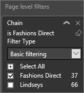

<properties
   pageTitle="Interact with a report in Reading View in Power BI"
   description="Interact with a report in Reading View in Power BI"
   services="powerbi"
   documentationCenter=""
   authors="mihart"
   manager="mblythe"
   backup=""
   editor=""
   tags=""
   qualityFocus="monitoring"
   qualityDate=""/>

<tags
   ms.service="powerbi"
   ms.devlang="NA"
   ms.topic="article"
   ms.tgt_pltfrm="NA"
   ms.workload="powerbi"
   ms.date="08/20/2016"
   ms.author="mihart"/>

# Interact with a report in Reading View in Power BI

##  Reading view

Reading view is not as interactive as Editing view, but it still gives you many options for exploring the data. Which comes in useful when viewing reports <bpt id="p1">[</bpt>shared with you<ept id="p1">](powerbi-service-share-unshare-dashboard.md)</ept>, since these can only be opened in Reading View.

In Reading View you can cross-highlight and cross-filter visuals on a page.  Simply highlight or select  a value in one visual and instantly see its impact on the other visuals. Use the Filter pane to add and modify filters on a report page, and change the way values are sorted in a visualization. Reading view is a fun and safe way to play with and get to know your data.

##  Cross-highlight the related visualizations on a page

The visualizations on a single report page are all "connected" to each other.  What this means is that if you select one or more values in one visualization, other visualizations will change based on that selection.

>[AZURE.NOTE] To select more than one element in a visualization, hold down the CTRL key.

##  Hover over visual elements to see the details

##  Sort the data in a visualization

Select the ellipses (...) to open <bpt id="p1">**</bpt>Sort by<ept id="p1">**</ept>. Select the dropdown arrow to choose which field to sort by or select the AZ icon to switch between ascending and descending.    

 

##  Interact with filters

If the report author added filters to a page in a report, you can interact with them in Reading View. Changes you make will not be saved with the report.

1.  Select the Filter icon in the upper-right corner.

      

2.  You'll see all filters that have been applied to the visual you have selected (Visual level filters), across the whole report page (Page level filters), and across the entire report (Report level filters).

    

3.  Hover over a filter and expand it by selecting the down arrow.

    

4.  Make changes to the filters and see how the visuals are impacted. Here are a few to try:

    -   Filter on <bpt id="p1">**</bpt>Fashions Direct<ept id="p1">**</ept> instead of <bpt id="p2">**</bpt>Lindseys<ept id="p2">**</ept> by removing the checkmark from one and adding it to the other.

        

    -   Or completely removing filtering on <bpt id="p1">**</bpt>Chain<ept id="p1">**</ept> by selecting the eraser icon <ph id="ph1"></ph> or by adding a checkmark to the <bpt id="p2">**</bpt>Fashions Direct<ept id="p2">**</ept> box.

    -   Select the <bpt id="p1">**</bpt>District<ept id="p1">**</ept> page level filter and switch to <bpt id="p2">**</bpt>Advanced filtering<ept id="p2">**</ept>. Filter to show only districts that start with <bpt id="p1">**</bpt>FD<ept id="p1">**</ept> and don't contain the number 4.

        

##      Zoom in on individual visuals

Hover over a visual and select the <bpt id="p1">**</bpt>Focus mode<ept id="p1">**</ept> icon <ph id="ph1"></ph>. When you view a visualization in Focus mode, it expands to fill the entire report canvas.

For more information, see <bpt id="p1">[</bpt>Add a filter to a report<ept id="p1">](powerbi-service-add-a-filter-to-a-report.md)</ept> and <bpt id="p2">[</bpt>About filters and highlighting in reports<ept id="p2">](powerbi-service-about-filters-and-highlighting-in-reports.md)</ept>.

##  Adjust the display dimensions
Reports are viewed on many different devices, with varying screen sizes and aspect ratios.  The default rendering may not be what you want to see on your device.  To adjust, select <bpt id="p1">**</bpt>View<ept id="p1">**</ept> and choose:

 - Fit to Page: scale content to best fit the page
 - Fit to Width: scale content to the width of the page
 - Actual Size: display content at full size  

  In Reading View, the display option you select is temporary - it is not saved when you close the report.

  For more information: <bpt id="p1">[</bpt>Tutorial: Change display settings in a report<ept id="p1">](powerbi-service-tutorial-change-report-display-settings.md)</ept>.

## Consulte también

[Reports in Power BI](powerbi-service-reports.md)

[About filters and highlighting in Power BI reports](powerbi-service-about-filters-and-highlighting-in-reports.md)

More questions? [Try the Power BI Community](http://community.powerbi.com/)
