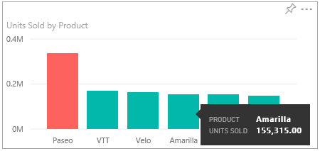
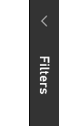
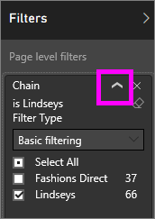

<properties
   pageTitle="Interactuar con un informe en la vista de lectura en Power BI"
   description="Interactuar con un informe en la vista de lectura en Power BI"
   services="powerbi"
   documentationCenter=""
   authors="mihart"
   manager="mblythe"
   backup=""
   editor=""
   tags=""
   qualityFocus="monitoring"
   qualityDate=""/>

<tags
   ms.service="powerbi"
   ms.devlang="NA"
   ms.topic="article"
   ms.tgt_pltfrm="NA"
   ms.workload="powerbi"
   ms.date="08/20/2016"
   ms.author="mihart"/>

# Interactuar con un informe en la vista de lectura en Power BI

##  Vista de lectura

Vista de lectura no es interactiva como como vista de edición, pero todavía ofrece muchas opciones para explorar los datos. Lo cual es útil al visualizar informes [compartido con usted](powerbi-service-share-unshare-dashboard.md), ya que éstas sólo se pueden abrir en vista de lectura.

En la vista de lectura puede realzado cruzado y filtro entre elementos visuales en una página.  Simplemente resaltar o seleccione un valor en un objeto visual y ver de forma instantánea su impacto en los otros elementos visuales. Use el panel de filtro para agregar y modificar los filtros en una página del informe y cambiar la manera en que los valores se ordenan en una visualización. Vista de lectura es una práctica divertida y jugar con y conocer los datos de forma segura.

##  Resaltan las visualizaciones relacionadas en una página

Las visualizaciones en una única página son todos "conectadas" entre sí.  Esto significa que si selecciona uno o más valores en una visualización, cambiará otras visualizaciones en función de esa selección.

>[AZURE.NOTE] Para seleccionar más de un elemento en una visualización, mantenga presionada la tecla CTRL.

##  Mantenga el mouse sobre los elementos visuales para ver los detalles

##  Ordenar los datos en una visualización

Seleccione el botón de puntos suspensivos (...) para abrir **Ordenar por**. Seleccione la flecha de lista desplegable para elegir qué campo ordenar por o seleccione el icono AZ para cambiar entre orden ascendente y descendente.    

 

##  Interactuar con filtros

Si el autor del informe agrega filtros a una página de un informe, puede interactuar con ellos en la vista de lectura. No se guardarán los cambios realizados con el informe.

1.  Seleccione el icono de filtro en la esquina superior derecha.

      

2.  Verá todos los filtros que se han aplicado al objeto visual seleccionado (filtros de nivel Visual), a través de la página de todo el informe (filtros de nivel de página) y en el informe completo (filtros de nivel de informe).

    

3.  Mantenga el mouse sobre un filtro y expanda seleccionando la flecha hacia abajo.

    

4.  Realizar cambios en los filtros y ver cómo se ven afectados los elementos visuales. Estos son algunos intentar:

    -   Filtrar por **modas directa** en lugar de **Lindseys** quitando la marca de verificación de uno y agregarlo a otro.

        

    -   O quitando completamente el filtrado en **cadena** seleccionando el icono de borrador  o agregando una marca de verificación a la **directa de moda** cuadro.

    -   Seleccione el **distrito** filtro de nivel de página y cambie a **filtrado avanzado**. Filtro para mostrar sólo demarcaciones que empiezan por **FD** y no contienen el número 4.

        

##      Usar el zoom en objetos visuales individuales

Mantenga el mouse sobre un objeto visual y seleccione el **modo de enfoque** icono . Al ver una visualización en modo de enfoque, se expande para rellenar el lienzo de informe completo.

Para obtener más información, consulte [Agregar un filtro a un informe](powerbi-service-add-a-filter-to-a-report.md) y [sobre los filtros y resaltado en informes](powerbi-service-about-filters-and-highlighting-in-reports.md).

##  Ajustar las dimensiones de la pantalla
Los informes se ven en muchos dispositivos diferentes, con diferentes tamaños de pantalla y proporciones de aspecto.  La representación predeterminada no puede ser lo que desea ver en su dispositivo.  Para ajustar, seleccione **vista** y elija:

 - Ajustar a la página: contenido de escala que mejor ajusta la página
 - Ajustar a ancho: ajustar el contenido al ancho de la página
 - Tamaño real: mostrar contenido en tamaño completo  

  En la vista de lectura, selecciona la opción de visualización es temporal y no se guarda al cerrar el informe.

  Para obtener más información: [Tutorial: cambiar la configuración de pantalla en un informe](powerbi-service-tutorial-change-report-display-settings.md).

## Consulte también

[Informes de Power BI](powerbi-service-reports.md)

[Filtros y resaltado en informes de Power BI](powerbi-service-about-filters-and-highlighting-in-reports.md)

¿Preguntas más frecuentes? [Pruebe la Comunidad de Power BI](http://community.powerbi.com/)
