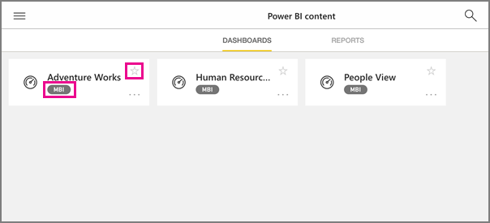

<properties 
   pageTitle="Grupos en la aplicación de iPad"
   description="Grupos de Power BI se basan en grupos de Office 365. Lea acerca de cómo ver e interactuar con los paneles del grupo en la aplicación móvil iOS de Power BI para el iPad."
   services="powerbi" 
   documentationCenter="" 
   authors="maggiesMSFT" 
   manager="mblythe" 
   backup=""
   editor=""
   tags=""
   qualityFocus="no"
   qualityDate=""/>
 
<tags
   ms.service="powerbi"
   ms.devlang="NA"
   ms.topic="article"
   ms.tgt_pltfrm="NA"
   ms.workload="powerbi"
   ms.date="09/12/2016"
   ms.author="maggies"/>
# Grupos en la aplicación de iPad (Power BI para iOS)

Grupos de Power BI proporcionan una experiencia de colaboración eficaces basada en grupos de Office 365. Obtenga más información sobre [grupos en Office 365](https://support.office.com/article/Create-a-group-in-Office-365-7124dc4c-1de9-40d4-b096-e8add19209e9). Grupos están disponibles con la experiencia de Power BI Pro.

Se [crear un grupo en el servicio Power BI](powerbi-service-create-a-group-in-power-bi.md).

A continuación, puede ver e interactuar con informes y paneles de grupo en Microsoft [aplicación de iOS de Power BI para el iPad](powerbi-mobile-iphone-app-get-started.md). 

## Interactuar con los grupos de Power BI

1.  Abra la aplicación Power BI para iOS para el iPad. 

    ¿Necesita [descargar e instalar la aplicación iOS](http://go.microsoft.com/fwlink/?LinkId=522062) primera?

2.  Puntee en el botón de navegación global  en la esquina superior izquierda.

3.  Seleccione un grupo.

    

4.  La página de grupo muestra los paneles e informes que se han publicado en el área de trabajo del grupo.

    

     -     Amarillo estrellas  Mostrar paneles de qué son los favoritos. 

     -     La notación debajo de cada nombre de panel  muestra cómo se clasifican los datos de cada panel. Obtenga más información sobre [clasificación de datos en Power BI](powerbi-service-data-classification.md).

5.  
            [Seleccione un panel](powerbi-mobile-dashboards-on-the-ipad-app.md) o [selecciona un informe](powerbi-mobile-reports-on-the-ipad-app.md) para abrirla y verla.

### Consulte también
- [La aplicación móvil de Power BI para iOS en el iPad](powerbi-mobile-iphone-app-get-started.md)
- [Crear un grupo en Power BI](powerbi-service-create-a-group-in-power-bi.md)
