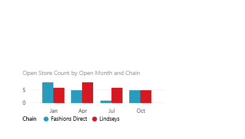

<properties
   pageTitle="Mover, cambiar el tamaño y salir una visualización en un informe de Power BI"
   description="Mover y cambiar el tamaño de una visualización en un informe de Power BI"
   services="powerbi"
   documentationCenter=""
   authors="mihart"
   manager="mblythe"
   backup=""
   editor=""
   tags=""
   qualityFocus="no"
   qualityDate=""/>

<tags
   ms.service="powerbi"
   ms.devlang="NA"
   ms.topic="article"
   ms.tgt_pltfrm="NA"
   ms.workload="powerbi"
   ms.date="10/05/2016"
   ms.author="mihart"/>

# Mover y cambiar el tamaño de una visualización en un informe de Power BI  

##   Abra el informe

En Power BI, abrir un informe en [vista de edición](powerbi-service-go-from-reading-view-to-editing-view.md) y [crear una visualización](powerbi-service-add-visualizations-to-a-report-i.md) Si todavía no tiene el informe.

## Mover la visualización  
-   Seleccione (haga clic) cualquier área de la visualización y arrastre a la nueva ubicación. 

## Cambiar el tamaño de la visualización  
-   Seleccione la visualización para mostrar el borde y haga clic y arrastre los manipuladores oscuro para cambiar el tamaño.  
    

## Seleccione el modo de enfoque para ver más detalles.
- Mantenga el mouse sobre la visualización y seleccione el icono de modo de foco.
 

## Consulte también  

[Cambiar el tamaño de una visualización en un panel](powerbi-service-edit-a-tile-in-a-dashboard.md)

[Mostrar un icono de panel en modo de pantalla completa (foco)](powerbi-service-display-dash-in-focus-mode.md)

[Visualizaciones en informes de Power BI](powerbi-service-visualizations-for-reports.md)

[Power BI: conceptos básicos](powerbi-service-basic-concepts.md)  

¿Preguntas más frecuentes? [Pruebe la Comunidad de Power BI](http://community.powerbi.com/)
