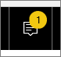

<properties
   pageTitle="Power BI unificada centro de notificaciones"
   description="El centro de notificaciones unificada es una fuente de información relacionada con su experiencia de Power BI secuencial."
   services="powerbi"
   documentationCenter=""
   authors="mihart"  
   manager="mblythe"
   backup=""
   editor=""
   tags=""
   featuredVideoId="bZMSv5KAlcE"
   qualityFocus="no"
   qualityDate=""/>

<tags
   ms.service="powerbi"
   ms.devlang="NA"
   ms.topic="article"
   ms.tgt_pltfrm="NA"
   ms.workload="powerbi"
   ms.date="08/23/2016"
   ms.author="mihart"/>

# Power BI unificada centro de notificaciones

El centro de notificaciones unificada es una fuente de información relacionada con su experiencia de Power BI secuencial. Abrir para ver mensajes sobre nuevos paneles que se han compartido con usted, cambios en el espacio del grupo, la información sobre eventos de Power BI y reuniones, alertas configuradas y mucho más. Puede [establecer alertas en el servicio Power BI](powerbi-service-set-data-alerts.md) y también en las aplicaciones móviles de Power BI.

Vea Amanda revise las notificaciones que se recibe, el Administrador de sus notificaciones y responder a ellas. Siga las instrucciones a continuación el vídeo para probarlo usted mismo.

<iframe width="560" height="315" src="https://www.youtube.com/embed/bZMSv5KAlcE" frameborder="0" allowfullscreen></iframe>

1.  Cuando inicie sesión en Power BI, hay nuevas notificaciones que hayan enviado mientras estaba sin conexión se agregan a la fuente. Si tiene las notificaciones nuevas, Power BI muestra una burbuja amarilla con el número de nuevos elementos.

    

2.  En la barra de menús de Power BI, seleccione el icono de notificación.

    

3.  Las notificaciones se muestran con la más reciente en los mensajes no leídos y superiores resaltados. Las notificaciones se conservan durante 90 días, a menos que eliminarlos antes o al alcanzar el límite máximo de 100.

    

4.  Para descartar una notificación, seleccione el icono de X.

### Consulte también
- [Alertas de datos en el servicio Power BI](powerbi-service-set-data-alerts.md)
- [Establecer alertas de datos en la aplicación de iPhone (Power BI para iOS)](powerbi-mobile-set-data-alerts-in-the-iphone-app.md)
- [Establecer alertas de datos en la aplicación móvil de Power BI para Windows 10](powerbi-mobile-set-data-alerts-in-the-windows-10-mobile-app.md)
-  ¿Preguntas más frecuentes? [Pruebe la Comunidad de Power BI](http://community.powerbi.com/)
