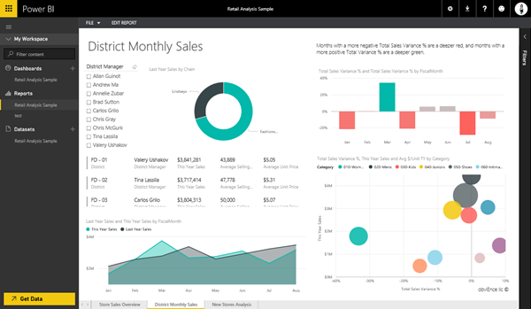

<properties
   pageTitle="Abra un informe de Power BI en la vista de lectura"
   description="Abra un informe de Power BI en la vista de lectura"
   services="powerbi"
   documentationCenter=""
   authors="mihart"
   manager="mblythe"
   backup=""
   editor=""
   tags=""
   qualityFocus="no"
   qualityDate=""/>

<tags
   ms.service="powerbi"
   ms.devlang="NA"
   ms.topic="article"
   ms.tgt_pltfrm="NA"
   ms.workload="powerbi"
   ms.date="08/25/2016"
   ms.author="mihart"/>

# Abra un informe de Power BI en la vista de lectura  
##   Vista de lectura
Vista de lectura es una excelente manera de explorar los datos en un informe de Power BI, sin tener en cuenta que podrá dividir algo.  Puede examinar el informe, interactuar con las visualizaciones y cualquiera de las visualizaciones Anclar al panel. 

>[AZURE.NOTE] Para editar el informe y guardar los cambios, [abrirlo en la vista de edición de](powerbi-service-go-from-reading-view-to-editing-view.md).

1.  
            [Crear un informe](powerbi-service-create-a-new-report.md) y ábralo en la vista de lectura.

    -   En el panel de navegación izquierdo, seleccione el nombre del informe, o

    -   En un panel, seleccione un mosaico, que se creó a partir de un informe para abrir el informe.

2.  El informe se abre en la vista de lectura.  

3.  Hay muchas cosas que puede hacer en la vista de lectura.  Empiece por examinar el informe haciendo clic en las flechas situadas en la parte inferior de la pantalla.  Este informe de ejemplo tiene varias páginas. Ahora inicie [interactuar con el informe](powerbi-service-interact-with-a-report-in-reading-view.md)

## Consulte también  
Obtenga más información sobre [informes de Power BI](powerbi-service-reports.md)

[Introducción a Power BI](powerbi-service-get-started.md)

[Power BI: conceptos básicos ](powerbi-service-basic-concepts.md)

¿Preguntas más frecuentes? [Pruebe la Comunidad de Power BI](http://community.powerbi.com/)  
