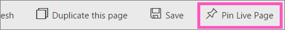

<properties
   pageTitle="Anclar una página de informe completo en un panel de Power BI "
   description="Documentación sobre cómo anclar una página de todo el informe activo a un panel de Power BI desde un informe."
   services="powerbi"
   documentationCenter=""
   authors="mihart"
   manager="mblythe"
   backup=""
   editor=""
   tags=""
   featuredVideoId="EzhfBpPboPA"
   qualityFocus="no"
   qualityDate=""/>

<tags
   ms.service="powerbi"
   ms.devlang="NA"
   ms.topic="article"
   ms.tgt_pltfrm="NA"
   ms.workload="powerbi"
   ms.date="08/11/2016"
   ms.author="mihart"/>

# Anclar una página de informe completo, como un icono dinámico a un panel de Power BI

Otra manera de agregar un nuevo [icono Panel de](powerbi-service-dashboard-tiles.md) es fijando una página de informe completo.  Se trata de una manera fácil de anclar una visualización más de uno en uno.  Además, al anclar una página completa, los iconos son *live*; puede interactuar con ellos aquí en el panel. Y se reflejan los cambios realizados en cualquiera de las visualizaciones en el editor de informe, como agregar un filtro o cambiar los campos utilizados en el gráfico del icono del panel.  

>[AZURE.NOTE]  No se puede anclar mosaicos de los informes que se comparten con usted.

## Anclar una página del informe

Vea Amanda anclar una página de informe a un panel y, a continuación, siga las instrucciones detalladas a continuación el vídeo para probarlo.

<iframe width="560" height="315" src="https://www.youtube.com/embed/EzhfBpPboPA" frameborder="0" allowfullscreen></iframe>

1. Abrir un informe en la vista de edición.

2.  En la barra de menús, seleccione **página activa de Pin**.

     

2.  Anclar el mosaico a un panel existente o a un nuevo panel. Observe el texto resaltado: *página activa de Pin permite cambios en los informes que aparecen en el mosaico del panel cuando se actualiza la página.*

  -   Panel existente: seleccione el nombre del panel en la lista desplegable. Los paneles que se han compartido con usted no aparecerá en la lista desplegable.

  -   Nuevo panel: escriba el nombre del nuevo panel.

     

3.  Seleccione **Pin live**. Un mensaje de confirmación (cerca de la esquina superior derecha) le permite saber que se ha agregado a la página, como un icono en el panel.

4.  En el panel de navegación, seleccione el panel con el nuevo icono dinámico. Allí, puede hacer cosas como [cambiar el nombre, tamaño, vincular y mover](powerbi-service-edit-a-tile-in-a-dashboard.md) la página de informe anclado.  

5. Interactuar con el icono dinámico.  En la captura de pantalla siguiente, al seleccionar una barra en la columna de gráfico tiene un filtro cruzado y resaltadas entre las otras visualizaciones en el mosaico.

    

## Consulte también

[Informes de Power BI](powerbi-service-reports.md)

[Preguntas y respuestas en Power BI](powerbi-service-q-and-a.md)

[Vista previa de Power BI: conceptos básicos](powerbi-service-basic-concepts.md)

[Paneles de Power BI](powerbi-service-dashboards.md)

¿Preguntas más frecuentes? [Pruebe la Comunidad de Power BI](http://community.powerbi.com/)
