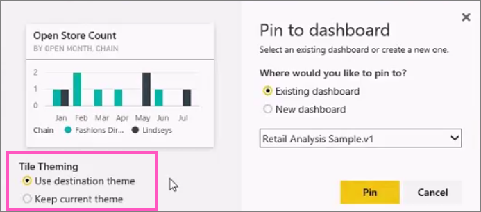

<properties
   pageTitle="Pin a tile to a Power BI dashboard from a report"
   description="Pin a tile to a Power BI dashboard from a report."
   services="powerbi"
   documentationCenter=""
   authors="mihart"
   manager="mblythe"
   backup=""
   editor=""
   tags=""
   featuredVideoId="lJKgWnvl6bQ"
   qualityFocus="no"
   qualityDate=""/>

<tags
   ms.service="powerbi"
   ms.devlang="NA"
   ms.topic="article"
   ms.tgt_pltfrm="NA"
   ms.workload="powerbi"
   ms.date="10/07/2016"
   ms.author="mihart"/>

# Pin a tile to a Power BI dashboard from a report
## Pinning tiles from a report

One way to add a new <bpt id="p1">[</bpt>dashboard tile<ept id="p1">](powerbi-service-dashboard-tiles.md)</ept> is from within a <bpt id="p2">[</bpt>Power BI report<ept id="p2">](powerbi-service-reports.md)</ept>. In fact, you can add many new tiles from a report.  Each of these tiles, when clicked, is a link back into the report.

And entire report pages can be pinned to a dashboard.  This is also known as pinning a <bpt id="p1">*</bpt>live<ept id="p1">*</ept> tile.  <bpt id="p1">*</bpt>Live<ept id="p1">*</ept> because you can interact with the tile on the dashboard and because, unlike individual visualization tiles, changes made in the report are synced with the dashboard. Read more about this below.

<bpt id="p1">**</bpt>NOTE<ept id="p1">**</ept>:  You can't pin tiles from shared reports or from Power BI Desktop.

## Pin a tile from a report

Watch Amanda create a dashboard by pinning visuals and images from a Power BI report.
<iframe width="560" height="315" src="https://www.youtube.com/embed/lJKgWnvl6bQ" frameborder="0" allowfullscreen></iframe>

Now create your own dashboard using one of the Power BI sample reports.

1.  Hover over the visualization you want to pin, and select the pin <ph id="ph1"></ph> icon. Power BI opens the <bpt id="p1">**</bpt>Pin to dashboard<ept id="p1">**</ept> screen.

      

2. Decide whether to pin to an existing dashboard or new dashboard.

  -   Existing dashboard: select the name of the dashboard from the dropdown. Dashboards that have been shared with you will not appear in the dropdown.

  -   New dashboard: type the name of the new dashboard.

3. In some cases, the item you are pinning may have a <bpt id="p1">*</bpt>theme<ept id="p1">*</ept> already applied.  For example, visuals pinned from an Excel workbook. If so, select which theme to apply to the tile.

4.  Select <bpt id="p1">**</bpt>Pin<ept id="p1">**</ept>.

    A Success message (near the top right corner) lets you know the visualization was added, as a tile, to your dashboard.

    

4.  From the navigation pane, select the dashboard with the new tile. Select the tile to jump back into the report. Or, <bpt id="p1">[</bpt>edit the tile display and behavior<ept id="p1">](powerbi-service-edit-a-tile-in-a-dashboard.md)</ept>.

## Pin an entire report page

Another option is to pin an entire report page to a dashboard. This is an easy way to pin more than one visualization at a time.  Also, when you pin an entire page, the tiles are <bpt id="p1">*</bpt>live<ept id="p1">*</ept>; you can interact with them right there on the dashboard. And changes you make to any of the visualizations back in the report editor, like adding a filter or changing the fields used in the chart, are reflected in the dashboard tile as well.  

For more information, see <bpt id="p1">[</bpt>Pin an entire report page<ept id="p1">](powerbi-service-pin-a-live-tile-to-a-dashboard-from-a-report.md)</ept>

## Consulte también

[Dashboards in Power BI](powerbi-service-dashboards.md)

[Dashboard tiles in Power BI](powerbi-service-dashboard-tiles.md)

[Reports in Power BI](powerbi-service-reports.md)

[Data refresh in Power BI](powerbi-refresh-data.md)

[Power BI Basic Concepts](powerbi-service-basic-concepts.md)

More questions? [Try the Power BI Community](http://community.powerbi.com/)
