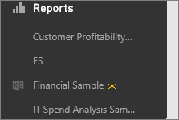

<properties
   pageTitle="Pin a tile to a Power BI dashboard from Excel"
   description="Pin a tile to a Power BI dashboard from Excel on OneDrive for Business. Pin ranges, charts, tables"
   services="powerbi"
   documentationCenter=""
   authors="mihart"
   manager="mblythe"
   backup=""
   editor=""
   tags=""
   featuredVideoId="l8JoB7w0zJA"
   qualityFocus="no"
   qualityDate=""/>

<tags
   ms.service="powerbi"
   ms.devlang="NA"
   ms.topic="article"
   ms.tgt_pltfrm="NA"
   ms.workload="powerbi"
   ms.date="08/25/2016"
   ms.author="mihart"/>

# Pin a tile to a Power BI dashboard from Excel

Watch Will demonstrate several ways to import data from, and connect to, Excel workbooks. Then follow the step-by-step instructions below the video to try it out yourself.

<iframe width="560" height="315" src="https://www.youtube.com/embed/l8JoB7w0zJA" frameborder="0" allowfullscreen></iframe>

>[AZURE.NOTE]  You can view, but not pin, tiles from workbooks that have been shared with you.

## Connect your Excel workbook from OneDrive for Business to Power BI

1.  Upload your workbook to your OneDrive for Business.

2. From Power BI, <bpt id="p1">[</bpt>connect to that workbook<ept id="p1">](powerbi-bring-in-whole-excel-files.md)</ept>.

3.  In Power BI, the workbook is listed in the left navigation pane under <bpt id="p1">**</bpt>Reports<ept id="p1">**</ept>. The <ph id="ph1"></ph> icon indicates this is an Excel workbook and the yellow asterisk indicates it's new.

    

4.  Open the workbook in Power BI by selecting the report name.

>[AZURE.NOTE]  Changes you make to the workbook in Power BI are not saved and do not affect the original workbook on OneDrive for Business. If you sort, filter, or change values in Power BI, those changes cannot be saved or pinned. To update the workbook, open it in Excel Online by selecting the ellipses and choosing <bpt id="p1">**</bpt>Edit<ept id="p1">**</ept>. Changes to the workbook may take a few minutes to be updated in the tiles.     

## Pin a range to a dashboard
One way to add a new <bpt id="p1">[</bpt>dashboard tile<ept id="p1">](powerbi-service-dashboard-tiles.md)</ept> is from within an Excel workbook. Ranges can be pinned from Excel workbooks that have been saved in your OneDrive for Business or another group-shared document library. The ranges can contain data, charts, tables, PivotTables, PivotCharts, and other Excel parts.

1. Highlight the cells that you'd like to pin to a dashboard.

    

2.  Select the pin <ph id="ph1"></ph> icon. 

3.  Pin the tile to an existing dashboard or to a new dashboard. 

    -   Existing dashboard: select the name of the dashboard from the dropdown.

    -   New dashboard: type the name of the new dashboard.

    

3.  Select <bpt id="p1">**</bpt>Pin<ept id="p1">**</ept>.

    A Success message (near the top right corner) lets you know the range was added, as a tile, to your dashboard.

    

4.  From the navigation pane, select the dashboard with the new tile. There, you can <bpt id="p1">[</bpt>rename, resize, link, and move<ept id="p1">](powerbi-service-edit-a-tile-in-a-dashboard.md)</ept> the pinned visualization.

## Pin an entire table or pivot chart to a dashboard

1.  To pin a table or pivot table, select the entire range of the table.

  - For tables, make sure to include the headers.

  - For pivot tables, make sure to include every visible part of the pivot table, including filters if used.

    

2. Follow steps 2-4 above.

>[AZURE.NOTE] A tile created from a table or pivot table will show the entire table.  If you add/remove/filter rows or columns in the original workbook, they will also be added/removed/filtered in the tile.

## View the workbook linked to the tile

Clicking a workbook tile opens the linked workbook. Since the workbook file is located on the owner’s OneDrive for Business, viewing the workbook requires you have Read permissions for the workbook. If you do not have permission to view the file, you will receive an error message. For more information, see <bpt id="p1">[</bpt>Dashboard tiles in Power BI<ept id="p1">](powerbi-service-dashboard-tiles.md)</ept>

>[AZURE.NOTE] Unsupported features: Power BI uses Excel Services to retrieve the workbook tiles. Therefore, since some features from Excel Desktop are not supported in Excel Services REST API, they will not be seen on tiles in Power BI. For example: Sparklines, icon set conditional formatting, time slicers. For a full list of unsupported features see <bpt id="p1">[</bpt>Unsupported Features in Excel Services REST API<ept id="p1">](http://msdn.microsoft.com/library/office/ff394477.aspx)</ept>

## Consulte también

[Share a dashboard that has links to an Excel workbook](powerbi-service-share-dashboard-that-links-to-excel.md)

[Bring whole Excel files into Power BI](powerbi-bring-in-whole-excel-files.md)

[Reports in Power BI](powerbi-service-reports.md)

[Power BI Preview - Basic Concepts](powerbi-service-basic-concepts.md)

[Dashboards in Power BI Preview](powerbi-service-dashboards.md)

More questions? [Try the Power BI Community](http://community.powerbi.com/)
