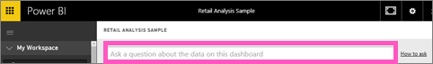

<properties
   pageTitle="Pin a tile to a Power BI dashboard from the Q&amp;A question box"
   description="Documentation on how to pin a tile to a Power BI dashboard from the Q&amp;A question box"
   services="powerbi"
   documentationCenter=""
   authors="mihart"
   manager="mblythe"
   backup=""
   editor=""
   tags=""
   qualityFocus="no"
   qualityDate=""/>

<tags
   ms.service="powerbi"
   ms.devlang="NA"
   ms.topic="article"
   ms.tgt_pltfrm="NA"
   ms.workload="powerbi"
   ms.date="10/08/2016"
   ms.author="mihart"/>

# Pin a tile to a Power BI dashboard from the Q&amp;A question box  
## How to pin a tile from Q&amp;A
Q&amp;A is the Power BI ad hoc reporting tool. Need to find a particular insight? Ask a question about your data, and receive an answer in the form of a visualization.

1.  Create a <bpt id="p1">[</bpt>dashboard<ept id="p1">](powerbi-service-dashboards.md)</ept> and <bpt id="p2">[</bpt>get data<ept id="p2">](powerbi-service-get-data.md)</ept>.

2.  In the question box at the top of your dashboard, start typing what you want to know about your data.  
    

3.  For example, as you type "last year sales by month and territory"...  
    

    the question box gives you suggestions "

4.  To add the chart to your dashboard as a tile, select the pin <ph id="ph1"></ph> on the top-right side of the canvas.

5.  Pin the tile to an existing dashboard or to a new dashboard. 

    -   Existing dashboard: select the name of the dashboard from the dropdown.

    -   New dashboard: type the name of the new dashboard.

6.  Select <bpt id="p1">**</bpt>Pin<ept id="p1">**</ept>.

    A success message (near the top-right corner) lets you know the visualization was added, as a tile, to your dashboard.  
    

7.  From the navigation pane, select the dashboard with the new tile. There, you can <bpt id="p1">[</bpt>rename, resize, add a hyperlink, and reposition the tile, and more<ept id="p1">](powerbi-service-edit-a-tile-in-a-dashboard.md)</ept> on your dashboard. 

## Tips for using Q&amp;A  
-   When you start typing a question, Q&amp;A immediately begins searching for the best answer from all datasets associated with the current dashboard.  The "current dashboard" is the dashboard highlighted in the navigation pane.

-   <bpt id="p1">**</bpt>How does Q&amp;A know which datasets to use<ept id="p1">**</ept>?  Q&amp;A has access to all datasets that have visualizations pinned to that dashboard.

## Véase también  
[Dashboards in Power BI](powerbi-service-dashboards.md)  
[Q&amp;A in Power BI](powerbi-service-q-and-a.md)  
[Power BI - Basic Concepts](powerbi-service-basic-concepts.md)  
More questions? [Try the Power BI Community](http://community.powerbi.com/)
