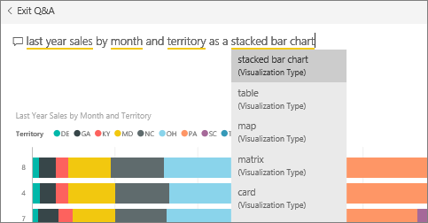

<properties
   pageTitle="Anclar un mosaico a un panel de Power BI desde el cuadro de pregunta de preguntas y respuestas"
   description="Documentación sobre cómo anclar un mosaico a un panel de Power BI desde el cuadro de pregunta de preguntas y respuestas"
   services="powerbi"
   documentationCenter=""
   authors="mihart"
   manager="mblythe"
   backup=""
   editor=""
   tags=""
   qualityFocus="no"
   qualityDate=""/>

<tags
   ms.service="powerbi"
   ms.devlang="NA"
   ms.topic="article"
   ms.tgt_pltfrm="NA"
   ms.workload="powerbi"
   ms.date="10/08/2016"
   ms.author="mihart"/>

# Anclar un mosaico a un panel de Power BI desde el cuadro de pregunta de preguntas y respuestas  
## Cómo anclar un mosaico de preguntas y respuestas
Preguntas y respuestas es la herramienta de creación de informes ad hoc de Power BI. ¿Necesita buscar una determinada información? Formule una pregunta sobre los datos y recibir una respuesta de la forma de una visualización.

1.  Crear un [panel](powerbi-service-dashboards.md) y [obtener datos](powerbi-service-get-data.md).

2.  En el cuadro de pregunta en la parte superior del panel del, comience a escribir lo que desea saber acerca de los datos.  
    

3.  Por ejemplo, se puede especificar "ventas del último año, mes y territorio"...  
    

    el cuadro de pregunta ofrece sugerencias"

4.  Para agregar el gráfico a su panel de mosaico, seleccione el pin  en la parte superior derecha del lienzo.

5.  Anclar el mosaico a un panel existente o a un nuevo panel. 

    -   Panel existente: seleccione el nombre del panel en la lista desplegable.

    -   Nuevo panel: escriba el nombre del nuevo panel.

6.  Seleccione **Pin**.

    Un mensaje de confirmación (cerca de la esquina superior derecha) le permite conocer que la visualización se ha agregado, como un icono al escritorio.  
    

7.  En el panel de navegación, seleccione el panel con el nuevo icono. Allí, puede [cambiar el nombre, cambiar el tamaño, agregar un hipervínculo y volver a colocar el mosaico y más](powerbi-service-edit-a-tile-in-a-dashboard.md) en el panel. 

## Sugerencias para usar preguntas y respuestas  
-   Al comenzar a escribir una pregunta, preguntas y respuestas inmediatamente comienza a buscar la mejor respuesta de todos los conjuntos de datos asociados con el panel actual.  Panel"actual" es el panel resaltado en el panel de navegación.

-   
            **¿Cómo preguntas y respuestas sabe qué conjuntos de datos para usar**?  Preguntas y respuestas tienen acceso a todos los conjuntos de datos con visualizaciones anclados a ese panel.

## Véase también  
[Paneles de Power BI](powerbi-service-dashboards.md)  
[Preguntas y respuestas en Power BI](powerbi-service-q-and-a.md)  
[Power BI: conceptos básicos](powerbi-service-basic-concepts.md)  
¿Preguntas más frecuentes? [Pruebe la Comunidad de Power BI](http://community.powerbi.com/)
