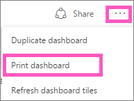

<properties
   pageTitle="Imprimir un panel, un icono del panel de impresión, imprimir una página de informe"
   description="Imprimir un mosaico, un panel o una página del informe de Power BI."
   services="powerbi"
   documentationCenter=""
   authors="mihart"
   manager="mblythe"
   backup=""
   editor=""
   tags=""
   featuredVideoId="jtlLGRKBvXY"
   qualityFocus="monitoring"
   qualityDate=""/>

<tags
   ms.service="powerbi"
   ms.devlang="NA"
   ms.topic="article"
   ms.tgt_pltfrm="NA"
   ms.workload="powerbi"
   ms.date="08/25/2016"
   ms.author="mihart"/>

# Imprimir desde Power BI

Imprimir un panel completo, un icono de panel, una página de informe o un informe visual desde el servicio Power BI. Los informes pueden sólo sean una página impresa en un tiempo, no se puede imprimir el informe completo a la vez.

>[AZURE.NOTE] Imprimir sólo está disponible en el servicio Power BI y no Power BI Desktop.

Vea Amanda imprimir desde sus paneles e informes. A continuación, siga las instrucciones detalladas a continuación el vídeo para probarlo usted mismo.

<iframe width="560" height="315" src="https://www.youtube.com/embed/jtlLGRKBvXY" frameborder="0" allowfullscreen></iframe>

## Imprimir un panel

1. Abrir el panel que desea imprimir.

2. En la esquina superior derecha, seleccione el botón de puntos suspensivos (...) y elija **panel imprimir**.

    

3. Se abre la ventana de impresión del explorador. Elija la configuración y el destino de impresión y seleccione **Imprimir**.

    > [AZURE.NOTE] El cuadro de diálogo de impresión que consulte dependerán de qué explorador que esté utilizando.

    

## Imprimir un mosaico de panel

1. 
            [Abra el mosaico en el modo de enfoque](powerbi-service-display-dash-in-focus-mode.md).

2. Abra la ventana en [modo de pantalla completa](powerbi-service-display-tile-in-full-screen-mode.md).

2. Mantenga el mouse sobre el icono para mostrar el menú de opciones.

    

3. Seleccione el icono Imprimir  . Continúe con el paso 3 anterior.

## Imprimir una página de informe

Informes se pueden imprimir una página a la vez.

1. Abra el informe en la vista de lectura o vista de edición.

2. Seleccione **archivo** > **Imprimir** para imprimir la página actual del informe.

    

2. Se abre la ventana de impresión del explorador. Elija la configuración y el destino de impresión y seleccione **Imprimir**.

    

  > [AZURE.NOTE] El cuadro de diálogo de impresión que consulte dependerán de qué explorador que esté utilizando.

## Imprimir un informe de visual

1. 
            [Abra el objeto visual en modo de enfoque](powerbi-service-display-dash-in-focus-mode.md).

2. Siga los pasos 2 y 3 en *Imprimir una página de informe* anteriormente.

##  Solucionar problemas

*   P: ¿no se puede encontrar el **Imprimir** botón.
*   R: si usa Power BI Desktop, no se puede imprimir.  Imprimir sólo funciona en el servicio Power BI.

*   P: no puedo imprimir todas las páginas del informe a la vez.
*   R: que es correcta. Páginas del informe sólo puede imprimir una página a la vez.

*   P: no puedo imprimir en PDF.
*   R: solo verá esta opción si ya ha configurado el controlador de PDF en el explorador.    

*   P: ¿Qué puedo ver al seleccionar **Imprimir** no coincide con lo que está mostrando me aquí.
*   R: las pantallas de impresión varían según el explorador y versión del software.

*   P: mi copia impresa no escala correctamente.  Mi panel no cabe en la página. Otras preguntas de escala y la orientación.
*   R: cosas como el escalado, los márgenes, orientación, tamaño no están controladas por Power BI. Para obtener ayuda con problemas como este, consulte la documentación del explorador específico.      

## Consulte también

[Paneles de Power BI](powerbi-service-dashboards.md)

[Power BI: conceptos básicos](powerbi-service-basic-concepts.md)

¿Preguntas más frecuentes? [Pruebe la Comunidad de Power BI](http://community.powerbi.com/)
