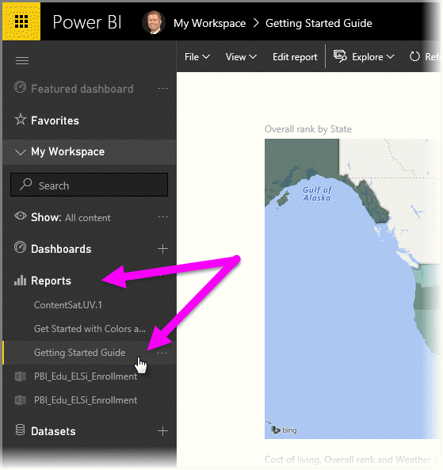
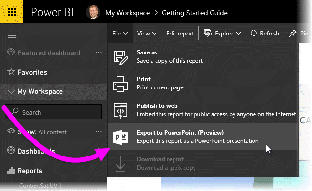
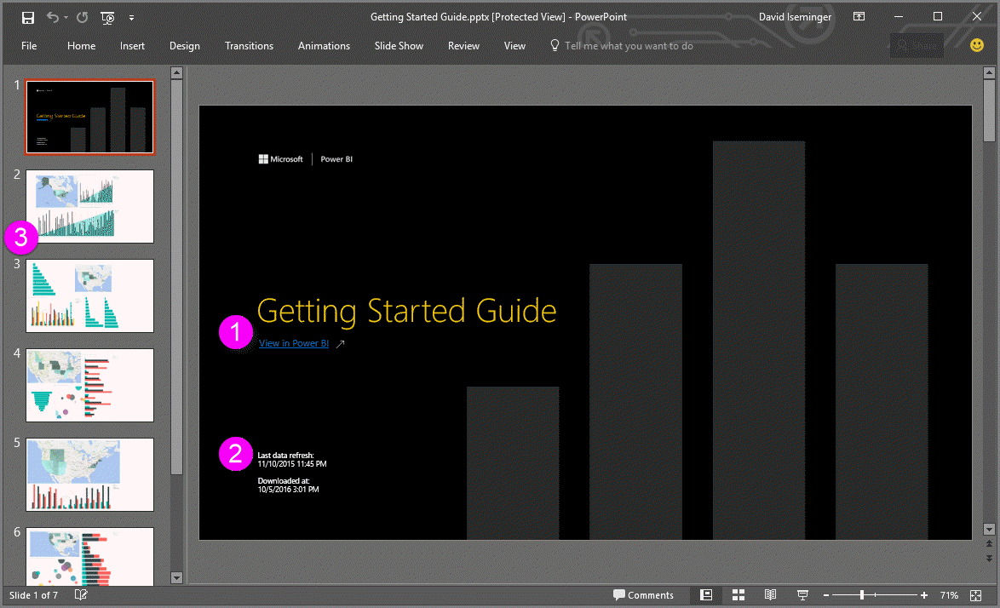
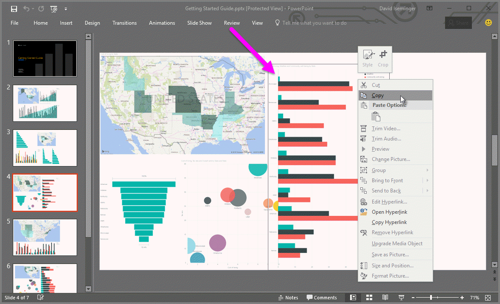

<properties
   pageTitle="Exportación de informes de Power BI para PowerPoint (vista previa)"
   description="Obtenga información acerca de cómo exportar un informe de Power BI a PowerPoint."
   services="powerbi"
   documentationCenter=""
   authors="davidiseminger"
   manager="mblythe"
   backup=""
   editor=""
   tags=""
   qualityFocus="complete"
   qualityDate=""/>

<tags
   ms.service="powerbi"
   ms.devlang="NA"
   ms.topic="article"
   ms.tgt_pltfrm="NA"
   ms.workload="powerbi"
   ms.date="10/04/2016"
   ms.author="davidi"/>

# Exportación de informes de Power BI para PowerPoint (vista previa)

Con Power BI, ahora puede publicar el informe para **Microsoft PowerPoint**, y crear fácilmente una presentación de diapositivas basado en el informe de Power BI. Cuando se **Exportar a PowerPoint**, ocurre lo siguiente:

-   Cada página del informe de Power BI se convierte en una diapositiva de PowerPoint
-   Cada visual en el informe de Power BI se exporta como una imagen de alta resolución en PowerPoint
-   Cuadros de texto en el informe de Power BI se convierten en cuadros de texto editable en PowerPoint
-   Se crea un vínculo en PowerPoint que se vincula al informe de Power BI

Obtener el **informe de Power BI** exportado en **PowerPoint** es fácil. Siga los pasos descritos en la sección siguiente.

## Cómo exportar el informe de Power BI a PowerPoint

En el servicio Power BI, seleccione la **informes** sección en el panel de navegación izquierdo para expandir esa sección, a continuación, seleccione el informe para mostrar en el lienzo. También puede seleccionar un informe desde su **Mi área de trabajo** sección, o su **favoritos**, si el informe está en ninguna de estas ubicaciones.

Cuando se muestre el informe que desea exportar a PowerPoint en el lienzo, seleccione **archivo > Exportar a PowerPoint (vista previa)** desde la barra de menús en el servicio Power BI, tal como se muestra en la siguiente imagen.

Verá un banner de notificaciones en la esquina superior derecha de la ventana del explorador de servicio Power BI que se exporta el informe a PowerPoint. Esto puede tardar unos minutos y puede continuar trabajando en Power BI mientras se exporta el informe.

Cuando haya terminado, los cambios de la pancarta de notificación para informarle de que el servicio Power BI ha terminado el proceso de exportación.

El archivo está disponible cuando el explorador muestra los archivos descargados. En la siguiente imagen, se muestra como una pancarta de descarga a lo largo de la parte inferior de la ventana del explorador.

Y eso es todo esto. Puede descargar el archivo, abrir con PowerPoint y, a continuación, modificar o mejorar, tal como lo haría con cualquier otro grupo de PowerPoint.

## Desproteger el archivo exportado de PowerPoint

Al abrir el archivo de PowerPoint que exportó de Power BI, encontrar unos cuantos elementos útiles y atractivos. Eche un vistazo a la siguiente imagen, a continuación, desproteger los elementos numerados a continuación se describen algunas de esas características interesantes.

1.  La primera página de la presentación de diapositivas incluye el nombre del informe y un vínculo para que pueda **vista en Power BI** el informe en el que se basa el juego de diapositivas.

2.  Obtendrá información útil acerca del informe, incluidos los *última actualización de datos* en el que se basa el informe exportado y *descargar en* hora y fecha, que es la hora y fecha cuando se exportó el informe de Power BI en un archivo de PowerPoint.

3.  Cada página del informe es una diapositiva independiente, como se muestra en el panel de navegación izquierdo.

Cuando vaya a una diapositiva individual, observará que cada visual es una imagen independiente (como se mencionó anteriormente). De este modo, puede copiar esa imagen y pegarlo en otra diapositiva o cualquier otro lugar que desea.

Qué hacer con la presentación de PowerPoint desde allí, o cualquiera de las imágenes de alta resolución, depende de usted!

## Limitaciones
Hay algunas consideraciones y limitaciones a tener en cuenta al trabajar con el **Exportar a PowerPoint** característica.

-   
            **Elementos visuales personalizados**, y **elementos visuales de R**, no se admiten actualmente. Cualquier tales elementos visuales se exportan como una imagen en blanco en PowerPoint.
-   Actualmente no se puede exportar informes con más de 15 páginas del informe.
-   El proceso de exportar el informe a PowerPoint puede tardar unos minutos en completarse, lo espere. Factores que influyen en el tiempo necesario incluyen la estructura del informe y la carga actual en el servicio Power BI.
-   Si el **Exportar a PowerPoint (vista previa)** elemento de menú no está disponible en el servicio Power BI, es probable porque el Administrador de inquilinos ha deshabilitado la característica. Póngase en contacto con el Administrador de inquilinos para obtener más información.
-   Imágenes de fondo se recortará con área de límite del gráfico. Se recomienda quitar imágenes de fondo antes de exportar a PowerPoint.
-   
            **En la sesión de interactividad** como resaltado y filtrado, profundidad y así sucesivamente, no se admiten al exportar a PowerPoint. PowerPoint exportada muestra los elementos visuales originales tal como se hayan guardado en el informe.

## Consulte también

            [Analizar en Excel](articles/powerbi-service-analyze-in-excel.md)

            [Datos de Excel en Power BI](articles/powerbi-service-excel-data.md)
