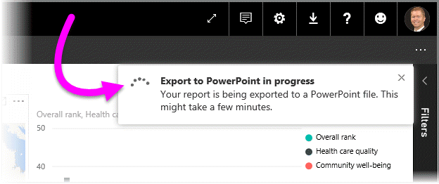

<properties
   pageTitle="Export reports from Power BI to PowerPoint (Preview)"
   description="Learn how to export a Power BI report to PowerPoint."
   services="powerbi"
   documentationCenter=""
   authors="davidiseminger"
   manager="mblythe"
   backup=""
   editor=""
   tags=""
   qualityFocus="complete"
   qualityDate=""/>

<tags
   ms.service="powerbi"
   ms.devlang="NA"
   ms.topic="article"
   ms.tgt_pltfrm="NA"
   ms.workload="powerbi"
   ms.date="10/04/2016"
   ms.author="davidi"/>

# Export reports from Power BI to PowerPoint (Preview)

With Power BI, you can now publish your report to <bpt id="p1">**</bpt>Microsoft PowerPoint<ept id="p1">**</ept>, and easily create a slide deck based on your Power BI report. When you <bpt id="p1">**</bpt>export to PowerPoint<ept id="p1">**</ept>, the following occurs:

-   Each page in the Power BI report becomes an individual slide in PowerPoint
-   Each visual in the Power BI report is exported as a high resolution image in PowerPoint
-   Text boxes in the Power BI report become editable text boxes in PowerPoint
-   A link is created in PowerPoint that links to the Power BI report

Getting your <bpt id="p1">**</bpt>Power BI report<ept id="p1">**</ept> exported into <bpt id="p2">**</bpt>PowerPoint<ept id="p2">**</ept> is easy. Just follow the steps outlined in the next section.

## How to export your Power BI report to PowerPoint

In the Power BI service, select the <bpt id="p1">**</bpt>Reports<ept id="p1">**</ept> section in the left navigation pane to expand that section, then select your report to display it on the canvas. You can also select a report from your <bpt id="p1">**</bpt>My Workspace<ept id="p1">**</ept> section, or your <bpt id="p2">**</bpt>Favorites<ept id="p2">**</ept>, if the report is in either of those locations.

When the report you want to export to PowerPoint is displayed on the canvas, select <bpt id="p1">**</bpt>File &gt; Export to PowerPoint (Preview)<ept id="p1">**</ept> from the menu bar in the Power BI service, as shown in the following image.

You'll see a notification banner in the upper right corner of the Power BI service browser window that the report is being exported to PowerPoint. This might take a few minutes, and you can continue to work in Power BI while the report is being exported.

Once complete, the notification banner changes to let you know that the Power BI service has finished the export process.

Your file is then available where your browser displays downloaded files. In the following image, it's shown as a download banner along the bottom of the browser window.

And that's all there is to it. You can download the file, open it with PowerPoint, and then modify or enhance it just like you would any other PowerPoint deck.

## Checking out your exported PowerPoint file

When you open the PowerPoint file that Power BI exported, you find a few cool and useful elements. Take a look at the following image, then check out the numbered elements below that describe some of those cool features.

1.  The first page of the slide deck includes the name of your report, and a link so that you can <bpt id="p1">**</bpt>View in Power BI<ept id="p1">**</ept> the report on which the slide deck is based.

2.  You get some useful information about the report, too, including the <bpt id="p1">*</bpt>last data refresh<ept id="p1">*</ept> on which the exported report is based, and the <bpt id="p2">*</bpt>downloaded at<ept id="p2">*</ept> time and date, which is the time and date when the Power BI report was exported into a PowerPoint file.

3.  Each report page is a separate slide, as shown in the left navigation pane.

When you go into an individual slide, you'll notice that each visual is an independent image (as mentioned before). That way you can copy that image, and paste it into another slide, or anywhere else you would like.

What you do with your PowerPoint deck from there, or any of the high resolution images, is up to you!

## Limitaciones
There are a few considerations and limitations to keep in mind when working with the <bpt id="p1">**</bpt>Export to PowerPoint<ept id="p1">**</ept> feature.

-   <bpt id="p1">**</bpt>Custom visuals<ept id="p1">**</ept>, and <bpt id="p2">**</bpt>R visuals<ept id="p2">**</ept>, are not currently supported. Any such visuals are exported as a blank image into PowerPoint.
-   Reports with more than 15 report pages can't currently be exported.
-   The process of exporting the report to PowerPoint may take a few minutes to complete, so please be patient. Factors that can impact the time required include the structure of the report, and the current load on the Power BI service.
-   If the <bpt id="p1">**</bpt>Export to PowerPoint (Preview)<ept id="p1">**</ept> menu item isn't available in the Power BI service, it's likely because your tenant administrator has disabled the feature. Please contact your tenant administrator for details.
-   Background images will be cropped with the chart's bounding area. It's highly recommended that you remove background images before exporting to PowerPoint.
-   <bpt id="p1">**</bpt>In-session interactivity<ept id="p1">**</ept> such as highlighting and filtering, drill-down, and so on, are not yet supported when exporting to PowerPoint. The exported PowerPoint shows the original visuals as they were saved in the report.

## Consulte también

<bpt id="p1">[</bpt>Analyze in Excel<ept id="p1">](articles/powerbi-service-analyze-in-excel.md)</ept>

<bpt id="p1">[</bpt>Excel data in Power BI<ept id="p1">](articles/powerbi-service-excel-data.md)</ept>
