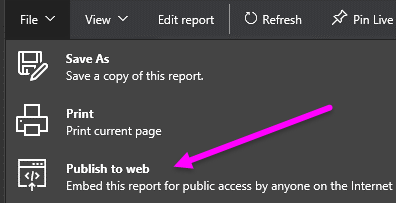
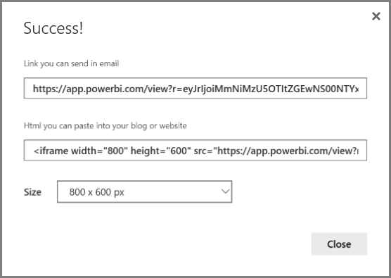
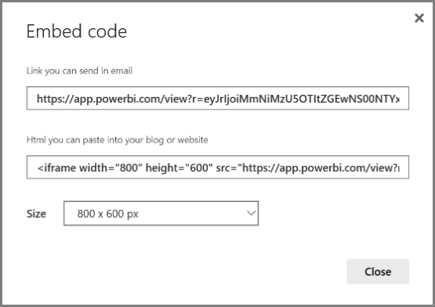
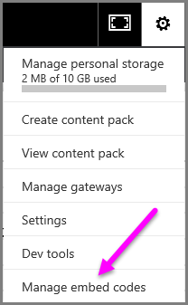
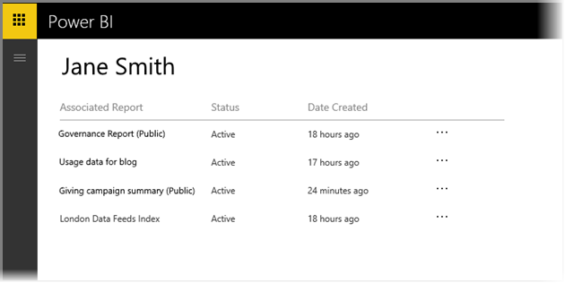
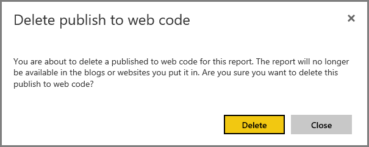

<properties
   pageTitle="Publicar en web de Power BI"
   description="Con Power BI publicar en web, puede incrustar fácilmente visualizaciones interactivas de Power BI en línea, como blogs, sitios Web, a través de mensajes de correo electrónico o medios sociales, en cualquier dispositivo."
   services="powerbi"
   documentationCenter=""
   authors="guyinacube"
   manager="ericre"
   backup=""
   editor=""
   tags=""
   qualityFocus="no"
   qualityDate=""/>

<tags
   ms.service="powerbi"
   ms.devlang="NA"
   ms.topic="article"
   ms.tgt_pltfrm="NA"
   ms.workload="powerbi"
   ms.date="10/10/2016"
   ms.author="asaxton"/>

# Publicar en web de Power BI

Con Power BI **publicar en web**, se pueden incrustar fácilmente visualizaciones de Power BI interactivas en línea, como se muestra en el blog de publicaciones, sitios Web, a través de mensajes de correo electrónico o medios sociales, en cualquier dispositivo.

También puede editar, actualización, actualización o dejar de compartir los objetos visuales publicados.

> [AZURE.WARNING] Al usar **publicar en web**, se puede ver el informe o visual publicar cualquier usuario de Internet. No hay ninguna autenticación que se utilizan al ver estos informes. Sólo puede utilizar publicación en web con informes y datos que cualquier persona en Internet (no autenticados miembros del público) debe ser capaz de ver. Antes de publicar este informe, asegúrese de que tiene el derecho a compartir los datos y visualizaciones públicamente. No publique información confidencial o propia. En caso de duda, compruebe las directivas de su organización antes de la publicación.

## Cómo utilizar la publicación en Web

            **Publicar en web** está disponible en los informes en las áreas de trabajo personales o de grupo que puede editar.  No puede utilizar la publicación en web con informes que se han compartido con usted o informes que se basan en la seguridad de nivel de fila para proteger los datos. Consulte la **limitaciones** sección para obtener una lista completa de los casos donde no se admite la publicación en web. Revise el **Advertencia** anteriormente en este artículo antes de usar la publicación en web.

Puede ver cómo funciona esta característica en la siguiente *breve vídeo*. A continuación, siga los pasos siguientes para probarlo.

<iframe width="560" height="315" src="https://www.youtube.com/embed/UF9QtqE7s4Y" frameborder="0" allowfullscreen></iframe>

Los pasos siguientes describen cómo usar **publicar en web**.

1.  En un informe en el área de trabajo que puede editar, seleccione **archivo > Publicar en web**.

    

2.  Revise el contenido del cuadro de diálogo y seleccione **crear incrustar código** como se muestra en el siguiente cuadro de diálogo.

    

3.  Revise la advertencia se muestra en el cuadro de diálogo siguiente y comprobar que los datos se puede incrustar en un sitio Web público. Si es así, seleccione **publicar**.

    

4.  Aparece un cuadro de diálogo que proporciona un vínculo que se puede enviar por correo electrónico, incrustado en el código (como un iFrame), o que puede pegar directamente en la página web o blog.

    

5.  Si previamente ha creado un código de incrustación para el informe, el código para insertar aparece rápidamente. Sólo se puede crear uno incrustar código para cada informe.

    

## Sugerencias y trucos para los modos de vista

Al incrustar contenido dentro de una entrada de blog, normalmente necesario para que quepa en un tamaño específico de la pantalla.  También puede ajustar el alto y el ancho de la etiqueta de iFrame según sea necesario, pero también debe asegurarse de que el informe quepa en el área determinado de iFrame, por lo que también necesite establecer un modo de vista adecuado al editar el informe.

En la tabla siguiente se proporciona instrucciones sobre el modo de vista y cómo va a aparecer cuando se incrusta.

|Modo de vista|Aspecto cuando incrustado|
|---|---|
|| 
            **Ajustar a la página** respetará el alto y el ancho del informe. Si establece la página 'Dynamic' proporciones como 16:9 o 4:3 el contenido se escala para ajustarse el iFrame proporcionada. Cuando se incrustan en un iFrame, utilizando **Ajustar a la página** puede dar lugar a **panorámica**, donde un fondo gris se muestra en las áreas de iFrame después del contenido como escala para que quepa en el iFrame. Para minimizar la panorámica, establezca el alto y ancho del iFrame adecuadamente.|
|| 
            **Tamaño real** se asegurará de que el informe conserva su tamaño como está establecido en la página del informe. Esto puede dar lugar a barras de desplazamiento estén presentes en el iFrame. Establecer el iFrame alto y ancho para evitar las barras de desplazamiento. |
|| 
            **Ajustar a ancho** garantiza que el contenido se ajusta dentro del área horizontal para el iFrame. Se seguirán mostrando un borde, pero el contenido se escala para usar todo el espacio horizontal disponible.  |

## Sugerencias y trucos para el ancho y el alto de iFrame

El código para insertar que aparece después de publicar en web tendrá un aspecto similar al siguiente:

Puede modificar el ancho y alto manualmente para asegurarse de que es precisamente cómo desea para ajustarla a la página en la que está incrustarlo.

Para obtener un ajuste perfecto más, puede intentar agregar 56 píxeles en el alto de iFrame. Este incluye el tamaño actual de la barra inferior. Si la página de informes utiliza el tamaño dinámico, la tabla siguiente proporciona algunos tamaños que puede usar para obtener un ajuste sin panorámica.

|Relación|Tamaño|Dimensiones (anchura x altura)|
|---|---|---|
|16:9|Pequeña|640 x 416 px|
|16:9|Mediana|506 x 800 px|
|16:9|Grande|960 x 596 px|
|4:3|Pequeña|640 x 536 px|
|4:3|Mediana|800 x 656 px|
|4:3|Grande|960 x 776 px|

## Administración de incrustar códigos

Una vez creado un **publicar en web** incrustar el código, puede administrar los códigos que se crea a partir de la **configuración** menú del servicio Power BI. Insertar códigos de administración incluye la capacidad de quitar el destino visual o informe para un código (que deja inutilizable el código para insertar), o recibir el código para insertar el nuevo.

1.  Para administrar su **publicar en web** incrustar códigos, abra el **configuración** de engranaje y seleccione **Administrar incrustar códigos**.

    

2.  Aparece la lista de códigos embed que haya creado, como se muestra en la siguiente imagen.

    

3.  Para cada **publicar en web** incrustar código en la lista, puede recuperar el código para insertar, o eliminar el código de incrustación y crear así todos los vínculos a ese informe o visual dejarán de funcionar.

    

4.  Si selecciona **Eliminar**, se le pregunta si está seguro de que desea eliminar el código para insertar.

    

## Actualizaciones de informes y la actualización de datos

Después de crear su **publicar en web** incrustar código y compartirlo, el informe se actualiza con los cambios que realice. Sin embargo, es importante saber que se puede tardar un rato para actualización esté visible para los usuarios. Las actualizaciones a un informe o visual dura aproximadamente una hora para que se reflejen en publicar en web incrustar códigos.

Cuando se utiliza inicialmente **publicar en web** para obtener un código de incrustación, el vínculo del código embed activa inmediatamente y se puede ver cualquier persona que abra el vínculo.  Después de la publicación inicial a la acción de web, las actualizaciones posteriores a los informes o elementos visuales a los que una publicación a los puntos de vínculo web puede tardar aproximadamente una hora sea visible para los usuarios.

Para obtener más información, consulte el **cómo funciona** sección más adelante en este artículo. Si necesita que las actualizaciones estén disponibles inmediatamente, puede eliminar el código de incrustación y crear uno nuevo.

## Actualización de datos

Las actualizaciones de datos son automáticamente reflejados en el informe incrustado o visual. Puede tardar aproximadamente 1 hora para los datos actualizados estarán visibles los códigos de incrustar. Puede desactivar la actualización automática seleccionando **no actualizar** en la programación para el conjunto de datos utilizado por el informe.  

## Elementos visuales personalizados

Se admiten elementos visuales personalizados en **publicar en web**. Cuando se utiliza la publicación en web, los usuarios con los que comparta su visual publicado no es necesario habilitar elementos visuales personalizados ver el informe.

## Limitaciones

            **Publicar en web** se admite para la mayoría de los orígenes de datos e informes en el servicio Power BI, sin embargo, lo siguiente no es actualmente compatibles o disponible con la publicación en web:

1.  Informes con orígenes de datos en tiempo real.

2.  Informes con seguridad de nivel de fila.

3.  Informes con Analysis Services Tablular hospedado de forma local.

4.  Informes compartidos a usted directamente o a través de un paquete de contenido de organización.

5.  Informes en un grupo en el que no es un miembro de la edición.

6.  "R" elementos visuales no se admiten actualmente en publicar informes web.

## Descripción de la columna de estado de insertar código

Al ver el **Administrar incrustar códigos** página para su **publicar en web** incrustar códigos, se proporciona una columna de estado. Incrustar códigos activos de forma predeterminada, pero puede encontrar uno de los Estados que se muestran a continuación.  

|Estado|Descripción|
|---|---|
|**Activo**|El informe está disponible para ver e interactuar con los usuarios de Internet.|
|**Bloqueado**|El contenido del informe infringe el [Power BI condiciones de servicio](https://powerbi.microsoft.com/terms-of-service). Se bloqueó por Microsoft. Si cree que el contenido se bloqueó por error, póngase en contacto con soporte técnico.|
|**No compatible**|Conjunto de datos del informe está utilizando seguridad de nivel de fila o en otra configuración no admitida. Consulte la **limitaciones** sección para obtener una lista completa.|

## Cómo informar de un problema con la publicación a contenido web

Informe de un problema relacionado con **publicar en web** contenido incrustado en un sitio Web o blog, use la **marca** icono en la barra inferior, se muestra en la siguiente imagen. Se le preguntará para enviar un correo electrónico a Microsoft que explica el problema. Microsoft evaluará el contenido basándose en las condiciones de servicio de Power BI y tomar las medidas adecuadas.

Para notificar un problema, seleccione la **marca** icono en la parte inferior de la publicación para informes web verá.

## Precios y licencias

Debe ser un usuario de Microsoft Power BI para usar **publicar en web**. Los consumidores del informe (lectores, visores) no es necesario que los usuarios de Power BI.

## Cómo funciona (detalles técnicos)

Cuando se crea un código de incrustar mediante **publicar en web**, el informe se hace visible a los usuarios en Internet. Está disponible públicamente por lo que puede esperar visores para compartir con facilidad el informe a través de redes sociales en el futuro. Cuando los usuarios vean el informe, ya sea abriendo la dirección URL pública directa o verlo incrustado en una página web o blog, Power BI almacena la definición de informe y los resultados de las consultas necesarias para ver el informe. Este enfoque garantiza que miles de usuarios simultáneos sin ningún impacto en el rendimiento puede verse el informe.  

La memoria caché es de larga duración, por lo que si se actualiza la definición de informe (por ejemplo, si cambia el modo de vista) o actualización los datos del informe, puede tardar aproximadamente una hora antes de cambios se reflejan en la versión del informe que ven los usuarios. Por lo tanto, se recomienda que organizar su trabajo por adelantado y cree el **publicar en web** incrustar código solo cuando esté satisfecho con la configuración.

¿Preguntas más frecuentes? [Pruebe la Comunidad de Power BI](http://community.powerbi.com/)